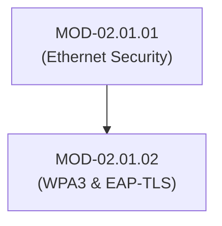

# Wireless LAN Security (802.11i WPA3 & EAP-TLS)

## 1. Overview & Purpose
Wireless LANs (Wi-Fi) transmit data over unguided radio frequencies, making physical perimeter isolation impossible.

This module details 802.11 frame structures, WPA2 vs WPA3-Personal (Simultaneous Authentication of Equals - SAE), WPA3-Enterprise (EAP-TLS), 802.11w Protected Management Frames (PMF), and Rogue Access Point detection.

---

## 2. Prerequisites & Prerequisites Graph
- **Prerequisites**: `MOD-02.01.01` (Ethernet & Link-Layer Security).



---

## 3. Learning Objectives & Taxonomy Alignment
- **L1 Awareness**: Differentiate WPA2-PSK, WPA3-SAE, and WPA3-Enterprise.
- **L2 Understanding**: Explain SAE Dragon4/Dragonfly handshake mechanics and EAP-TLS mutual authentication.
- **L3 Practical**: Configure RADIUS server EAP-TLS authentication and capture 802.11 management frames.
- **L4 Engineering**: Design enterprise wireless Zero-Trust architectures with PMF enforcement.

---

## 4. L1 — Awareness (Overview & Core Terminology)
Wi-Fi networks operate under IEEE 802.11 standards. WPA3 replaces vulnerable WPA2 Pre-Shared Key (PSK) handshakes with **Simultaneous Authentication of Equals (SAE)**, preventing offline dictionary attacks against captured 4-way handshakes.

---

## 5. L2 — Understanding (Core Theory & Mechanics)

```mermaid
graph TD
    subgraph WPA3-SAE (Dragonfly Key Exchange - Personal)
        CLIENT["Wireless Client"]
        AP["Access Point"]

        CLIENT -->|Commit (Scalar & Element)| AP
        AP -->|Commit (Scalar & Element)| CLIENT
        CLIENT -->|Confirm (SHA-256 Confirm Hash)| AP
        AP -->|Confirm (SHA-256 Confirm Hash)| CLIENT
        CLIENT <-->|Derive Pairwise Master Key - PMK| AP
    end
```

### WPA3-SAE (Dragonfly Handshake):
Uses Diffie-Hellman memory exchange based on password-derived curves. Even if an attacker records the wireless exchange, they cannot perform offline brute-force attacks against the pre-shared password.

### 802.1X / EAP-TLS (Enterprise Security):
Provides mutual cryptographic authentication using X.509 client and server digital certificates over a RADIUS server infrastructure.

---

## 6. L3 — Practical (Commands & Configurations)

### Inspecting Wireless Interfaces on Linux (`iw` / `nmcli`):
```bash
# Display wireless interface capabilities (PMF support)
iw phy phy0 info | grep -i "protection"

# Connect to WPA3-Enterprise EAP-TLS network
nmcli connection add type wifi con-name "Corporate-WiFi" ifname wlan0 ssid "Corp-Secure" \
  wifi-sec.key-mgmt wpa-eap \
  802-1x.eap tls \
  802-1x.identity "user@corp.internal" \
  802-1x.ca-cert "/etc/ssl/certs/CorpCA.pem" \
  802-1x.client-cert "/etc/ssl/certs/User.pem" \
  802-1x.private-key "/etc/ssl/private/UserKey.pem"
```

---

## 7. L4 — Engineering (Design Trade-offs & System Integration)
- **802.11w Protected Management Frames (PMF)**: Mandatory in WPA3. Cryptographically signs Deauthentication and Disassociation frames, eliminating wireless Denial-of-Service (Deauth flood attacks).

---

## 8. Internal Architecture & Data Structures
EAP-TLS Packet Payload inside RADIUS Access-Request:
```text
EAP Code: Response (2)
EAP Type: TLS (13)
Flags: Length, More Fragments, TLS Message
TLS Record: Handshake (ClientHello / ClientCertificate)
```

---

## 9. Security Implications & Boundary Controls
- **Rogue APs / Evil Twin Attacks**: Attackers broadcast matching SSIDs. EAP-TLS prevents client compromise because the client validates the server X.509 certificate before submitting credentials.

---

## 10. Attack Vectors & Exploitation Primitives
1. **Dragonblood Attacks**: Timing and cache side-channel vulnerabilities in early WPA3-SAE implementations.
2. **Deauthentication Flooding (WPA2)**: Sending forged Deauth management frames (`SubType 0x000C`) to disconnect clients.

---

## 11. Defense & Telemetry Verification
- Enforce **WPA3-Enterprise with EAP-TLS** (Certificate-based authentication).
- Enable **802.11w PMF (Required Mode)** across all Enterprise Access Points.

---

## 12. Detection & Telemetry Verification

### Wireless WIPS Telemetry Alert (Rogue AP Detection):
```yaml
title: Unauthorized Rogue Access Point Detected
id: e82019a2-4721-42b1-b01a-829101fa882b
logsource:
  category: wireless_wips
  product: enterprise_wifi
detection:
  selection:
    EventType: 'RogueAP_Detected'
    SSID: 'Corp-Secure'
  condition: selection
level: critical
```

---

## 13. Hands-On Lab Reference
- **Associated Lab**: `LAB-NET002` (EAP-TLS Certificate Authentication Setup).

---

## 14. Related Projects & Applications
- **Associated Project**: `PRJ-TIP001` (Wireless Sensor Telemetry Engine).

---

## 15. Troubleshooting & Diagnostics Matrix

| Symptom | Root Cause | Remediation / Diagnostic Command |
| :--- | :--- | :--- |
| Client fails EAP-TLS handshake. | Client certificate expired or untrusted RADIUS CA. | Verify RADIUS server certificate validation settings in wpa_supplicant logs. |

---

## 16. Related Concepts & Cross-Domain Links
- `CON-NET003`: 802.1X EAP-TLS (`DOM-02`)
- `CON-CRY001`: X.509 Digital Certificates (`DOM-03`)

---

## 17. Technical Interview Preparation (Q&A)
**Q: How does WPA3 SAE mitigate offline dictionary attacks compared to WPA2?**  
*Answer*: WPA2 4-way handshakes derive session keys directly from PMK (hashed PSK), allowing attackers to capture the handshake and run offline dictionary attacks. WPA3 SAE uses the Dragonfly key exchange, executing a zero-knowledge Diffie-Hellman exchange where passwords authenticate the exchange without exposing key material for offline verification.

---

## 18. Self-Assessment & Mastery Checklist
- [ ] Understand Dragonfly SAE commit/confirm phase.
- [ ] Able to trace EAP-TLS authentication exchanges in Wireshark.

---

## 19. References & Further Reading
- IEEE 802.11i Standard: *Medium Access Control (MAC) Security Enhancements*.
- Wi-Fi Alliance: *WPA3 Security Technology Specifications*.
