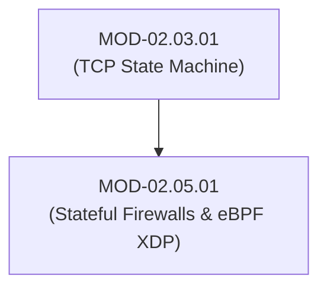
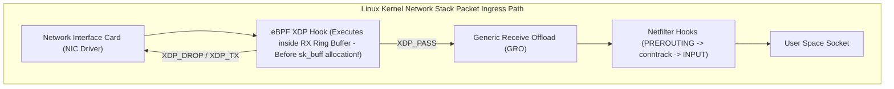

# Stateful Firewalls, Linux Netfilter & eBPF XDP High-Speed Packet Processing

## 1. Overview & Purpose
Network firewalls enforce access control policies by inspecting incoming and outgoing packet flows at network perimeters and host interfaces.

This module details Stateless vs Stateful Packet Inspection, Linux Netfilter architecture (`iptables` / `nftables`), Connection Tracking (`conntrack`), eBPF eXpress Data Path (XDP) kernel-bypass packet processing, and Deep Packet Inspection (DPI) primitives.

---

## 2. Prerequisites & Prerequisites Graph
- **Prerequisites**: `MOD-02.03.01` (TCP State Machine) & Linux kernel basics.



---

## 3. Learning Objectives & Taxonomy Alignment
- **L1 Awareness**: Differentiate packet filtering, stateful inspection, and application proxies.
- **L2 Understanding**: Explain Netfilter hook points (`PREROUTING`, `INPUT`, `FORWARD`, `OUTPUT`, `POSTROUTING`) and eBPF XDP driver-level packet filtering.
- **L3 Practical**: Write custom `nftables` rules and compile C eBPF XDP packet drop programs.
- **L4 Engineering**: Design multi-gigabit per second DDoS mitigation architectures filtering 100M+ pps at the network driver layer.

---

## 4. L1 — Awareness (Overview & Core Terminology)
Stateless firewalls evaluate individual packets against static rule tables (`IP:Port`). Stateful firewalls track connection states (`NEW`, `ESTABLISHED`, `RELATED`, `INVALID`) in a dynamic memory table (`conntrack`), allowing response traffic automatically.

---

## 5. L2 — Understanding (Core Theory & Mechanics)



### eBPF XDP (eXpress Data Path) Advantage:
Traditional Linux firewalls (`iptables` / `nftables`) process packets after the kernel allocates a 2KB `sk_buff` (socket buffer) memory structure for each packet. Under a 100 Million pps DDoS attack, CPU allocation overhead crashes the system. **eBPF XDP** runs custom bytecode directly inside the Network Interface Card (NIC) driver DMA ring buffer *before* any `sk_buff` allocation, dropping malicious packets in nanoseconds (`XDP_DROP`).

---

## 6. L3 — Practical (Commands & Configurations)

### Modern `nftables` Stateful Firewall Configuration:
```text
# /etc/nftables.conf
table inet filter {
    chain input {
        type filter hook input priority 0; policy drop;

        # Allow loopback and established connections
        iif "lo" accept
        ct state established,related accept
        ct state invalid drop

        # Allow SSH and HTTPS
        tcp dport { 22, 443 } accept
    }
}
```

### Writing a Basic eBPF XDP Packet Dropper in C:
```c
#include <linux/bpf.h>
#include <bpf/bpf_helpers.h>
#include <linux/if_ether.h>
#include <linux/ip.h>

SEC("xdp")
int xdp_drop_ip(struct xdp_md *ctx) {
    void *data = (void *)(long)ctx->data;
    void *data_end = (void *)(long)ctx->data_end;

    struct ethhdr *eth = data;
    if ((void *)(eth + 1) > data_end)
        return XDP_PASS;

    if (eth->h_proto == __constant_htons(ETH_P_IP)) {
        struct iphdr *iph = (void *)(eth + 1);
        if ((void *)(iph + 1) > data_end)
            return XDP_PASS;

        // Drop specific malicious source IP (198.51.100.50)
        if (iph->saddr == __constant_htonl(0xC6336432)) {
            return XDP_DROP;
        }
    }
    return XDP_PASS;
}
char _license[] SEC("license") = "GPL";
```

---

## 7. L4 — Engineering (Design Trade-offs & System Integration)
- **XDP Action Modes**:
  - `XDP_PASS`: Allows packet up into standard Linux network stack.
  - `XDP_DROP`: Drops packet immediately at RX ring buffer level.
  - `XDP_TX`: Bounces packet straight back out the same NIC interface.
  - `XDP_REDIRECT`: Redirects packet to another NIC or CPU core.

---

## 8. Internal Architecture & Data Structures
Linux `conntrack` Memory Entry (`/proc/net/nf_conntrack`):
```text
ipv4 2 tcp 6 432000 ESTABLISHED src=192.168.1.50 dst=93.184.216.34 sport=54321 dport=443 src=93.184.216.34 dst=192.168.1.50 sport=443 dport=54321 [ASSURED] mark=0 use=1
```

---

## 9. Security Implications & Boundary Controls
- **Conntrack Table Exhaustion**: Sending millions of unique TCP state requests to fill the kernel `nf_conntrack_max` table, blocking legitimate new connections.

---

## 10. Attack Vectors & Exploitation Primitives
1. **Conntrack Table Flooding**: Filling firewall memory tables with bogus connection states.
2. **Firewall Rule Evasion via IPv6 Extension Headers**: Hiding malicious payloads behind complex header chains.

---

## 11. Defense & Telemetry Verification
- Replace legacy `iptables` with **`nftables`** or **eBPF XDP**.
- Monitor `conntrack` memory usage (`sysctl net.netfilter.nf_conntrack_count`).

---

## 12. Detection & Telemetry Verification

### Telemetry Tracing Command:
```bash
# Check current connection tracking table usage
sysctl net.netfilter.nf_conntrack_count net.netfilter.nf_conntrack_max
```

---

## 13. Hands-On Lab Reference
- **Associated Lab**: `LAB-NET009` (eBPF XDP DDoS Mitigation Development).

---

## 14. Related Projects & Applications
- **Associated Project**: `PRJ-TIP001` (High-Speed Packet Filtering Engine).

---

## 15. Troubleshooting & Diagnostics Matrix

| Symptom | Root Cause | Remediation / Diagnostic Command |
| :--- | :--- | :--- |
| Firewall drops incoming valid connections with `nf_conntrack: table full`. | `conntrack` table max limit breached during traffic surge. | Increase limit via `sysctl -w net.netfilter.nf_conntrack_max=262144`. |

---

## 16. Related Concepts & Cross-Domain Links
- `CON-NET016`: Linux Netfilter Hooks (`DOM-02`)
- `CON-NET017`: eBPF XDP Packet Processing (`DOM-02`)
- `CON-DRV002`: eBPF Verifier & Safety (`DOM-01`)

---

## 17. Technical Interview Preparation (Q&A)
**Q: Why is eBPF XDP dramatically faster at dropping DDoS traffic than standard Linux `iptables`?**  
*Answer*: `iptables` processes packets inside the Linux Netfilter framework after the kernel receives the packet, allocates memory for an `sk_buff` structure, and executes interrupt handling. eBPF XDP hooks directly into the Network Interface Card (NIC) driver ring buffer, executing filtering logic before any memory allocation or kernel stack processing occurs.

---

## 18. Self-Assessment & Mastery Checklist
- [ ] Understand 5 Netfilter hook positions.
- [ ] Able to compile and attach a basic eBPF XDP program using `bpftool` or `ip link`.

---

## 19. References & Further Reading
- Cilium / Isovalent: *eBPF and XDP Documentation*.
- Netfilter Documentation: *nftables Architecture & Linux Kernel Filtering*.
