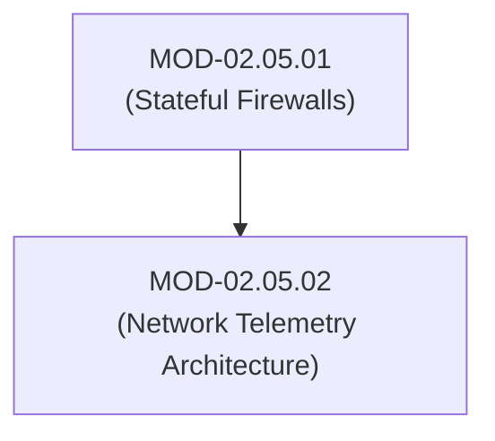
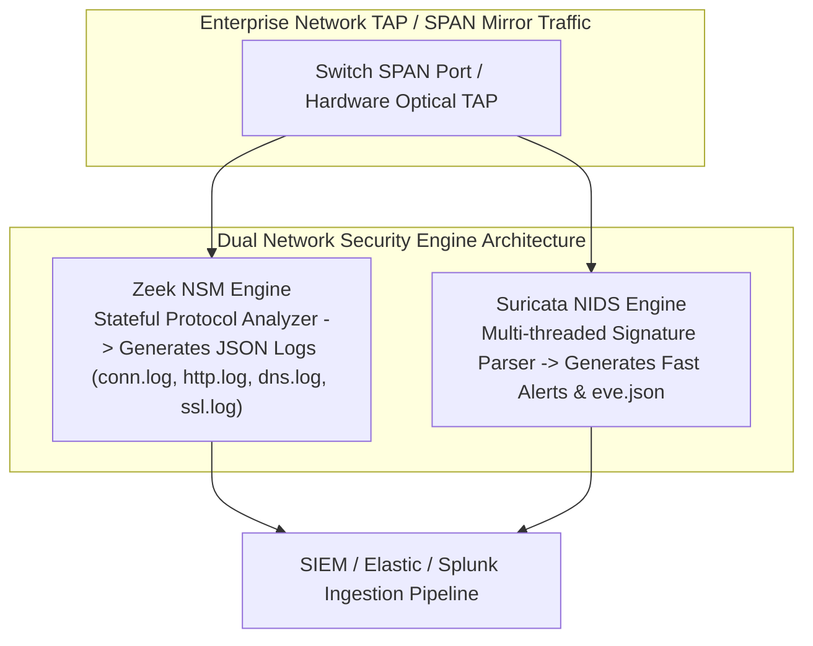

# Network Telemetry Architecture: NetFlow/IPFIX, Zeek & Suricata Detection Engine

## 1. Overview & Purpose
Network Security Monitoring (NSM) provides real-time visibility into traffic patterns, protocol transactions, and security threats across enterprise infrastructure.

This module details Full Packet Capture (PCAP), Flow Record telemetry (NetFlow v9 / IPFIX), Zeek Network Security Monitoring framework, Suricata Signature Inspection Engine, and network fingerprinting.

---

## 2. Prerequisites & Prerequisites Graph
- **Prerequisites**: `MOD-02.05.01` (Stateful Firewalls & Packet Processing).



---

## 3. Learning Objectives & Taxonomy Alignment
- **L1 Awareness**: Contrast Full Packet Capture (PCAP) and IPFIX Flow Telemetry.
- **L2 Understanding**: Explain Zeek script event engines (`event http_request`) vs Suricata signature pattern matching.
- **L3 Practical**: Analyze PCAP files with `tcpdump` and `Zeek`, write custom Suricata detection rules.
- **L4 Engineering**: Design enterprise multi-gigabit network monitoring pipelines distributing SPAN/TAP mirror traffic across Zeek clusters.

---

## 4. L1 — Awareness (Overview & Core Terminology)
Network telemetry operates across three abstraction tiers:
1. **Full Packet Capture (PCAP)**: Complete copy of raw binary frames (High storage requirement).
2. **Flow Summaries (NetFlow v9 / IPFIX)**: Statistical metadata (SrcIP, DstIP, SrcPort, DstPort, Protocol, Bytes, Packets).
3. **Transaction Logs (Zeek NSM)**: Structured protocol metadata (DNS queries, HTTP headers, TLS certificate details).

---

## 5. L2 — Understanding (Core Theory & Mechanics)



---

## 6. L3 — Practical (Commands & Configurations)

### Running Zeek against PCAP Capture File:
```bash
# Analyze PCAP file using Zeek
zeek -r traffic_capture.pcap

# Inspect generated structured logs
cat conn.log | zeek-cut id.orig_h id.resp_h id.resp_p proto service
cat dns.log | zeek-cut query answers
```

### Writing a Custom Suricata Signature Rule:
```text
# /etc/suricata/rules/custom.rules
alert http $HOME_NET any -> $EXTERNAL_NET any (msg:"MALWARE - Malicious User-Agent Detected"; content:"User-Agent|3a 20|CustomMalwareClient"; http_header; sid:3000001; rev:1;)
```

---

## 7. L4 — Engineering (Design Trade-offs & System Integration)
- **Zeek vs Suricata**: Suricata is a signature-driven Intrusion Detection System (IDS) optimized for fast string/regex pattern matching. Zeek is an extensible, Turing-complete event-driven scripting environment designed for deep protocol behavioral analysis and long-term security metrics.

---

## 8. Internal Architecture & Data Structures
IPFIX (IP Flow Information Export - RFC 7011) Template Record:
```text
Set ID: 2 (Template Set)
Template ID: 256
Field Count: 7
  1. sourceIPv4Address (4 Bytes)
  2. destinationIPv4Address (4 Bytes)
  3. octetDeltaCount (8 Bytes)
  4. packetDeltaCount (8 Bytes)
  5. sourceTransportPort (2 Bytes)
  6. destinationTransportPort (2 Bytes)
  7. protocolIdentifier (1 Byte)
```

---

## 9. Security Implications & Boundary Controls
- **Encrypted Traffic Visibility**: As TLS 1.3 and ECH obscure payloads and SNI headers, NSM architecture relies on flow heuristics (packet size sequences, inter-packet timing), TLS JA4 fingerprints, and passive DNS mapping.

---

## 10. Attack Vectors & Exploitation Primitives
1. **Sensor Evasion via IP Fragmentation**: Splitting attack payloads across fragmented IP packets to evade un-assembled NIDS signature engines.
2. **Log Flooding / NIDS Resource Exhaustion**: Generating high volumes of false alerts to exhaust SIEM disk storage.

---

## 11. Defense & Telemetry Verification
- Deploy **Zeek + Suricata** in tandem across core network choke points.
- Implement **IPFIX flow collection** on all perimeter routers.

---

## 12. Detection & Telemetry Verification

### Suricata Eve JSON Alert Output Format:
```json
{
  "timestamp": "2026-07-29T18:00:00.000000",
  "event_type": "alert",
  "src_ip": "192.168.1.50",
  "src_port": 54321,
  "dest_ip": "198.51.100.1",
  "dest_port": 80,
  "proto": "TCP",
  "alert": {
    "action": "allowed",
    "signature_id": 3000001,
    "signature": "MALWARE - Malicious User-Agent Detected",
    "category": "A Network Trojan was detected",
    "severity": 1
  }
}
```

---

## 13. Hands-On Lab Reference
- **Associated Lab**: `LAB-NET010` (Zeek Scripting & Suricata Rule Development).

---

## 14. Related Projects & Applications
- **Associated Project**: `PRJ-TIP001` (Enterprise Threat Investigation Platform).

---

## 15. Troubleshooting & Diagnostics Matrix

| Symptom | Root Cause | Remediation / Diagnostic Command |
| :--- | :--- | :--- |
| Suricata drops packets during network traffic peak. | Single worker thread bottleneck or packet ring buffer overflow. | Set `runmode: workers` and increase `ring-size` in `suricata.yaml`. |

---

## 16. Related Concepts & Cross-Domain Links
- `CON-NET018`: Zeek Event Engine (`DOM-02`)
- `CON-NET019`: IPFIX Flow Records (`DOM-02`)

---

## 17. Technical Interview Preparation (Q&A)
**Q: What is the fundamental difference between NetFlow/IPFIX flow records and Zeek logs?**  
*Answer*: NetFlow/IPFIX provides aggregate statistical summaries of transport connections (source/destination IPs, ports, packet counts, byte counts) without inspecting application payloads. Zeek performs deep protocol parsing, generating detailed structured transaction logs containing application-layer details (such as HTTP request URIs, Host headers, DNS queries, TLS certificate serial numbers, and JA3/JA4 fingerprints).

---

## 18. Self-Assessment & Mastery Checklist
- [ ] Understand differences between PCAP, IPFIX, Zeek, and Suricata.
- [ ] Able to write custom Zeek scripts and Suricata signatures.

---

## 19. References & Further Reading
- Zeek Documentation: *The Zeek Network Security Monitor Reference*.
- Suricata Documentation: *Suricata User Guide & Rule Formatting*.
