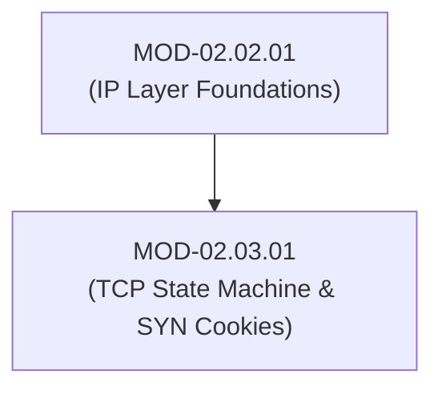

# TCP State Machine, Windowing & SYN Cookie Defense

## 1. Overview & Purpose
Transmission Control Protocol (TCP) provides reliable, connection-oriented, flow-controlled byte stream transmission over IP networks (Layer 4).

This module details the 11-state TCP finite state machine, 3-Way Handshake / 4-Way Teardown, TCP Window Scaling, SYN Flood Denial-of-Service attacks, SYN Cookies (`syncookies`), and TCP Reset (`RST`) injection attacks.

---

## 2. Prerequisites & Prerequisites Graph
- **Prerequisites**: `MOD-02.02.01` (IPv4/IPv6 Protocol Internals).



---

## 3. Learning Objectives & Taxonomy Alignment
- **L1 Awareness**: Trace the 3-Way Handshake (`SYN`, `SYN-ACK`, `ACK`).
- **L2 Understanding**: Detail the TCP State Machine (`LISTEN`, `SYN_RCVD`, `ESTABLISHED`, `FIN_WAIT_1`, `TIME_WAIT`) and SYN Cookie mathematical generation.
- **L3 Practical**: Analyze TCP flags in Wireshark and configure Linux kernel TCP stack hardening (`sysctl`).
- **L4 Engineering**: Design kernel-bypass eBPF XDP SYN flood mitigation systems capable of handling 100M+ pps attacks.

---

## 4. L1 — Awareness (Overview & Core Terminology)
TCP establishes a virtual connection between endpoints using Sequence Numbers (`SEQ`) and Acknowledgment Numbers (`ACK`). The 3-way handshake initializes sequence numbers and negotiates options (MSS, Window Scale, SACK).

---

## 5. L2 — Understanding (Core Theory & Mechanics)

```mermaid
graph TD
    subgraph TCP 3-Way Handshake & SYN Flood Vulnerability
        CLIENT["Client (Attacker / Spoofed IPs)"]
        SERVER["Server (Allocates TCB Memory in SYN Queue)"]

        CLIENT -->|1. SYN (SEQ = x)| SERVER
        SERVER -->|2. SYN-ACK (SEQ = y, ACK = x+1)<br/>Allocates Transmission Control Block (TCB)| CLIENT
        CLIENT -.->|3. ACK Omitted (Leaves Half-Open TCB)| SERVER
    end

    subgraph Linux Kernel SYN Cookie Protection
        COOKIE["SYN Cookie Encoding<br/>ISN = Hash(SrcIP, DstIP, SrcPort, DstPort, Secret) + MSS_Index"]
        SERVER <-->|Zero Memory Allocation until Valid ACK Returns| COOKIE
    end
```

### SYN Flood DDoS Attack Mechanics:
In a standard handshake, receiving a `SYN` forces the OS kernel to allocate a Transmission Control Block (TCB) in memory and place the connection in the `SYN_RCVD` state. An attacker sends millions of `SYN` packets with spoofed source IPs, exhausting the kernel's `SYN` queue buffer (`tcp_max_syn_backlog`) and causing refusal of legitimate connections.

### SYN Cookie Defense (`syncookies`):
SYN Cookies eliminate memory allocation during the `SYN_RCVD` state. When the SYN queue overflows, the kernel encodes the Initial Sequence Number (ISN) using a cryptographic hash of connection tuples and a secret key:

$$\text{ISN} = \text{SHA-256}(\text{SrcIP}, \text{DstIP}, \text{SrcPort}, \text{DstPort}, \text{Secret}) + \text{MSS Index}$$

When the client returns the final `ACK`, the kernel subtracts 1 from `ACK-1`, verifies the cryptographic hash, and allocates the TCB only after the handshake is successfully completed.

---

## 6. L3 — Practical (Commands & Configurations)

### Hardening Linux TCP Stack via `sysctl`:
```bash
# Enable SYN Cookies protection
sudo sysctl -w net.ipv4.tcp_syncookies=1

# Increase SYN backlog queue size
sudo sysctl -w net.ipv4.tcp_max_syn_backlog=4096

# Decrease TCP SYN-ACK retries to clear half-open connections faster
sudo sysctl -w net.ipv4.tcp_synack_retries=2

# Make settings persistent in /etc/sysctl.conf
echo "net.ipv4.tcp_syncookies = 1" | sudo tee -a /etc/sysctl.conf
```

---

## 7. L4 — Engineering (Design Trade-offs & System Integration)
- **SYN Cookies Limitations**: SYN Cookies disable advanced TCP options (such as Large Window Scale factors and Selective Acknowledgments - SACK) because options cannot fit inside the 32-bit ISN encoding. High-throughput networks rely on eBPF XDP hardware SYN proxies to preserve TCP options.

---

## 8. Internal Architecture & Data Structures
TCP Header Format (20 Bytes Base):
```text
Source Port (16b) | Destination Port (16b)
Sequence Number (32b)
Acknowledgment Number (32b)
Data Offset (4b) | Reserved (3b) | Flags: URG, ACK, PSH, RST, SYN, FIN (6b) | Window Size (16b)
Checksum (16b) | Urgent Pointer (16b)
TCP Options (Variable: MSS, Window Scale, SACK Permitted, Timestamps)
```

---

## 9. Security Implications & Boundary Controls
- **TCP RST Injection**: Attackers who can sniff active TCP sequence numbers can forge a `TCP RST` packet (`RST=1`), immediately tearing down an active TCP session (e.g., terminating BGP peering or SSH sessions).

---

## 10. Attack Vectors & Exploitation Primitives
1. **SYN Flood DDoS**: Saturating server SYN queues using spoofed high-rate `SYN` packets.
2. **TCP Session Hijacking**: Predicting TCP Initial Sequence Numbers (ISNs) to inject malicious payloads into established TCP streams.

---

## 11. Defense & Telemetry Verification
- Enable **Kernel SYN Cookies (`net.ipv4.tcp_syncookies = 1`)**.
- Deploy **eBPF XDP SYN Proxy** mitigations on perimeter edge routers.

---

## 12. Detection & Telemetry Verification

### Suricata Rule (TCP SYN Flood Detection):
```text
alert tcp any any -> $HOME_NET any (msg:"DOS - Potential TCP SYN Flood Detected"; flags:S; threshold: type threshold, track by_dst, count 500, seconds 1; sid:2000002; rev:1;)
```

---

## 13. Hands-On Lab Reference
- **Associated Lab**: `LAB-NET005` (TCP SYN Flood Attack & eBPF XDP Mitigation).

---

## 14. Related Projects & Applications
- **Associated Project**: `PRJ-TIP001` (Network Sensor Engine).

---

## 15. Troubleshooting & Diagnostics Matrix

| Symptom | Root Cause | Remediation / Diagnostic Command |
| :--- | :--- | :--- |
| `dmesg` logs `Possible SYN flooding on port 80. Sending cookies.`. | SYN backlog queue full due to high connection volume or attack. | Enable `tcp_syncookies` and increase `tcp_max_syn_backlog`. |

---

## 16. Related Concepts & Cross-Domain Links
- `CON-NET008`: TCP 3-Way Handshake (`DOM-02`)
- `CON-NET009`: SYN Cookie Generation (`DOM-02`)

---

## 17. Technical Interview Preparation (Q&A)
**Q: How do SYN Cookies defend against TCP SYN Flood attacks without allocating state?**  
*Answer*: Instead of allocating a Transmission Control Block (TCB) in memory upon receiving a `SYN`, the server encodes the client's connection parameters and a secret hash directly into the 32-bit Initial Sequence Number (`ISN`) returned in the `SYN-ACK`. When the client returns the final `ACK`, the server verifies the cryptographic payload in the `ACK-1` value. If valid, memory is allocated only then.

---

## 18. Self-Assessment & Mastery Checklist
- [ ] Understand TCP 11-state transition machine.
- [ ] Able to configure Linux kernel `sysctl` TCP stack hardening parameters.

---

## 19. References & Further Reading
- RFC 793: *Transmission Control Protocol Specification*.
- RFC 4987: *TCP SYN Flooding Attacks and Common Mitigations*.
