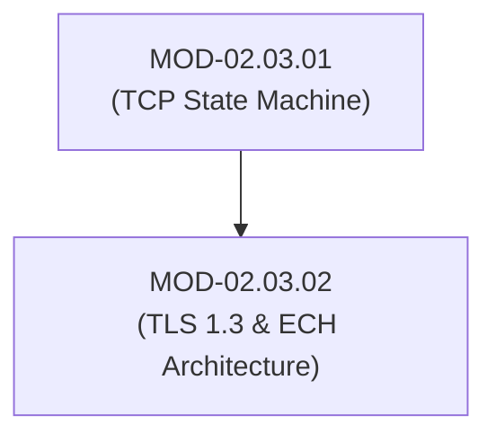

# TLS 1.3 Architecture, Cryptographic Handshakes & Encrypted Client Hello (ECH)

## 1. Overview & Purpose
Transport Layer Security (TLS 1.3 - RFC 8446) provides privacy, data integrity, and mutual authentication for internet communications.

This module details TLS 1.2 vs TLS 1.3 Handshake differences, ECDHE Perfect Forward Secrecy (PFS), Zero-RTT (0-RTT) early data risks, SNI leakage, Encrypted Client Hello (ECH / ESNI), and JA3/JA4 TLS fingerprinting.

---

## 2. Prerequisites & Prerequisites Graph
- **Prerequisites**: `MOD-02.03.01` (TCP State Machine) & Cryptography basics.



---

## 3. Learning Objectives & Taxonomy Alignment
- **L1 Awareness**: Contrast TLS 1.2 (2-RTT) and TLS 1.3 (1-RTT) handshakes.
- **L2 Understanding**: Explain Ephemeral Elliptic Curve Diffie-Hellman (ECDHE) key exchange and ECH outer/inner ClientHello encryption.
- **L3 Practical**: Inspect TLS 1.3 handshake extensions in Wireshark and compute JA3/JA4 client fingerprints.
- **L4 Engineering**: Design zero-trust TLS inspection architectures and ECH-aware network perimeters.

---

## 4. L1 — Awareness (Overview & Core Terminology)
TLS 1.3 eliminates obsolete cryptographic algorithms (RSA key exchange, CBC ciphers, SHA-1) and mandates **Perfect Forward Secrecy (PFS)** using ephemeral Diffie-Hellman keys.

---

## 5. L2 — Understanding (Core Theory & Mechanics)

```mermaid
graph TD
    subgraph TLS 1.3 1-RTT Handshake Sequence
        CLIENT["Client"]
        SERVER["Server"]

        CLIENT -->|1. ClientHello + Key Share (ECDHE Public Key) + ECH| SERVER
        SERVER -->|2. ServerHello + Key Share + Encrypted Extensions + Cert + Finished| CLIENT
        CLIENT -->|3. Finished (Application Data Encrypted)| SERVER
    end
```

### Key Differences (TLS 1.2 vs TLS 1.3):
- **Latency**: TLS 1.2 requires 2 full round trips (2-RTT) before application data flows. TLS 1.3 completes handshake in 1 round trip (1-RTT).
- **PFS Enforcement**: TLS 1.3 removes static RSA key exchange; if a server's private key is compromised in the future, past recorded traffic **cannot be decrypted**.
- **Encrypted Client Hello (ECH)**: In standard TLS, the Server Name Indication (SNI) header is sent in plaintext, leaking the domain name being visited. ECH encrypts the inner ClientHello (containing SNI) using the server's public key retrieved via DNS HTTPS records.

---

## 6. L3 — Practical (Commands & Configurations)

### Inspecting TLS Handshake via OpenSSL:
```bash
# Connect using TLS 1.3 and display certificate chain
openssl s_client -connect example.com:443 -tls1_3 -showcerts

# Test SNI negotiation
openssl s_client -connect example.com:443 -servername example.com
```

### Computing JA3 Hash in Python:
```python
import hashlib

# JA3 string format: SSLVersion,Cipher,SSLExtension,EllipticCurve,EllipticCurvePointFormat
ja3_string = "771,4865-4866-4867,0-23-65281-10-11,29-23-24,0"
ja3_hash = hashlib.md5(ja3_string.encode()).hexdigest()
print(f"JA3 Fingerprint: {ja3_hash}")
```

---

## 7. L4 — Engineering (Design Trade-offs & System Integration)
- **0-RTT Replay Attacks**: TLS 1.3 supports 0-RTT early data for returning clients. However, early data lacks replay protection; adversaries can intercept and replay 0-RTT HTTP requests (e.g., repeating a payment transaction) unless endpoints restrict 0-RTT to idempotent `GET` requests.

---

## 8. Internal Architecture & Data Structures
TLS 1.3 ClientHello Message Format:
```text
ContentType: Handshake (22)
Protocol Version: TLS 1.2 (0x0303 - legacy field for compatibility)
Handshake Type: ClientHello (1)
Random: 32 bytes
Cipher Suites: TLS_AES_256_GCM_SHA384 (0x1302), TLS_CHACHA20_POLY1305_SHA256 (0x1303)
Extension: supported_versions (TLS 1.3 / 0x0304)
Extension: key_share (ECDHE Curve25519 / X25519 public key)
Extension: encrypted_client_hello (Outer ECH wrapper)
```

---

## 9. Security Implications & Boundary Controls
- **Loss of Passive Network Inspection**: Encrypted Client Hello (ECH) prevents passive firewalls and IDS sensors from seeing domain names in SNI headers. Perimeter security must rely on DNS filtering, proxy re-encryption, or IP reputation.

---

## 10. Attack Vectors & Exploitation Primitives
1. **0-RTT Replay Attacks**: Intercepting and re-sending early data packets before server state updates.
2. **JA3/JA4 Fingerprint Evasion**: Malware modifying cipher suite order and TLS extension ordering to mimic legitimate browser fingerprints (e.g., impersonating Chrome).

---

## 11. Defense & Telemetry Verification
- Enforce **TLS 1.3 Only** policy on high-security endpoints (`MinVersion TLSv1.3`).
- Implement **JA3/JA4 Fingerprint Logging** on perimeter reverse proxies.

---

## 12. Detection & Telemetry Verification

### Zeek Script (Malicious JA3 Fingerprint Alert):
```zeek
event ssl_established(c: connection) {
    if ( c$ssl?$ja3 && c$ssl$ja3 == "e7d705a3286e4ae2a7e8c3bcfbc9fc77" ) {
        NOTICE([$note=SSL::Malicious_JA3,
                $msg=fmt("Malware TLS fingerprint detected from %s", c$id$orig_h)]);
    }
}
```

---

## 13. Hands-On Lab Reference
- **Associated Lab**: `LAB-NET006` (TLS 1.3 Wireshark Decryption & JA3 Analysis).

---

## 14. Related Projects & Applications
- **Associated Project**: `PRJ-TIP001` (TLS Fingerprint Analyzer Engine).

---

## 15. Troubleshooting & Diagnostics Matrix

| Symptom | Root Cause | Remediation / Diagnostic Command |
| :--- | :--- | :--- |
| `openssl s_client` returns `handshake failure` (`35`). | No overlapping cipher suites or protocol version mismatch. | Verify client supports `TLS_AES_256_GCM_SHA384` or `TLS_CHACHA20_POLY1305_SHA256`. |

---

## 16. Related Concepts & Cross-Domain Links
- `CON-NET010`: TLS 1.3 Handshake (`DOM-02`)
- `CON-NET011`: Encrypted Client Hello ECH (`DOM-02`)
- `CON-CRY002`: Elliptic Curve Diffie-Hellman ECDHE (`DOM-03`)

---

## 17. Technical Interview Preparation (Q&A)
**Q: Why does TLS 1.3 mandate ECDHE key exchange and remove static RSA key exchange?**  
*Answer*: Static RSA key exchange uses the server's long-term private key to encrypt the pre-master secret. If the private key is compromised in the future, an attacker can decrypt all previously recorded historical traffic. ECDHE generates temporary (ephemeral) key pairs for every individual session, guaranteeing Perfect Forward Secrecy (PFS).

---

## 18. Self-Assessment & Mastery Checklist
- [ ] Understand 1-RTT TLS 1.3 handshake message flow.
- [ ] Able to parse ECH extensions and calculate JA3 hashes.

---

## 19. References & Further Reading
- RFC 8446: *The Transport Layer Security (TLS) Protocol Version 1.3*.
- Cloudflare Research: *Encrypted Client Hello (ECH) Architecture*.
