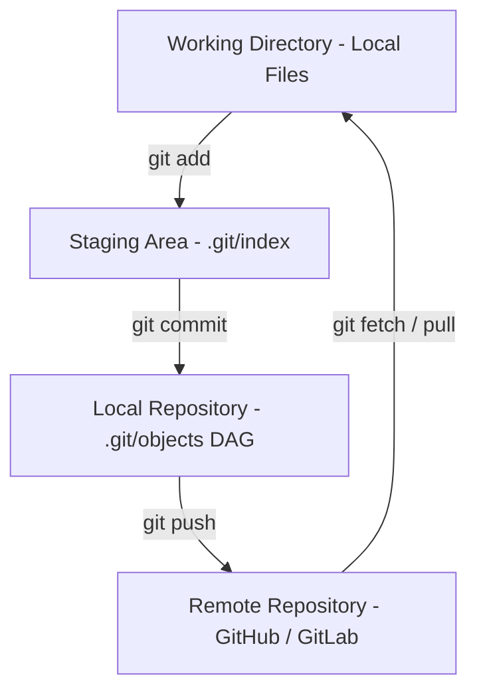
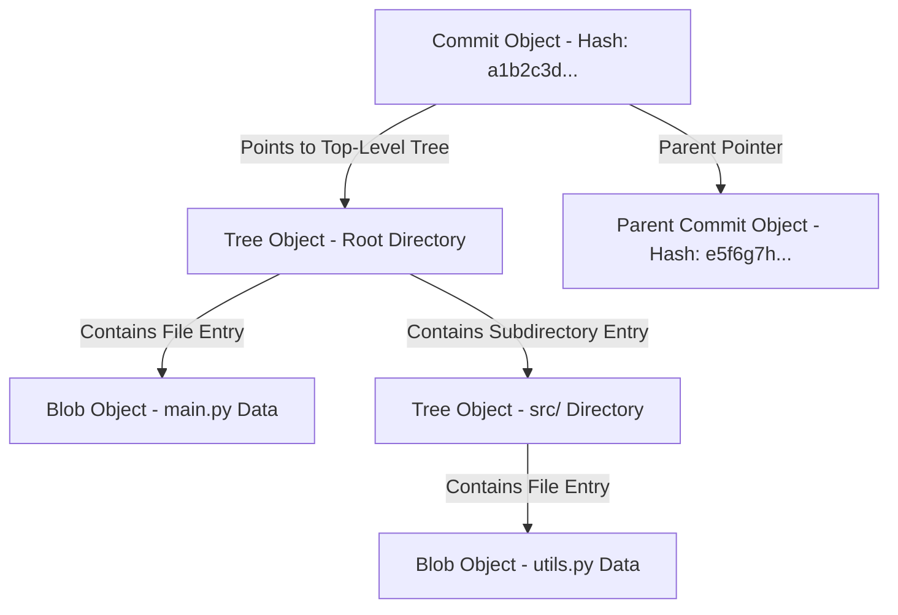
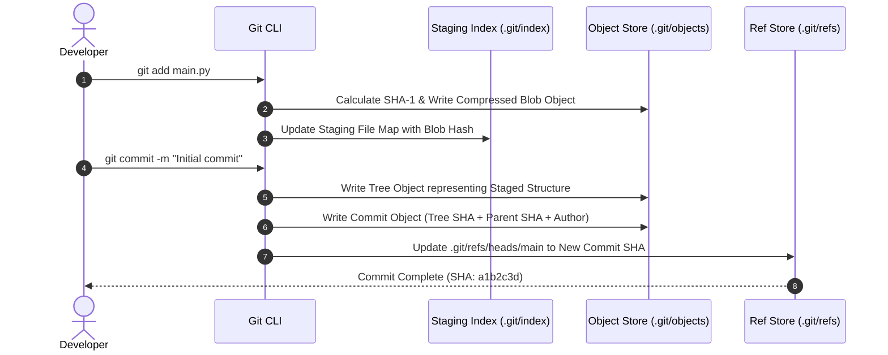

# P-01: Git & Version Control Systems

> **Module ID:** P-01  
> **Category:** Software Engineering & DevSecOps  
> **Difficulty:** Intermediate  
> **Estimated Time:** 6 Hours  
> **Prerequisites:** Command Line / Shell Basics  
> **Related Topics:** Branching Strategies, Git Internals, Reflog, Merge Conflicts, CI/CD Pipelines  
> **Framework Standard:** Cyber Act Universal Engineering Framework (v2 Standard)

---

# Part I — Understanding

## Overview

### Definition
* **Definition:** Git is a distributed content-addressable version control system (VCS) that tracks source code and binary file changes across a directed acyclic graph (DAG) of immutable revision objects.
* **One-Line Summary:** A distributed content-addressable object database tracking codebase evolution via Directed Acyclic Graphs (DAGs).

### Purpose & Problem Statement
* **Purpose:** Enables multi-developer collaboration, non-linear development branching, cryptographic commit integrity verification, and instant historical rollback without requiring a central server single point of failure.
* **Problem it Solves:** Eliminates file overwrites, uncoordinated concurrent editing, loss of historic codebase states, and untracked code modifications.
* **Why it Exists:** Developed by Linus Torvalds in 2005 for Linux kernel development after BitKeeper revoked free licensing, requiring extreme speed, distributed operation, and safeguards against corruption.

### History & Evolution
* **Origins & Evolution:** Created in 2005 (v1.0), evolved from SHA-1 to SHA-256 object hashing, added Git LFS for binary storage, and now powers modern DevSecOps, GitHub/GitLab automation, and GitOps infrastructure pipelines.

### Mental Model & Analogy
* **Real-World Analogy:** A cryptographic bank ledger where every entry (commit) is signed, immutable, chained to previous transactions, and cloned in full to every auditor's computer.
* **Mental Model:** A local key-value object database (`.git/objects`) storing zlib-compressed snapshots mapped by content SHA hash, with pointer references (`HEAD`, branches) pointing to DAG nodes.

> [!NOTE]
> Think of Git not as a system that tracks file diffs, but as a mini filesystem that takes cryptographically signed snapshots of your entire repository over time.

---

## Terminology

### Key Terms & Definitions

#### **Working Tree**
* **Definition:** The local directory on the filesystem containing uncommitted files currently being edited by the developer.
* **Context / Scope:** User space filesystem.
* **Key Properties:** Contains modified, untracked, and clean files before staging.

#### **Staging Area (Index)**
* **Definition:** A binary cache file (`.git/index`) acting as a launchpad for the next commit snapshot.
* **Context / Scope:** Pre-commit preparation area.
* **Key Properties:** Pre-assembles directory tree objects before committing to the repository database.

#### **Commit Object**
* **Definition:** An immutable database object containing a pointer to a root Tree object, author/committer metadata, parent commit SHAs, and a log message.
* **Context / Scope:** A node within the Directed Acyclic Graph (DAG).
* **Key Properties:** Cryptographically identified by its 40-character SHA-1 (or 64-character SHA-256) hash.

#### **HEAD Pointer**
* **Definition:** A reference pointer stored in `.git/HEAD` that tracks the currently checked-out commit or active branch tip.
* **Context / Scope:** Local repository state indicator.
* **Key Properties:** Can be in a "detached HEAD" state if pointing directly to a commit SHA rather than a branch ref.

#### **Blob Object**
* **Definition:** A Git internal object storing raw file content bytes without storing filenames, directory structure, or file permissions.
* **Context / Scope:** Low-level object database (`.git/objects/`).
* **Key Properties:** Content-addressable; identical files share the exact same Blob hash regardless of filename.

---

## Big Picture

### Domain & Ecosystem Placement
* **Domain:** Systems Engineering & Software Development
* **Parent Topic:** Software Configuration Management (SCM)
* **Child Topics:** Git Internals, Branching Strategies, Merge Conflicts, Rebase, GitHub/GitLab Workflows, Reflog, Stash, Git Security
* **Prerequisites:** Command Line / Shell Fundamentals
* **Topics Enabled:** DevSecOps Pipelines, CI/CD Automation, GitOps Infrastructure (ArgoCD, Flux), Open-Source Collaboration

### Architectural Placement
* **Technology Ecosystem:** Local SCM CLI (`git`), Remote Hosting (GitHub, GitLab, Bitbucket), DevSecOps CI/CD (GitHub Actions, GitLab CI).
* **Architecture Placement:** Development Tooling & Source Code Control Layer.
* **Stack Placement:** Foundation Layer across all software stacks.

### System Ecosystem Map


---

# Part II — Internal Engineering

## Architecture

### Core Subsystems & Components
* **Components:** Object Database (`.git/objects/`), Reference Storage (`.git/refs/`), Index Cache (`.git/index`), Configuration Engine (`.git/config`), Hooks Engine (`.git/hooks/`).
* **Services & Processes:** Local execution CLI daemon & SSH/HTTP network transport helpers.

### Memory & Data Structures
* **Internal Object Store (`.git/objects/`):**
  * **Blob Object:** Stores raw file data compressed via zlib. `Header: "blob <size>\0<content>"`.
  * **Tree Object:** Stores directory listings mapping file names, permissions (mode `100644`), and Blob/Tree SHA hashes.
  * **Commit Object:** Points to a top-level Tree object and parent Commit SHA(s), accompanied by author, committer, and log message metadata.
  * **Tag Object:** An annotated pointer referencing a specific commit object with a cryptographic PGP signature.

### Component Architecture Map


---

## Mechanism

### Core Execution Workflow
1. Developer executes `git add main.py`.
2. Git computes SHA-1 hash of `main.py`, compresses its contents via zlib, writes the object file to `.git/objects/xx/yyyy...`, and updates the staging binary index (`.git/index`).
3. Developer executes `git commit -m "Add main script"`.
4. Git writes a new Tree object for the current staging area and creates a Commit object pointing to the Tree and current parent commit SHA.
5. Git updates the reference file `.git/refs/heads/main` to store the new Commit SHA.

### Execution Sequence Map


### Failure & Error Flow
* **Divergent History (Push Rejected):** Local branch tip is behind remote branch tip ➔ Remote host rejects `git push` with `[rejected - non-fast-forward]` ➔ Developer must execute `git pull --rebase` to integrate remote changes before pushing.

---

## Relationships

### Upstream & Downstream Dependencies
* **Depends On:** Local Filesystem (POSIX/NTFS), Cryptographic Hashing Libraries (SHA-1/SHA-256), Compression Libraries (zlib), SSH / HTTPS Network Sockets.
* **Used By:** Developers, CI/CD Engines (GitHub Actions, Jenkins), Deployment Agents (ArgoCD), Code Review Systems.
* **Communicates With:** Remote SCM Hosts via Smart HTTP protocol (`https://`) or SSH Protocol (`git@github.com:...`).

### Resource Lifecycle
* **Creates / Uses:** Allocates `.git/objects/` Blobs, Trees, and Commits; updates `.git/refs/`.
* **Execution Ordering:** `git init` ➔ `git add` ➔ `git commit` ➔ `git push`.

---

## Runtime Environment

### Execution & System Context
* **Execution Environment:** User Space CLI tool running on local developer hosts, CI/CD runners, or server instances.
* **Location:** Local Developer Workstation / Cloud SCM Server.
* **Space:** User Space.
* **Execution Unit:** Single-threaded CLI Process.
* **Storage Unit:** Disk Storage (`.git/` directory).
* **Deployment Model:** Installed binary (`git` package).
* **Lifetime:** Persistent across the repository software development lifecycle.

---

# Part III — Operations

## Installation

### Setup Procedures
```bash
# Ubuntu / Debian
sudo apt update && sudo apt install -y git

# RedHat / CentOS
sudo dnf install -y git

# Verify installation
git --version
```

---

## Configuration

### System & Service Configuration
* **Configuration Files:** `.git/config` (Local repo), `~/.gitconfig` (Global user), `/etc/gitconfig` (System-wide).
* **Environment Variables:** `GIT_AUTHOR_NAME`, `GIT_AUTHOR_EMAIL`, `GIT_SSH_COMMAND`.

```bash
# Global Configuration Commands
git config --global user.name "Vamshi"
git config --global user.email "vamshi@cyber.local"
git config --global init.defaultBranch main
git config --global core.editor "vim"
```

---

## Interfaces

### Commands

#### `git init`
* **Purpose:** Initializes a new, empty Git repository by creating the `.git` directory structure.
* **Syntax:** `git init [directory]`
* **Parameters:**
  * `-b <branch-name>`: Specifies the initial branch name (e.g. `main`).
* **Example Usage:**
  ```bash
  git init -b main my-project
  ```

---

#### `git add`
* **Purpose:** Adds file modifications from the working directory into the staging area (Index).
* **Syntax:** `git add <file-path>`
* **Parameters:**
  * `.`: Stages all modifications in the current directory and subdirectories.
  * `-p`: Interactively stage patch chunks.
  * `-u`: Stages modified and deleted files, excluding untracked files.
* **Example Usage:**
  ```bash
  git add main.py
  git add -p
  ```

---

#### `git commit`
* **Purpose:** Saves the staged snapshot into the repository object database as a new Commit object.
* **Syntax:** `git commit -m "commit message"`
* **Parameters:**
  * `-m "<msg>"`: Specifies the commit message string.
  * `-a`: Automatically stage tracked files before committing.
  * `--amend`: Replace the tip commit with a new commit combining staged changes.
* **Example Usage:**
  ```bash
  git commit -m "feat: Add authentication module"
  git commit --amend --no-edit
  ```

---

#### `git status`
* **Purpose:** Displays working directory and staging index state (tracked, untracked, modified files).
* **Syntax:** `git status [options]`
* **Parameters:**
  * `-s`: Display short format output.
* **Example Usage:**
  ```bash
  git status -s
  ```

---

#### `git diff`
* **Purpose:** Shows line-by-line changes between working tree, staging index, and commits.
* **Syntax:** `git diff [options]`
* **Parameters:**
  * `--staged` / `--cached`: Show changes staged for the next commit.
  * `<branch1>..<branch2>`: Show differences between two branches.
* **Example Usage:**
  ```bash
  git diff --staged
  ```

---

#### `git log`
* **Purpose:** Shows commit revision history graph and author details.
* **Syntax:** `git log [options]`
* **Parameters:**
  * `--oneline`: Displays each commit on a single line with abbreviated SHA.
  * `--graph`: Displays ASCII DAG graph representation of branch history.
  * `-n <count>`: Limit commit log count.
* **Example Usage:**
  ```bash
  git log --oneline --graph --all -n 10
  ```

---

#### `git branch` & `git switch`
* **Purpose:** Manages branches (create, list, delete) and switches active working branches.
* **Syntax:** `git branch <branch-name>` / `git switch <branch-name>`
* **Parameters:**
  * `git branch -a`: List all local and remote branches.
  * `git branch -d <name>`: Delete a merged branch.
  * `git switch -c <name>`: Create and switch to a new branch.
* **Example Usage:**
  ```bash
  git switch -c feature/auth-service
  ```

---

#### `git merge`
* **Purpose:** Integrates commits from a target branch into the current active branch.
* **Syntax:** `git merge <target-branch>`
* **Parameters:**
  * `--no-ff`: Create a merge commit even if fast-forward is possible.
  * `--abort`: Abort conflict resolution and restore pre-merge state.
* **Example Usage:**
  ```bash
  git merge feature/auth-service
  ```

---

#### `git rebase`
* **Purpose:** Reapplies commits on top of another base tip, creating a linear history.
* **Syntax:** `git rebase <base-branch>`
* **Parameters:**
  * `-i <commit-sha>`: Launch interactive rebase to squash, edit, or reorder commits.
  * `--abort`: Abort rebase operation on conflict.
* **Example Usage:**
  ```bash
  git rebase -i HEAD~3
  ```

---

#### `git stash`
* **Purpose:** Temporarily shelves uncommitted working directory modifications for later restoration.
* **Syntax:** `git stash [save|pop|list|drop]`
* **Parameters:**
  * `push -m "<msg>"`: Save working changes to stash stack with message.
  * `pop`: Apply and remove most recent stash item.
* **Example Usage:**
  ```bash
  git stash push -m "work-in-progress"
  git stash pop
  ```

---

#### `git reflog`
* **Purpose:** Displays the log of where `HEAD` and branch references pointed in the local repository over time.
* **Syntax:** `git reflog`
* **Example Usage:**
  ```bash
  git reflog
  ```

---

#### `git reset` & `git revert`
* **Purpose:** `git reset` moves `HEAD` to a previous commit SHA (modifying history); `git revert` creates a new inverse commit undoing a target commit (preserving history).
* **Syntax:** `git reset [--soft|--mixed|--hard] <commit>` / `git revert <commit>`
* **Example Usage:**
  ```bash
  git reset --hard HEAD~1
  git revert a1b2c3d
  ```

---

#### `git cherry-pick`
* **Purpose:** Applies the changes introduced by an existing commit on another branch onto the current branch tip.
* **Syntax:** `git cherry-pick <commit-sha>`
* **Example Usage:**
  ```bash
  git cherry-pick e5f6g7h
  ```

---

### APIs & Libraries
* **SDKs & Libraries:** `libgit2` (C library for Git operations), `GitPython` (Python interface to Git), `go-git` (Go implementation).
* **APIs:** GitHub REST API v3, GitHub GraphQL API v4, GitLab REST API.

### Data Formats & Protocols
* **File Formats:** Packfiles (`.pack`), Index files (`.idx`), Loose objects (`.git/objects/xx/yyy`), Commit graphs (`commit-graph`).
* **Protocols & RFCs:** Smart HTTP Protocol (`https://`), Git Native Protocol (`git://`), SSH Protocol (`git@github.com:...`).

---

# Part IV — Observation

## Monitoring

### Telemetry & Inspection Tools
* **Inspection Tools:** `git status`, `git log --graph --oneline`, `git cat-file -p <sha>`, `git verify-pack -v`, `git count-objects -v`.
* **Log Sources:** `.git/logs/HEAD`, `.git/logs/refs/heads/main`.

---

## Debugging

### Step-by-Step Debugging Workflow
1. **Inspect Working Directory:** Run `git status` to verify modified vs staged files.
2. **Inspect Object Database:** Run `git cat-file -t <sha>` to view object type (blob, tree, commit).
3. **Recover Lost Commits:** Run `git reflog` to identify lost commit SHAs, then restore using `git checkout <sha>` or `git reset --hard <sha>`.

> [!TIP]
> Use `git bisect` to perform automated binary searches across commit history to locate the exact commit that introduced a bug.

---

# Part V — Security

## Security

### Threat Model & Attack Surface
* **Threat Model:** Hardcoded secret credentials in commits, malicious git hooks (`.git/hooks/`), dependency typosquatting, MITM during unencrypted HTTP pushes.
* **Attack Surface:** Commits, remote repository URL transports, custom hooks.

### Attack Vectors & Vulnerabilities
* **Secret Leaks in Commits:** Developers accidentally committing API keys or SSH private keys. Deleting the file in a later commit leaves the key accessible in historic commit Blobs.

### Detection & Telemetry
* **Detection Opportunities:** Auditd EXECVE logs capturing `git push` execution, pre-commit secret scanner logs (`gitleaks`, `trufflehog`).
* **MITRE ATT&CK Mapping:** T1552.001 (Unsecured Credentials: Credentials In Files).

### Hardening & Security Best Practices
* Enforce **GPG / SSH Commit Signing** (`git config --global commit.gpgSign true`).
* Enforce **Pre-commit Hooks** (`gitleaks`, `trufflehog`) to scan for secrets before commits.
* Configure strict `.gitignore` patterns for credentials and build artifacts.
* Purge leaked secrets from history using `git-filter-repo` or BFG Repo-Cleaner.

- [ ] Is commit signing enabled via GPG or SSH keys?
- [ ] Are pre-commit secret scanners installed in the repository?
- [ ] Is main branch protection enabled on remote SCM host?

> [!CAUTION]
> Deleting a secret file in a new commit does NOT remove it from history. Attackers can still extract it from historic Commit Blobs unless history is rewritten via `git-filter-repo`.

---

# Part VI — Engineering

## Engineering Analysis

### Design Rationale & Philosophy
* Git uses content-addressable storage where object identity equals the cryptographic hash of its contents. This makes data corruption or tampering immediately detectable.

### Technology Comparison Matrix
| Attribute | Git | Subversion (SVN) | Mercurial (Hg) |
| :--- | :--- | :--- | :--- |
| **Architecture** | Distributed (Full repo local) | Centralized Server | Distributed |
| **Branching** | Instantaneous Pointer Move | Slow Directory Copy | Branch Pointers |
| **Offline Work** | Complete Capabilities | Requires Connection | Complete Capabilities |

---

# Part VII — Practical

## Basic Lab
```bash
mkdir -p ~/git-lab && cd ~/git-lab
git init -b main
echo "Hello Cyber Act" > file.txt
git add file.txt
git commit -m "Initial commit"
```

## Observation Lab
```bash
# Observe git log visual graph
git log --oneline --graph --all
```

## Internal Lab (Inspect Object Database)
```bash
# View object type and content of HEAD commit
COMMIT_SHA=$(git rev-parse HEAD)
git cat-file -t $COMMIT_SHA
git cat-file -p $COMMIT_SHA
```

## Security Lab (Recover Lost Commit via Reflog)
```bash
# 1. Create a dummy commit and reset hard to lose it
echo "Secret Data" > secret.txt
git add secret.txt && git commit -m "Accidental commit"
git reset --hard HEAD~1

# 2. Inspect reflog and restore lost commit
git reflog
# Locate commit SHA from reflog output and recover
```

---

# Part VIII — Reference

## Quick Reference & Cheat Sheet
* `git status` | `git add .` | `git commit -m "msg"` | `git push origin main`
* `git log --oneline --graph` | `git reflog` | `git cat-file -p <sha>` | `git switch -c <branch>`
* `git rebase -i HEAD~N` | `git cherry-pick <sha>` | `git stash` | `git stash pop`
* Key Directory: `.git/` (`.git/objects/`, `.git/refs/`, `.git/HEAD`, `.git/index`, `.git/hooks/`).

---

# Part IX — Professional

## Interview Questions

### Fundamental & Architecture Questions
* **Question 1:** *How does Git store file history internally compared to traditional VCS like SVN?*
  > [!NOTE]
  > Traditional VCS like SVN store delta file diffs. Git stores cryptographically hashed snapshots of the entire repository object tree (`Blob`, `Tree`, `Commit`) using zlib compression.

### Security & Troubleshooting Questions
* **Question 2:** *How do you permanently remove a leaked API key committed in a historic Git commit?*
  > [!IMPORTANT]
  > Deleting the file in a new commit does NOT remove it from history. You must rewrite Git history using `git-filter-repo` or BFG Repo-Cleaner to purge the Blob SHA across all tree objects, force push, and revoke the leaked credential immediately.

---

## Revision

### Executive Summary & Revision
* **Key Takeaways:** Git is a content-addressable DAG object store (`Blob`, `Tree`, `Commit`, `Tag`) tracking snapshot history locally and distributing updates securely across remotes.
* **One-Minute Revision:** Working Directory ➔ `git add` (Blob in `.git/objects` + Index update) ➔ `git commit` (Tree + Commit object) ➔ `git push` (Remote ref update).

---

## Master Completion Checklist

### Understanding
- [x] Can define it
- [x] Can explain why it exists
- [x] Understand terminology
- [x] Know where it fits

### Internal Engineering
- [x] Can explain architecture
- [x] Can explain workflow
- [x] Can draw diagrams
- [x] Understand lifecycle

### Operations
- [x] Can install/configure
- [x] Can use CLI commands
- [x] Understand APIs/protocols

### Observation
- [x] Can monitor telemetry
- [x] Can debug failures
- [x] Know log sources

### Security
- [x] Know attack vectors
- [x] Know mitigations
- [x] Know detection telemetry

### Engineering
- [x] Can compare alternatives
- [x] Understand trade-offs
- [x] Know performance limits

### Practical
- [x] Completed basic lab
- [x] Completed observation lab
- [x] Completed security lab

### Professional
- [x] Can answer interview questions
- [x] Can explain to an engineer
- [x] Can implement independently
