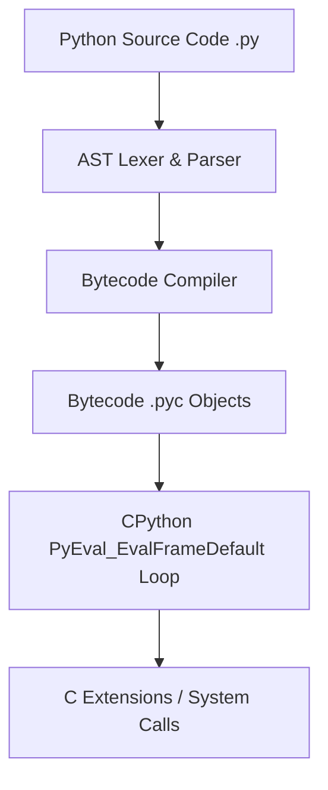
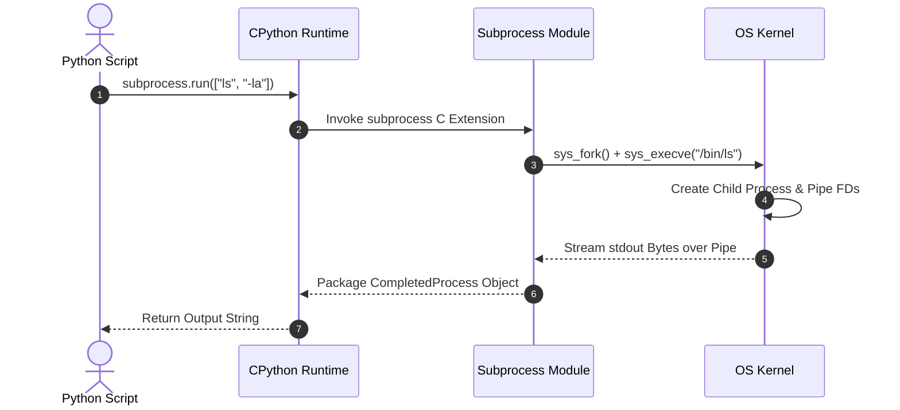

# P-04: Python Systems Programming & Security Automation

> **Module ID:** P-04  
> **Category:** Software Engineering & DevSecOps  
> **Difficulty:** Intermediate  
> **Estimated Time:** 8 Hours  
> **Prerequisites:** Python Fundamentals & Basic OS Concepts  
> **Related Topics:** CPython Internals, GIL, Sockets, Subprocesses, Struct, Ctypes, Security Libraries  
> **Framework Standard:** Cyber Act Universal Engineering Framework (v2 Standard)

---

# Part I — Understanding

## Overview

### Definition
* **Definition:** Python Systems Programming is the utilization of Python's standard system modules (`os`, `sys`, `subprocess`, `socket`, `struct`, `ctypes`) and CPython virtual machine internals to perform low-level OS operations, network socket interactions, binary memory manipulation, and security automation.
* **One-Line Summary:** Low-level OS interaction, socket communication, binary memory structure packing, and security automation using Python's CPython engine.

### Purpose & Problem Statement
* **Purpose:** Enables security engineers and developers to rapidly build automation tools, security scanners, exploit payloads, network daemons, and system monitoring agents without writing verbose C code.
* **Problem it Solves:** Eliminates slow manual terminal auditing, complex C socket boilerplate, platform-specific build dependencies, and unsafe memory handling for scripting tasks.
* **Why it Exists:** Developed by Guido van Rossum in 1991 to provide a clean, high-level readable scripting language with powerful standard library C bindings.

### History & Evolution
* **Origins & Evolution:** Created in 1991, evolved from Python 2 to Python 3 (strict Unicode handling), adding `asyncio`, improved C extensions (`ctypes`, `cffi`), and memory tracing tools.

### Mental Model & Analogy
* **Real-World Analogy:** A Swiss Army knife with specialized attachments: The CPython interpreter acts as the heavy-duty handle, while specialized modules (`socket` for communications, `struct` for binary packing, `subprocess` for system tasks) deploy instantly to handle specific engineering needs.
* **Mental Model:** Python code compiles to bytecode (`.pyc`) ➔ CPython Virtual Machine executes opcode loop ➔ Interacts with operating system kernel via C standard library wrappers (`glibc` / `msvcrt`).

> [!NOTE]
> The **Global Interpreter Lock (GIL)** in CPython prevents multiple native CPU threads from executing Python bytecode simultaneously. For CPU-bound tasks, use `multiprocessing` or C extensions.

---

## Terminology

### Key Terms & Definitions

#### **CPython**
* **Definition:** The reference implementation of the Python programming language written in C, compiling Python code into bytecode executed by a stack-based virtual machine.
* **Context / Scope:** Python Runtime Engine.
* **Key Properties:** Uses reference counting and a generational garbage collector for memory management.

#### **Global Interpreter Lock (GIL)**
* **Definition:** A mutual exclusion lock used by CPython to synchronize thread execution, preventing multi-threaded Python programs from utilizing multiple CPU cores for bytecode execution.
* **Context / Scope:** Concurrency Engine.
* **Key Properties:** Affects CPU-bound multi-threading; I/O-bound operations release the GIL.

#### **`struct` Module**
* **Definition:** Python standard library module converting between Python values and C data structures packed as binary byte strings.
* **Context / Scope:** Low-level Memory & Network Serialization.
* **Key Properties:** Converts integers/strings into packed binary structs (`pack('>I', 1024)`).

#### **`ctypes` Module**
* **Definition:** Foreign function library for Python providing C compatible data types and allowing calling functions in shared C libraries (`.so` / `.dll`).
* **Context / Scope:** Low-level C Interoperability.
* **Key Properties:** Allows direct interaction with Windows APIs or Linux system calls.

---

## Big Picture

### Domain & Ecosystem Placement
* **Domain:** Systems Programming & Security Automation
* **Parent Topic:** Software Engineering Foundations
* **Child Topics:** CPython Internals, `os`/`sys`, `subprocess`, Network Sockets, `struct`, `ctypes`, Async I/O, Security Scripting
* **Prerequisites:** Python Basic Syntax & OS Concepts
* **Topics Enabled:** Network Security Tooling, Security Telemetry Collectors, Automated Exploit Scripts, Malware Analysis Tooling

### Architectural Placement
* **Technology Ecosystem:** CPython 3.x, PyPA (`pip`), `scapy`, `pwntools`, `requests`, `cryptography`.
* **Architecture Placement:** Application & Security Tooling Layer.
* **Stack Placement:** Automation & Systems Engineering Layer.

### System Ecosystem Map
```mermaid
graph TD
    PyScript[Python Code - script.py] --> CPython[CPython VM - Bytecode Interpreter]
    CPython --> StdLib[Standard Library - os, socket, struct, ctypes]
    StdLib --> C runtime[C Runtime - glibc / msvcrt]
    C runtime --> Kernel[OS Kernel - Syscalls Ring 0]
```

---

# Part II — Internal Engineering

## Architecture

### Core Subsystems & Components
* **Components:** CPython Compiler, Bytecode Interpreter, Object Allocator (PyMalloc), Generational Garbage Collector, Foreign Function Interface (`ctypes`).
* **Services & Processes:** Python runtime execution engine (`python3`).

### Memory & Data Structures
* **PyObject Structure:** All Python objects wrapped in C `PyObject` containing `ob_refcnt` (reference count) and `ob_type` (pointer to type object).
* **Binary Packing Format Specifiers:**
  * `b` / `B`: Signed/Unsigned Char (1 Byte).
  * `h` / `H`: Signed/Unsigned Short (2 Bytes).
  * `i` / `I`: Signed/Unsigned Int (4 Bytes).
  * `q` / `Q`: Signed/Unsigned Long Long (8 Bytes).
  * `>` / `<`: Big-Endians / Little-Endians Byte Ordering.

### Component Architecture Map


---

## Mechanism

### Core Execution Workflow (Subprocess Execution)
1. Python executes `subprocess.run(["ls", "-la"], capture_output=True)`.
2. `subprocess` module calls C `fork()` / `execve()` (Linux) or `CreateProcess()` (Windows).
3. OS spawns child process and redirects stdout/stderr pipes to parent Python process.
4. Python reads pipe bytes, releases GIL during I/O wait, and packages results into a `CompletedProcess` object.

### Execution Sequence Map


---

## Relationships

### Upstream & Downstream Dependencies
* **Depends On:** C Compiler / C Standard Library (`glibc`), Host OS Kernel, OpenSSL Library.
* **Used By:** Security Automation Scripts, Web Frameworks (FastAPI, Django), Data Science, Security Scanners.
* **Communicates With:** OS Kernel via System Calls, Remote Hosts via Sockets.

### Resource Lifecycle
* **Creates / Uses:** Allocates `PyObject` heap memory, socket file descriptors, child process handles.
* **Execution Ordering:** Compile to Bytecode ➔ Init CPython VM ➔ Execute Frame Loop ➔ Garbage Collect ➔ Exit.

---

## Runtime Environment

### Execution & System Context
* **Execution Environment:** User Space CPython Runtime.
* **Location:** System Path (`/usr/bin/python3`).
* **Space:** User Space.
* **Storage Unit:** Bytecode Objects & RAM Heap.
* **Deployment Model:** Script File / Virtual Environment (`venv`) / PyInstaller Executable.
* **Lifetime:** Execution duration of script session.

---

# Part III — Operations

## Installation & Setup

### Setup Procedures
```bash
# Ubuntu / Debian
sudo apt update && sudo apt install -y python3 python3-pip python3-venv

# Verify installation
python3 --version
pip3 --version
```

---

## Configuration

### Virtual Environment Setup
```bash
# Create and activate virtual environment
python3 -m venv venv
source venv/bin/activate
```

---

## Interfaces

### Core Systems Modules Reference

#### `os` Module
* **Purpose:** Provides direct interface to operating system functions and environment metadata.
* **Key Functions:**
  * `os.system(cmd)`: Execute shell command string.
  * `os.getenv(key)`: Get environment variable.
  * `os.getpid()`: Return current process ID.
  * `os.urandom(n)`: Generate cryptographically secure random bytes.
* **Example:**
  ```python
  import os
  print(f"[+] PID: {os.getpid()}")
  random_bytes = os.urandom(16)
  print(f"[+] Secret Salt: {random_bytes.hex()}")
  ```

---

#### `sys` Module
* **Purpose:** Access interpreter parameters, command line arguments, and system configuration.
* **Key Functions:** `sys.argv` (command arguments list), `sys.exit(code)` (exit script), `sys.path` (module search paths).
* **Example:**
  ```python
  import sys
  if len(sys.argv) < 2:
      print(f"Usage: {sys.argv[0]} <target-ip>")
      sys.exit(1)
  ```

---

#### `subprocess` Module
* **Purpose:** Spawns new OS processes, connects to their input/output pipes, and retrieves return codes.
* **Key Functions:** `subprocess.run(cmd, capture_output=True, text=True)`.
* **Example:**
  ```python
  import subprocess
  res = subprocess.run(["id"], capture_output=True, text=True)
  print(f"[+] Output: {res.stdout.strip()}")
  ```

---

#### `socket` Module
* **Purpose:** Low-level BSD network socket interface for client/server TCP/UDP communication.
* **Key Functions:** `socket.socket(AF_INET, SOCK_STREAM)`, `connect()`, `bind()`, `listen()`, `accept()`, `send()`, `recv()`.
* **Example:**
  ```python
  import socket
  s = socket.socket(socket.AF_INET, socket.SOCK_STREAM)
  s.settimeout(2.0)
  result = s.connect_ex(("127.0.0.1", 80))
  if result == 0:
      print("[+] Port 80 is OPEN")
  s.close()
  ```

---

#### `struct` Module
* **Purpose:** Converts Python values to packed binary C structs and vice versa.
* **Key Functions:** `struct.pack(fmt, v1, ...)`, `struct.unpack(fmt, buffer)`.
* **Example:**
  ```python
  import struct
  # Pack integer 0xDEADBEEF into 4 big-endian bytes
  packed = struct.pack(">I", 0xDEADBEEF)
  print(f"[+] Packed Bytes: {packed.hex()}")
  unpacked = struct.unpack(">I", packed)[0]
  print(f"[+] Unpacked Int: {hex(unpacked)}")
  ```

---

#### `ctypes` Module
* **Purpose:** Foreign function interface calling functions in shared C libraries (`.so` / `.dll`).
* **Key Functions:** `ctypes.CDLL()`, `ctypes.c_char_p`.
* **Example:**
  ```python
  import ctypes
  # Load C standard library
  libc = ctypes.CDLL("libc.so.6")
  libc.puts(b"Hello from C Standard Library via Python!")
  ```

---

#### `json` & `requests` & `logging` Modules
* **Purpose:** `json` parses data payloads; `requests` executes HTTP APIs; `logging` records structured execution telemetry.
* **Example:**
  ```python
  import json
  import logging

  logging.basicConfig(level=logging.INFO)
  data = {"status": "active", "code": 200}
  logging.info(f"Payload: {json.dumps(data)}")
  ```

---

### APIs & Libraries
* **SDKs & Libraries:** `scapy` (packet crafting), `pwntools` (CTF/exploit framework), `cryptography` (modern crypto).

### Data Formats & Protocols
* **Formats:** Bytearrays, JSON, Packed Binary Structs.

---

# Part IV — Observation

## Monitoring

### Telemetry & Inspection Tools
* **Tools:** `tracemalloc`, `cProfile`, `pdb` (Python Debugger), `valgrind`, `strace`.
* **Log Sources:** Standard Python `logging` output, `/var/log/syslog`.

---

## Debugging

### Step-by-Step Debugging Workflow
1. **Insert Debugger:** Insert `import pdb; pdb.set_trace()` at target line.
2. **Profile Execution Performance:** Run `python3 -m cProfile script.py`.
3. **Trace Memory Allocations:** Utilize `tracemalloc` to pinpoint memory leaks in long-running Python scripts.

> [!TIP]
> Use `python3 -m trace --trace script.py` to watch every single line of Python code as it executes in real time.

---

# Part V — Security

## Security

### Threat Model & Attack Surface
* **Threat Model:** Command Injection via `os.system` / `subprocess(shell=True)`, unsafe deserialization via `pickle`, insecure random numbers via `random` module, hardcoded secrets.
* **Attack Surface:** Unchecked user inputs passed into OS command strings, untrusted `pickle` files.

### Attack Vectors & Vulnerabilities
* **Command Injection (`shell=True`):** Passing unsanitized user input into `subprocess.run(f"ping {user_input}", shell=True)` allowing arbitrary command execution (`127.0.0.1; cat /etc/passwd`).

### Detection & Telemetry
* **Detection Opportunities:** Auditd EXECVE logs capturing `python3` spawning child shells (`/bin/sh`), Bandit static analysis warnings.
* **MITRE ATT&CK Mapping:** T1059.006 (Command and Scripting Interpreter: Python).

### Hardening & Security Best Practices
* **NEVER** use `os.system()` or `subprocess(shell=True)`. Always pass commands as explicit lists (`["ping", "-c", "1", host]`).
* **NEVER** deserialize untrusted data with `pickle`. Use `json` instead.
* Use `secrets` or `os.urandom()` for cryptographic key generation (Never use standard `random`).

- [ ] Is `shell=True` eliminated across all codebase subprocess calls?
- [ ] Is `pickle` replaced with `json` for untrusted data?
- [ ] Is `secrets` or `os.urandom()` used for all security tokens?

> [!CAUTION]
> Using `pickle.loads()` on data received over a network socket allows remote attackers to execute arbitrary shell code on the server immediately.

---

# Part VI — Engineering

## Engineering Analysis

### Design Rationale & Philosophy
* Python prioritizes rapid development velocity and code readability by providing powerful high-level abstractions over complex low-level C system calls.

### Technology Comparison Matrix
| Attribute | Python 3 | C / C++ | Go (Golang) |
| :--- | :--- | :--- | :--- |
| **Development Speed**| Extremely Fast | Slow | Fast |
| **Execution Performance**| Moderate (CPython VM) | Maximum (Native Machine Code) | High (Compiled Native) |
| **Memory Safety** | Garbage Collected | Manual Memory Management | Garbage Collected |

---

# Part VII — Practical

## Basic Lab
```bash
# Verify Python version and interactive REPL
python3 -c "import sys; print(f'Python Version: {sys.version}')"
```

## Observation Lab
```python
# Create test script observing process environment
import os
import sys

print(f"[+] Executable: {sys.executable}")
print(f"[+] Current PID: {os.getpid()}")
```

## Internal Lab (Binary Struct Packing)
```python
import struct

# Pack 32-bit integer into big-endian network bytes
header = struct.pack(">I", 8080)
print(f"[+] Packed Port 8080: {header.hex()}")
```

## Security Lab (Secure Subprocess Execution)
```python
import subprocess

# Safe execution using list arguments (No shell=True)
res = subprocess.run(["uname", "-a"], capture_output=True, text=True)
print(f"[+] System Details: {res.stdout.strip()}")
```

---

# Part VIII — Reference

## Quick Reference & Cheat Sheet
* `subprocess.run(["cmd", "arg"], capture_output=True, text=True)`
* `os.urandom(16)` | `socket.socket(AF_INET, SOCK_STREAM)` | `struct.pack(">I", val)`
* `sys.argv` | `sys.exit(0)` | `ctypes.CDLL("libc.so.6")`
* Security Rules: Avoid `shell=True`, avoid `pickle`, use `secrets` module.

---

# Part IX — Professional

## Interview Questions

### Fundamental & Architecture Questions
* **Question 1:** *What is the CPython Global Interpreter Lock (GIL) and how does it impact multi-threaded programs?*
  > [!NOTE]
  > The GIL is a mutual exclusion lock preventing multiple native threads from executing Python bytecode simultaneously. It limits CPU-bound multi-threading, requiring `multiprocessing` for parallel CPU execution.

### Security & Troubleshooting Questions
* **Question 2:** *Why is `subprocess.run(..., shell=True)` dangerous, and how do you secure it?*
  > [!IMPORTANT]
  > `shell=True` passes input to the system shell (`/bin/sh`), enabling Command Injection if user input contains shell metacharacters. Securing it requires passing command arguments as a list without `shell=True`.

---

## Revision

### Executive Summary & Revision
* **Key Takeaways:** Python Systems Programming leverages CPython standard modules (`os`, `subprocess`, `socket`, `struct`, `ctypes`) for low-level OS operations, network communication, and security automation.
* **One-Minute Revision:** Script Execution ➔ CPython Bytecode ➔ Standard Library C Wrappers ➔ OS Kernel System Calls.

---

## Master Completion Checklist

### Understanding
- [x] Can define it
- [x] Can explain why it exists
- [x] Understand terminology
- [x] Know where it fits

### Internal Engineering
- [x] Can explain architecture
- [x] Can explain workflow
- [x] Can draw diagrams
- [x] Understand lifecycle

### Operations
- [x] Can install/configure
- [x] Can use CLI commands
- [x] Understand APIs/protocols

### Observation
- [x] Can monitor telemetry
- [x] Can debug failures
- [x] Know log sources

### Security
- [x] Know attack vectors
- [x] Know mitigations
- [x] Know detection telemetry

### Engineering
- [x] Can compare alternatives
- [x] Understand trade-offs
- [x] Know performance limits

### Practical
- [x] Completed basic lab
- [x] Completed observation lab
- [x] Completed security lab

### Professional
- [x] Can answer interview questions
- [x] Can explain to an engineer
- [x] Can implement independently
