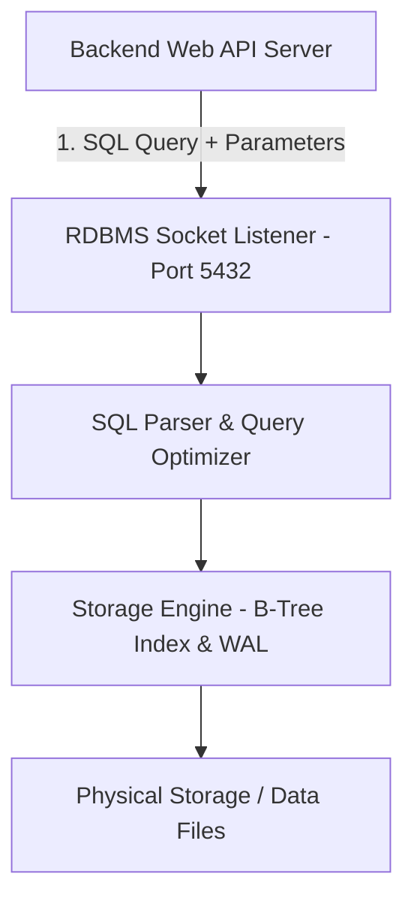
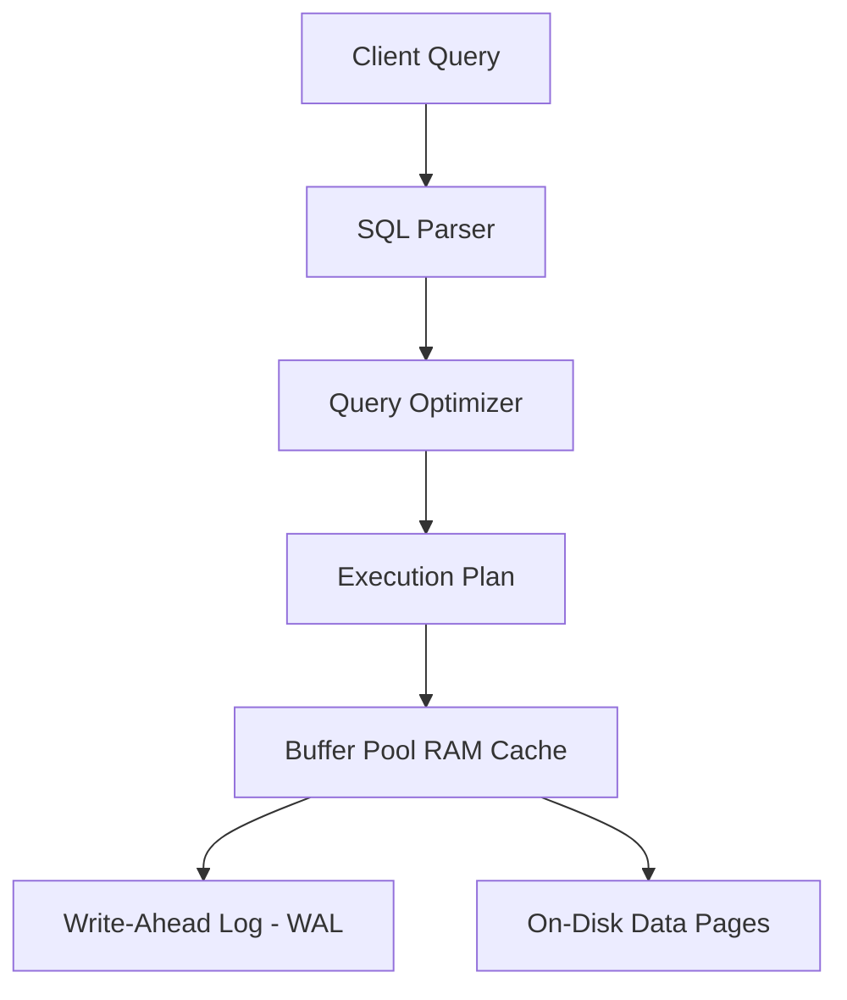
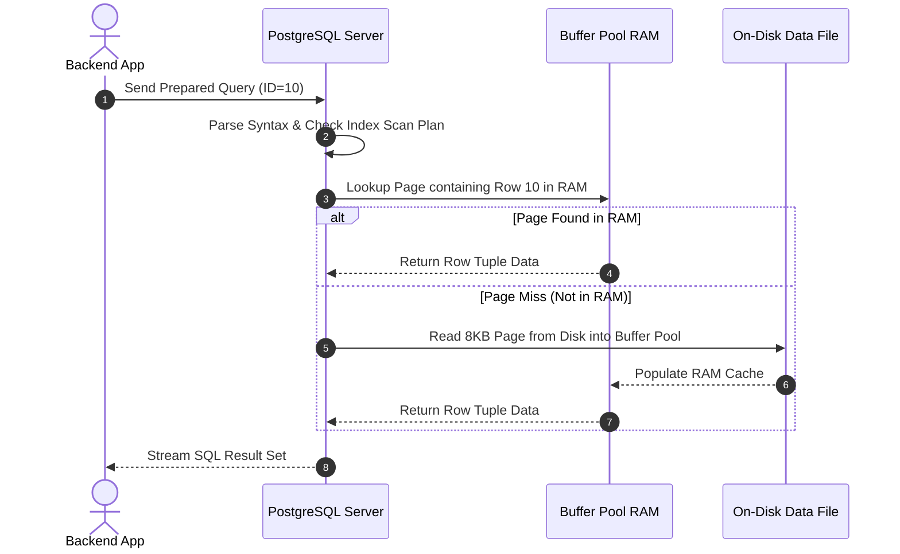

# P-05: Relational Databases, SQL & Database Security

> **Module ID:** P-05  
> **Category:** Data Engineering & Database Security  
> **Difficulty:** Intermediate  
> **Estimated Time:** 8 Hours  
> **Prerequisites:** Basic Data Structuring & Python Fundamentals  
> **Related Topics:** Relational Algebra, ACID Transactions, B-Tree Indexes, Parameterized Queries, SQL Injection Defense  
> **Framework Standard:** Cyber Act Universal Engineering Framework (v2 Standard)

---

# Part I — Understanding

## Overview

### Definition
* **Definition:** A Relational Database Management System (RDBMS) is a database software engine that stores data in structured tables composed of rows and columns, enforcing relational schemas, ACID transactional properties, and access controls queried via Structured Query Language (SQL).
* **One-Line Summary:** Standardized table-based data storage engine enforcing ACID transaction guarantees, relational integrity, and SQL query interfaces.

### Purpose & Problem Statement
* **Purpose:** Provides durable, consistent, highly available, concurrent, and structured data storage for applications, financial ledgers, user accounts, and enterprise records.
* **Problem it Solves:** Eliminates unstructured data corruption, race conditions during concurrent updates, unindexed linear search bottlenecks, and inconsistent state across distributed applications.
* **Why it Exists:** Introduced by Edgar F. Codd in 1970 to replace hierarchical and network database models with a mathematically rigorous relational model.

### History & Evolution
* **Origins & Evolution:** Created in 1970 (IBM System R), standardized as ANSI SQL (1986), evolved into enterprise engines (PostgreSQL, MySQL, Oracle, SQLite) and modern distributed SQL systems (CockroachDB, AWS Aurora).

### Mental Model & Analogy
* **Real-World Analogy:** An organized accounting office spreadsheet workbook: Tables are individual worksheet tabs, columns are predefined headers with data types, rows are entry line items, and Primary/Foreign keys are cross-reference links between tabs.
* **Mental Model:** Client sends SQL query string over socket connection ➔ RDBMS SQL Parser compiles query into an Execution Plan ➔ Storage Engine uses B-Tree Indexes to fetch data blocks from disk ➔ Returns record set to client.

> [!NOTE]
> SQL queries describe **WHAT** data to retrieve (declarative language); the RDBMS query optimizer calculates **HOW** to retrieve it efficiently (procedural execution plan).

---

## Terminology

### Key Terms & Definitions

#### **ACID Properties**
* **Definition:** The 4 foundational guarantees of database transactions:
  * **Atomicity:** All operations in a transaction succeed, or the entire transaction rolls back.
  * **Consistency:** Data must satisfy all schema constraints and validation rules.
  * **Isolation:** Concurrent transactions execute without cross-transaction interference.
  * **Durability:** Committed transactions survive power failures and system crashes.
* **Context / Scope:** Transaction Guarantee Standard.
* **Key Properties:** Ensured via Write-Ahead Logging (WAL).

#### **Primary Key vs Foreign Key**
* **Definition:** A **Primary Key** is a column (or set of columns) uniquely identifying each row in a table; a **Foreign Key** is a column referencing the Primary Key of another table.
* **Context / Scope:** Relational Schema Integrity.
* **Key Properties:** Enforces Referential Integrity across tables.

#### **B-Tree Index**
* **Definition:** A self-balancing tree data structure maintained on disk by the RDBMS that enables $O(\log N)$ logarithmic time search for targeted query lookup.
* **Context / Scope:** Storage Query Optimization.
* **Key Properties:** Speeds up `SELECT` queries; adds minor overhead to `INSERT`/`UPDATE` operations.

#### **SQL Injection (SQLi)**
* **Definition:** A high-severity security vulnerability where un-sanitized user input is concatenated directly into SQL command strings, allowing attackers to manipulate database queries.
* **Context / Scope:** Web & Database Application Security.
* **Key Properties:** Mitigated 100% by using Parameterized Queries (Prepared Statements).

#### **Parameterized Query (Prepared Statement)**
* **Definition:** A database execution technique where the SQL command structure is compiled separately from user-supplied parameters, preventing parameters from being executed as SQL code.
* **Context / Scope:** Defensive Database Engineering.
* **Key Properties:** Complete mitigation against SQL Injection.

---

## Big Picture

### Domain & Ecosystem Placement
* **Domain:** Data Engineering & Database Security
* **Parent Topic:** Data Systems & Persistence
* **Child Topics:** Relational Algebra, SQL DDL/DML/TCL, ACID Transactions, B-Tree Indexing, Query Optimization, Parameterized Queries, SQL Injection Mitigation
* **Prerequisites:** Data Structuring Fundamentals
* **Topics Enabled:** Secure Web API Engineering, Data Warehousing, Database Forensics, Backend Architecture

### Architectural Placement
* **Technology Ecosystem:** PostgreSQL, MySQL, SQLite, MariaDB, ORMs (`SQLAlchemy`, `Prisma`), `psql`.
* **Architecture Placement:** Persistence & Data Storage Layer.
* **Stack Placement:** Core Database Layer.

### System Ecosystem Map


---

# Part II — Internal Engineering

## Architecture

### Core Subsystems & Components
* **Components:** Connection Manager, SQL Parser, Query Optimizer, Execution Engine, Buffer Pool (RAM Cache), Lock Manager, Write-Ahead Log (WAL), Storage Engine.
* **Services & Processes:** `postgres` (PostgreSQL daemon), `mysqld` (MySQL daemon).

### Memory & Data Structures
* **Write-Ahead Logging (WAL):** System changes are written to a sequential disk log buffer *before* updating actual data pages, guaranteeing Durability during unexpected power failure crashes.
* **B-Tree Index Node:** `[Key1 | Ptr1 | Key2 | Ptr2 | ...]` balancing disk page read efficiency.

### Component Architecture Map


---

## Mechanism

### Core Execution Workflow
1. Application sends parameterized SQL statement `SELECT * FROM users WHERE id = $1` with parameter `10`.
2. Database checks Plan Cache; if missing, SQL Parser validates syntax and constructs Parse Tree.
3. Query Optimizer evaluates table statistics and selects B-Tree Index scan path.
4. Execution Engine retrieves target 8KB page into Buffer Pool RAM, extracts row `10`, and streams result tuple to application socket.

### Execution Sequence Map


---

## Relationships

### Upstream & Downstream Dependencies
* **Depends On:** Operating System VFS, Physical Storage (SSDs/NVMe), Operating System Memory Manager.
* **Used By:** Web Applications, Financial Systems, Identity Providers, Analytics Engines.
* **Communicates With:** Applications via TCP Sockets (PostgreSQL port 5432, MySQL port 3306).

### Resource Lifecycle
* **Creates / Uses:** Allocates Connection Sockets, Buffer Pool Memory, Lock Tables, WAL Files.
* **Execution Ordering:** Start RDBMS Daemon ➔ Open Pool ➔ `BEGIN` Transaction ➔ SQL Statements ➔ `COMMIT` / `ROLLBACK`.

---

## Runtime Environment

### Execution & System Context
* **Execution Environment:** User Space Database Daemon Engine.
* **Location:** Enterprise Database Host / Managed Cloud DB (AWS RDS).
* **Space:** User Space.
* **Storage Unit:** 8KB Page Files & WAL Log Files.
* **Deployment Model:** Database Server Daemon / Embedded Library (`sqlite3`).
* **Lifetime:** Continuous persistent database daemon.

---

# Part III — Operations

## Installation & Setup

### Setup Procedures
```bash
# Ubuntu / Debian - Install PostgreSQL
sudo apt update && sudo apt install -y postgresql postgresql-contrib

# Start and enable PostgreSQL service
sudo systemctl enable --now postgresql
```

---

## Configuration

### Core Configuration Files
* `/etc/postgresql/14/main/postgresql.conf`: Main PostgreSQL configuration.
* `/etc/postgresql/14/main/pg_hba.conf`: Host-based client authentication setup.

---

## Interfaces

### SQL Language & Management Commands Reference

#### DDL (Data Definition Language)
* **Purpose:** Defines and alters database schema structures.
* **Examples:**
  ```sql
  -- Create Users Table
  CREATE TABLE users (
      id SERIAL PRIMARY KEY,
      username VARCHAR(50) UNIQUE NOT NULL,
      email VARCHAR(100) NOT NULL,
      created_at TIMESTAMP DEFAULT CURRENT_TIMESTAMP
  );

  -- Create B-Tree Index
  CREATE INDEX idx_users_email ON users(email);

  -- Alter Table
  ALTER TABLE users ADD COLUMN is_active BOOLEAN DEFAULT TRUE;

  -- Drop Table
  DROP TABLE IF EXISTS users;
  ```

---

#### DML (Data Manipulation Language)
* **Purpose:** Manages data rows inside tables.
* **Examples:**
  ```sql
  -- INSERT
  INSERT INTO users (username, email) VALUES ('vamshi', 'vamshi@cyber.local');

  -- SELECT with INNER JOIN
  SELECT u.id, u.username, o.amount
  FROM users u
  INNER JOIN orders o ON u.id = o.user_id
  WHERE u.is_active = TRUE
  ORDER BY o.amount DESC;

  -- UPDATE
  UPDATE users SET is_active = FALSE WHERE id = 5;

  -- DELETE
  DELETE FROM users WHERE id = 10;
  ```

---

#### TCL (Transaction Control Language)
* **Purpose:** Manages ACID transaction boundaries.
* **Examples:**
  ```sql
  BEGIN;
  UPDATE accounts SET balance = balance - 100 WHERE id = 1;
  UPDATE accounts SET balance = balance + 100 WHERE id = 2;
  COMMIT;
  -- If error occurs: ROLLBACK;
  ```

---

#### Query Tuning & Optimization (`EXPLAIN ANALYZE`)
* **Purpose:** Displays the query execution plan, index usage, and runtime execution timing.
* **Example:**
  ```sql
  EXPLAIN ANALYZE SELECT * FROM users WHERE email = 'vamshi@cyber.local';
  ```

---

#### CLI Tools Reference (`psql`, `sqlite3`, `mysql`)
* **Purpose:** Command line client tools to connect and query relational databases.
* **Examples:**
  ```bash
  # PostgreSQL CLI
  sudo -u postgres psql -d mydb

  # SQLite CLI
  sqlite3 mydatabase.db

  # MySQL CLI
  mysql -u root -p -h localhost
  ```

---

### APIs & Libraries
* **SDKs & Libraries:** `psycopg2` (Python PostgreSQL driver), `SQLAlchemy` (Python ORM), `mysql-connector-python`.

### Data Formats & Protocols
* **Formats:** Tabular Result Sets, PostgreSQL Wire Protocol, MySQL Client/Server Protocol.

---

# Part IV — Observation

## Monitoring

### Telemetry & Inspection Tools
* **Tools:** `psql`, `pg_stat_activity`, `pg_stat_database`, `EXPLAIN ANALYZE`, Slow Query Logs.
* **Log Sources:** `/var/log/postgresql/postgresql-14-main.log`, `/var/log/mysql/error.log`.

---

## Debugging

### Step-by-Step Debugging Workflow
1. **Identify Slow Queries:** Inspect PostgreSQL slow query log or `pg_stat_activity`.
2. **Analyze Execution Plan:** Run `EXPLAIN ANALYZE` on targeted SQL statement.
3. **Verify Index Usage:** Check if query performs a `Seq Scan` (Full table scan) instead of an `Index Scan`. Add B-Tree index if missing.

> [!TIP]
> Use `SELECT * FROM pg_stat_activity WHERE state = 'active';` to inspect currently running database queries in real time.

---

# Part V — Security

## Security

### Threat Model & Attack Surface
* **Threat Model:** SQL Injection (SQLi), authentication bypass, unauthorized database reading, weak `pg_hba.conf` rules, unencrypted socket connections.
* **Attack Surface:** Web application user input fields, exposed database port 5432/3306.

### Attack Vectors & Vulnerabilities
* **SQL Injection Vulnerability:** Concatenating user input directly into SQL queries (`"SELECT * FROM users WHERE username = '" + user_input + "'"`). Input `' OR '1'='1` bypasses authentication completely.

### Detection & Telemetry
* **Detection Opportunities:** Database error logs displaying SQL syntax errors, WAF logs capturing `' OR '1'='1`.
* **MITRE ATT&CK Mapping:** T1190 (Exploit Public-Facing Application: SQL Injection).

### Hardening & Security Best Practices
* **ALWAYS** use Parameterized Queries / Prepared Statements (100% SQLi protection).
* Restrict database socket network access (`pg_hba.conf` set to local subnet only).
* Enforce Least Privilege database users (Never use `postgres` / `root` superuser for web application connections).

- [ ] Are 100% of dynamic database queries using Parameterized Statements?
- [ ] Is remote database access restricted via firewall rules?
- [ ] Are application database users limited to Least Privilege?

> [!CAUTION]
> String concatenation of user input into SQL commands creates SQL Injection vulnerabilities, allowing attackers to dump or delete the entire database.

---

# Part VI — Engineering

## Engineering Analysis

### Design Rationale & Philosophy
* Relational databases prioritize strict data consistency, schema enforcement, and ACID guarantees over unrestricted write scaling.

### Technology Comparison Matrix
| Attribute | Relational (PostgreSQL) | NoSQL (MongoDB) | In-Memory (Redis) |
| :--- | :--- | :--- | :--- |
| **Data Model** | Tables & Rows | BSON Documents | Key-Value Pairs |
| **Schema** | Strict Predefined | Schema-less (Flexible) | Key-Value |
| **ACID Support** | Full Native Support | Document-level | Limited |

---

# Part VII — Practical

## Basic Lab
```bash
# Verify SQLite installation and create test database
sqlite3 test.db "CREATE TABLE test (id INT, name TEXT); INSERT INTO test VALUES (1, 'CyberAct'); SELECT * FROM test;"
```

## Observation Lab
```bash
# Connect to PostgreSQL and list tables
sudo -u postgres psql -c "\l"
```

## Internal Lab (Query Optimization)
```sql
-- Demonstrate EXPLAIN ANALYZE in SQLite/PostgreSQL
EXPLAIN ANALYZE SELECT * FROM users WHERE id = 1;
```

## Security Lab (Python Parameterized Query)
```python
import sqlite3

conn = sqlite3.connect(":memory:")
cursor = conn.cursor()
cursor.execute("CREATE TABLE users (id INT, username TEXT)")

# SAFE: Parameterized Query preventing SQL Injection
username_input = "admin' OR '1'='1"
cursor.execute("SELECT * FROM users WHERE username = ?", (username_input,))
results = cursor.fetchall()
print(f"[+] Safe Query Results: {results}")
conn.close()
```

---

# Part VIII — Reference

## Quick Reference & Cheat Sheet
* `CREATE TABLE` | `INSERT INTO` | `SELECT * FROM table WHERE ...` | `UPDATE table SET ...`
* `BEGIN;` | `COMMIT;` | `ROLLBACK;` | `EXPLAIN ANALYZE <query>`
* `psql -u postgres` | `sqlite3 database.db` | `pg_stat_activity`
* Key Port: PostgreSQL (`5432`), MySQL (`3306`).

---

# Part IX — Professional

## Interview Questions

### Fundamental & Architecture Questions
* **Question 1:** *Explain the ACID properties of relational databases and how Write-Ahead Logging (WAL) ensures Durability.*
  > [!NOTE]
  > ACID stands for Atomicity, Consistency, Isolation, and Durability. WAL ensures Durability by writing all transaction changes sequentially to an on-disk log *before* updating data pages, allowing recovery after power crashes.

### Security & Troubleshooting Questions
* **Question 2:** *How do Parameterized Queries prevent SQL Injection vulnerabilities?*
  > [!IMPORTANT]
  > Parameterized Queries pre-compile the SQL statement structure separately from parameters. The database engine treats user input strictly as literal data values, never as executable SQL commands.

---

## Revision

### Executive Summary & Revision
* **Key Takeaways:** Relational Databases store structured data in tables with ACID guarantees, using B-Tree indexes for fast queries, secured against SQL Injection using Parameterized Queries.
* **One-Minute Revision:** SQL Query ➔ Parser ➔ Optimizer Plan ➔ Buffer Pool RAM Cache ➔ B-Tree Index / WAL Disk Write.

---

## Master Completion Checklist

### Understanding
- [x] Can define it
- [x] Can explain why it exists
- [x] Understand terminology
- [x] Know where it fits

### Internal Engineering
- [x] Can explain architecture
- [x] Can explain workflow
- [x] Can draw diagrams
- [x] Understand lifecycle

### Operations
- [x] Can install/configure
- [x] Can use CLI commands
- [x] Understand APIs/protocols

### Observation
- [x] Can monitor telemetry
- [x] Can debug failures
- [x] Know log sources

### Security
- [x] Know attack vectors
- [x] Know mitigations
- [x] Know detection telemetry

### Engineering
- [x] Can compare alternatives
- [x] Understand trade-offs
- [x] Know performance limits

### Practical
- [x] Completed basic lab
- [x] Completed observation lab
- [x] Completed security lab

### Professional
- [x] Can answer interview questions
- [x] Can explain to an engineer
- [x] Can implement independently
