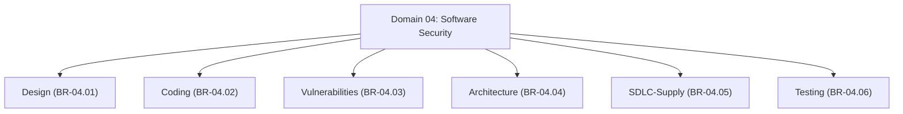

# Master Software Security Branch Index

## 1. Overview
This directory (`04 - Branch Knowledge/Software-Security/`) houses the complete engineering implementation of **Domain 04: Software Security**.

The domain is organized into **6 core engineering branches** covering secure design, secure coding, vulnerability primitives, secure application architecture, SDLC & supply chain, and automated security testing/fuzzing.

---

## 2. Directory & Module Map

### Module Registry Table

| Branch ID | Module ID | Module Title | File Location | Key Engineering Concepts |
| :--- | :--- | :--- | :--- | :--- |
| `BR-04.01` | **`MOD-04.01.01`** | **Security Design & Threat Modeling** | `Design/01 - Security Design Principles & Threat Modeling.md` | STRIDE, PASTA, Trust Boundaries, Threat Modeling, Fail-Safe Defaults. |
| `BR-04.01` | **`MOD-04.01.02`** | **Defense-in-Depth & Attack Surface Reduction** | `Design/02 - Defense in Depth & Trust Boundaries.md` | Defense-in-Depth, Least Privilege, Attack Surface Reduction, Sandbox. |
| `BR-04.02` | **`MOD-04.02.01`** | **Input Validation & Output Encoding** | `Coding/01 - Input Validation & Output Encoding.md` | Whitelisting, Contextual Encoding, Parameterized Inputs, Sanitization. |
| `BR-04.02` | **`MOD-04.02.02`** | **Secure File Handling & Secret Management** | `Coding/02 - Secure File Handling & Secret Management.md` | Path Sanitization, TOCTOU File Leaks, Secret Scrubbing in Memory. |
| `BR-04.03` | **`MOD-04.03.01`** | **Memory Corruption & Buffer Overflows** | `Vulnerabilities/01 - Memory Corruption & Buffer Overflows.md` | Stack/Heap Overflows, UAF, ASLR/DEP/Canaries, Rust Memory Safety. |
| `BR-04.03` | **`MOD-04.03.02`** | **Injection Vulnerabilities (SQLi & Command)** | `Vulnerabilities/02 - Injection Vulnerabilities.md` | SQLi, Command Injection, Blind SQLi, Prepared Statements, Escaping. |
| `BR-04.03` | **`MOD-04.03.03`** | **Web Vulnerabilities (XSS, CSRF & SSRF)** | `Vulnerabilities/03 - Web Vulnerabilities XSS CSRF SSRF.md` | Stored/Reflected XSS, SameSite CSRF, SSRF Cloud Metadata, IDOR. |
| `BR-04.04` | **`MOD-04.04.01`** | **Secure API Design (REST, GraphQL, gRPC)** | `Architecture/01 - Secure API Design REST GraphQL gRPC.md` | API Rate Limiting, GraphQL Depth Limits, gRPC Protobuf Validation. |
| `BR-04.04` | **`MOD-04.04.02`** | **Microservice & Service Communication** | `Architecture/02 - Microservice Security & Service Mesh.md` | mTLS Service Mesh, Message Queue Security, Service-to-Service Auth. |
| `BR-04.05` | **`MOD-04.05.01`** | **Secure SDLC & SAST/SCA Analysis** | `SDLC-Supply/01 - Secure SDLC & SAST Analysis.md` | Shift-Left Security, SAST Rulesets (Semgrep), Code Review, SCA. |
| `BR-04.05` | **`MOD-04.05.02`** | **Software Supply Chain Security & SBOM** | `SDLC-Supply/02 - Software Supply Chain Security & SBOM.md` | CycloneDX/SPDX SBOM, Dependency Tampering, SLSA Levels, Sigstore. |
| `BR-04.06` | **`MOD-04.06.01`** | **Automated Security Testing & Fuzzing (AFL++)** | `Testing/01 - Automated Security Testing & Fuzzing.md` | Coverage-Guided Fuzzing, AFL++, libFuzzer, ASan/MSan Sanitizers. |
