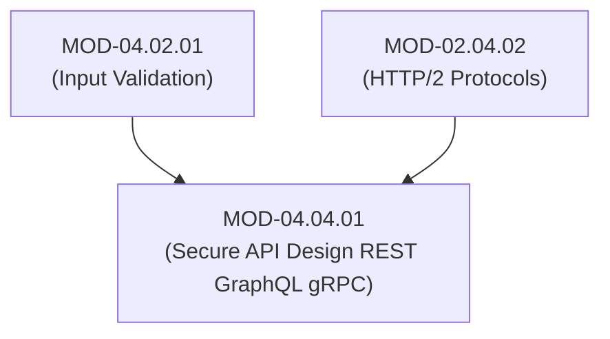

# Secure API Design (REST, GraphQL, gRPC & Payload Sanitization)

## 1. Overview & Purpose
Application Programming Interfaces (APIs) represent the primary communication interfaces powering web applications, mobile apps, and microservice architectures.

This module details REST API Security Best Practices, GraphQL Query Depth/Complexity Limits, gRPC Protocol Buffer Validation, API Rate Limiting (Token Bucket / Leaky Bucket), Mass Assignment vulnerabilities, and Broken Object Level Authorization (BOLA / IDOR).

---

## 2. Prerequisites & Prerequisites Graph
- **Prerequisites**: `MOD-04.02.01` (Input Validation) & `MOD-02.04.02` (HTTP/2 Protocols).



---

## 3. Learning Objectives & Taxonomy Alignment
- **L1 Awareness**: Differentiate REST, GraphQL, and gRPC security architectures.
- **L2 Understanding**: Explain GraphQL Batching/Depth Exhaustion Attacks, gRPC Protobuf schema strict enforcement, and BOLA (OWASP API #1).
- **L3 Practical**: Configure Token Bucket rate limiting in Nginx/Redis and write GraphQL query depth limiters in Node.js/Python.
- **L4 Engineering**: Design enterprise API Gateways (Kong / Envoy) with automated schema validation and rate limiting.

---

## 4. L1 — Awareness (Overview & Core Terminology)
REST APIs use HTTP verbs (`GET`, `POST`, `PUT`, `DELETE`). **GraphQL** exposes a single `/graphql` endpoint accepting complex query graphs. **gRPC** uses HTTP/2 and binary Protocol Buffers (`.proto`). **BOLA (Broken Object Level Authorization)** occurs when an API fails to verify if the requesting user owns the requested object ID (`/api/users/105`).

---

## 5. L2 — Understanding (Core Theory & Mechanics)

```mermaid
graph TD
    subgraph GraphQL Nested Query Depth Exhaustion Attack
        CLIENT["Attacker Client"]
        GRAPHQL["GraphQL API Server"]

        CLIENT -->|1. Deeply Nested Query: author { books { author { books { author ... } } } }| GRAPHQL
        GRAPHQL -->|2. Exponential Database Joins / Recursive Resolution| DB["Database Engine"]
        DB -->|3. CPU & Memory Exhaustion -> DOS!| GRAPHQL
    end

    subgraph Defense: GraphQL Query Depth & Complexity Limiters
        GRAPHQL <-->|Calculates Depth & Cost Score BEFORE Execution| COST_ENGINE["Query Cost Calculator (Rejects Depth > 5)"]
    end
```

### BOLA / IDOR Vulnerability (OWASP API Top 10 #1):
BOLA occurs when an API endpoint takes an object identifier (e.g. `GET /api/v1/invoices/9942`) and returns data without verifying that the caller's session token has permission to access invoice `9942`.

---

## 6. L3 — Practical (Commands & Configurations)

### Protecting GraphQL APIs with Depth Limits in Python:
```python
from graphql import parse, ValidationRule, GraphQLError

MAX_QUERY_DEPTH = 5

class DepthLimitRule(ValidationRule):
    def enter_selection_set(self, node, key, parent, path, ancestors):
        # Calculate current nesting depth from ancestors list
        depth = len([a for a in ancestors if hasattr(a, 'kind') and a.kind == 'selection_set'])
        if depth > MAX_QUERY_DEPTH:
            self.context.report_error(
                GraphQLError(f"Query exceeds maximum allowed depth of {MAX_QUERY_DEPTH}")
            )

# Query validation runs BEFORE executing resolver logic!
```

### Redis Token Bucket Rate Limiting in Python:
```python
import redis
import time

r = redis.Redis(host='localhost', port=6379, db=0)

def is_rate_limited(user_id: str, limit: int = 100, window_seconds: int = 60) -> bool:
    key = f"rate:{user_id}"
    current_time = int(time.time())
    pipeline = r.pipeline()
    
    # Sliding Window Counter via Sorted Set (ZSET)
    pipeline.zremrangebyscore(key, 0, current_time - window_seconds)
    pipeline.zadd(key, {str(current_time): current_time})
    pipeline.zcard(key)
    pipeline.expire(key, window_seconds)
    results = pipeline.execute()

    request_count = results[2]
    return request_count > limit
```

---

## 7. L4 — Engineering (Design Trade-offs & System Integration)
- **REST vs gRPC Security Trade-off**: REST JSON payloads are human-readable, making WAF payload inspection straightforward. gRPC binary Protocol Buffers (`.proto`) achieve 10x higher transport performance over HTTP/2, but require WAFs to possess `.proto` schema definitions to parse and inspect request bodies.

---

## 8. Internal Architecture & Data Structures
gRPC Protocol Buffer Schema Definition (`user_service.proto`):
```protobuf
syntax = "proto3";

package user;

message UserRequest {
  uint64 user_id = 1; // Strict Type Safety
}

message UserResponse {
  string username = 1;
  string email = 2;
}

service UserService {
  rpc GetUserProfile (UserRequest) returns (UserResponse);
}
```

---

## 9. Security Implications & Boundary Controls
- **Mass Assignment Vulnerability**: Accepting un-filtered JSON objects in `POST /api/users` allows attackers to inject internal fields like `"is_admin": true`. Always use explicit DTO (Data Transfer Object) schemas.

---

## 10. Attack Vectors & Exploitation Primitives
1. **GraphQL Query Batching Attack**: Sending 1,000 login queries inside a single JSON array to bypass IP rate limiters.
2. **BOLA / IDOR Exploitation**: Iterating sequential user IDs (`/api/v1/users/1`, `/api/v1/users/2`) to scrape user databases.

---

## 11. Defense & Telemetry Verification
- Enforce **Strict Object-Level Authorization Checks (BOLA defense)** on every API handler.
- Set **GraphQL Max Depth (< 5)** and **Max Complexity Cost (< 1000)** caps.

---

## 12. Detection & Telemetry Verification

### Telemetry Check for BOLA / High Volume Sequential Scrapes:
```yaml
title: Potential BOLA / IDOR Sequential Scraping Detected
id: e9102941-8210-41ab-b01b-920191fa771b
logsource:
  category: webserver
  product: envoy_apigateway
detection:
  selection:
    uri_path|re: '/api/v1/invoices/[0-9]+'
    status: 200
  condition: selection | count() by src_ip > 200
level: high
```

---

## 13. Hands-On Lab Reference
- **Associated Lab**: `LAB-SEC008` (GraphQL Depth Limits & BOLA Vulnerability Remediation).

---

## 14. Related Projects & Applications
- **Associated Project**: `PRJ-SEC001` (Secure Healthcare Platform).

---

## 15. Troubleshooting & Diagnostics Matrix

| Symptom | Root Cause | Remediation / Diagnostic Command |
| :--- | :--- | :--- |
| GraphQL queries return `400 Bad Request: Query exceeds depth`. | Deeply nested legitimately required frontend query. | Refactor GraphQL query using fragments or adjust max depth threshold. |

---

## 16. Related Concepts & Cross-Domain Links
- `CON-SEC016`: Broken Object Level Authorization BOLA (`DOM-04`)
- `CON-SEC017`: GraphQL Depth & Complexity Limiters (`DOM-04`)
- `CON-NET014`: HTTP/2 Protobuf Transport (`DOM-02`)

---

## 17. Technical Interview Preparation (Q&A)
**Q: What is Broken Object Level Authorization (BOLA) and why is it the #1 vulnerability on the OWASP API Security Top 10?**  
*Answer*: BOLA (historically known as IDOR) occurs when an API endpoint accepts a user-supplied object identifier (such as `/api/v1/accounts/8841`) but fails to verify that the authenticated user possesses authorization rights to access that specific account record. It is the #1 API vulnerability because modern microservice architectures expose raw database IDs directly in REST/GraphQL URIs, and developers frequently rely on gateway authentication while forgetting to code explicit tenancy/ownership checks inside individual endpoint handlers.

---

## 18. Self-Assessment & Mastery Checklist
- [ ] Understand BOLA vs Mass Assignment flaws.
- [ ] Able to write Redis Token Bucket rate limiting middleware.

---

## 19. References & Further Reading
- OWASP: *API Security Top 10 (2023 Edition)*.
- GraphQL Security Guidelines: *Securing GraphQL APIs*.
