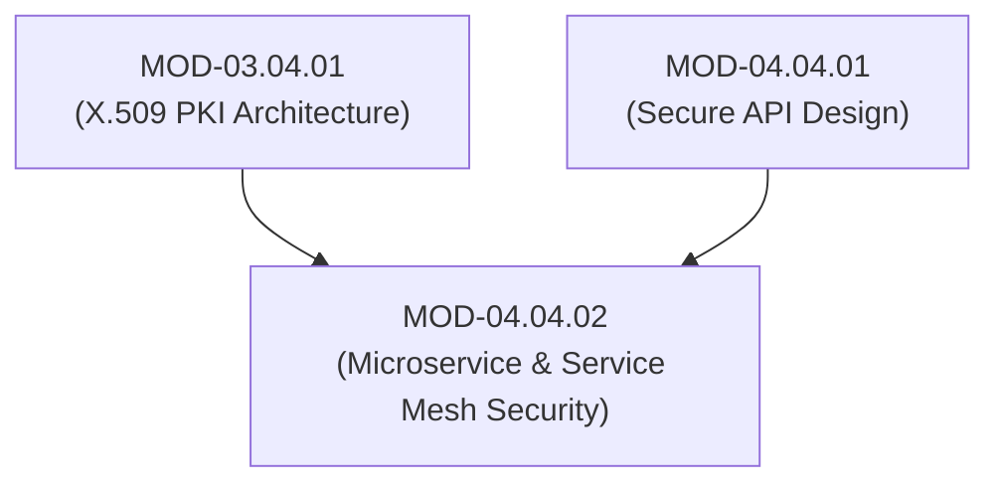

# Microservice Security, Service Mesh (mTLS) & Message Queue Security

## 1. Overview & Purpose
Microservice architectures decompose monolithic applications into distributed, independently deployable services communicating over internal networks.

This module details Service-to-Service Authentication (mTLS via SPIFFE/SPIRE), Service Mesh sidecar proxies (Envoy / Istio), Message Queue Security (Kafka / RabbitMQ TLS & ACLs), Dependency Isolation, and Zero-Trust East-West traffic controls.

---

## 2. Prerequisites & Prerequisites Graph
- **Prerequisites**: `MOD-03.04.01` (X.509 PKI) & `MOD-04.04.01` (Secure API Design).



---

## 3. Learning Objectives & Taxonomy Alignment
- **L1 Awareness**: Contrast North-South traffic (API Gateway) and East-West traffic (Service-to-Service).
- **L2 Understanding**: Detail SPIFFE ID X.509 SVID issuing mechanics, Envoy sidecar proxy mTLS interception, and Kafka ACL topic enforcement.
- **L3 Practical**: Configure SPIRE workload attestation and Envoy mTLS sidecar communication.
- **L4 Engineering**: Design zero-trust microservice communication architectures with automated short-lived certificate rotation.

---

## 4. L1 — Awareness (Overview & Core Terminology)
In monolithic apps, function calls happen in-memory. In microservices, every call is a network request (East-West traffic). **mTLS (Mutual TLS)** provides both encryption in transit and cryptographic service-to-service identity authentication.

---

## 5. L2 — Understanding (Core Theory & Mechanics)

```mermaid
graph TD
    subgraph Service Mesh mTLS Sidecar Proxy Architecture (Istio / Envoy + SPIFFE)
        subgraph Pod A: Payment Microservice
            APP_A["Payment App"]
            ENVOY_A["Envoy Sidecar Proxy (SPIFFE ID: spiffe://corp/ns/prod/sa/payment)"]
        end

        subgraph Pod B: Database Adapter Microservice
            ENVOY_B["Envoy Sidecar Proxy (SPIFFE ID: spiffe://corp/ns/prod/sa/db-adapter)"]
            APP_B["DB Adapter App"]
        end

        SPIRE["SPIRE Server (Workload Attestation & Short-Lived SVID Issuance)"]

        SPIRE -->|1. Issues 1-Hour X.509 SVID| ENVOY_A
        SPIRE -->|1. Issues 1-Hour X.509 SVID| ENVOY_B

        APP_A -->|2. Local HTTP Request| ENVOY_A
        ENVOY_A <-->|3. Encrypted mTLS (Validates Peer SPIFFE ID)| ENVOY_B
        ENVOY_B -->|4. Plaintext Local HTTP| APP_B
    end
```

### SPIFFE / SPIRE Workload Identity:
**SPIFFE (Secure Production Identity Framework for Everyone)** defines a standardized URI format for service identities (`spiffe://trust-domain/ns/prod/sa/service-name`). **SPIRE** attests workloads (verifying PID, cgroups, binary hash) and automatically issues short-lived X.509 SVID certificates without requiring hardcoded secrets.

---

## 6. L3 — Practical (Commands & Configurations)

### Envoy Sidecar mTLS Configuration (`envoy.yaml`):
```yaml
static_resources:
  listeners:
  - name: service_listener
    address:
      socket_address: { address: 0.0.0.0, port_value: 15001 }
    filter_chains:
    - transport_socket:
        name: envoy.transport_sockets.tls
        typed_config:
          "@type": type.googleapis.com/envoy.extensions.transport_sockets.tls.v3.DownstreamTlsContext
          common_tls_context:
            tls_certificates:
            - certificate_chain: { filename: "/etc/certs/svid.pem" }
              private_key: { filename: "/etc/certs/svid_key.pem" }
            validation_context:
              trusted_ca: { filename: "/etc/certs/root_ca.pem" }
              match_typed_subject_alt_names:
              - san_type: URI
                matcher:
                  exact: "spiffe://corp.internal/ns/prod/sa/billing"
```

---

## 7. L4 — Engineering (Design Trade-offs & System Integration)
- **Sidecar Proxy vs Ambient Mesh**: Traditional sidecar proxies (Envoy) run a container alongside every application pod, introducing 2-5MB RAM overhead and 1-2ms latency per hop. Ambient mesh architectures move mTLS handling to per-node ztunnels (zero-trust tunnels), reducing resource overhead while preserving mTLS.

---

## 8. Internal Architecture & Data Structures
SPIFFE ID Standard Format:
```text
spiffe://domain.example.com/ns/production/sa/payment-service
└────┬────────────────────┘└────────────────────────────────┘
  Trust Domain                      Workload Identifier Path
```

---

## 9. Security Implications & Boundary Controls
- **Implicit Internal Trust Anti-Pattern**: Assuming internal East-West microservice traffic is safe without mTLS allows an attacker who compromises a single edge web server to pivot unhindered across all internal database services.

---

## 10. Attack Vectors & Exploitation Primitives
1. **Unauthenticated Microservice Pivoting**: Sending un-encrypted HTTP requests to internal microservices after compromising an edge container.
2. **Message Queue Poisoning**: Injecting unauthorized messages into unauthenticated RabbitMQ/Kafka topics.

---

## 11. Defense & Telemetry Verification
- Enforce **Strict mTLS** across all East-West microservice communication.
- Implement **SPIFFE/SPIRE** for automated, short-lived X.509 SVID certificate rotation.

---

## 12. Detection & Telemetry Verification

### Telemetry Query (Envoy mTLS Handshake Failures):
```text
envoy_cluster_ssl_connection_error{app="payment-service"} > 0
```

---

## 13. Hands-On Lab Reference
- **Associated Lab**: `LAB-SEC009` (SPIFFE/SPIRE Workload Attestation & Envoy mTLS Setup).

---

## 14. Related Projects & Applications
- **Associated Project**: `PRJ-SEC001` (Secure Healthcare Platform).

---

## 15. Troubleshooting & Diagnostics Matrix

| Symptom | Root Cause | Remediation / Diagnostic Command |
| :--- | :--- | :--- |
| Envoy returns `503 Service Unavailable: TLS SAN Verification Failed`. | Peer SPIFFE ID in X.509 certificate does not match allowed SAN URI matcher. | Update Envoy `match_typed_subject_alt_names` configuration to match peer SPIFFE ID. |

---

## 16. Related Concepts & Cross-Domain Links
- `CON-SEC018`: SPIFFE / SPIRE Workload Attestation (`DOM-04`)
- `CON-SEC019`: Envoy Sidecar mTLS (`DOM-04`)
- `CON-CRY019`: X.509 SAN Extensions (`DOM-03`)

---

## 17. Technical Interview Preparation (Q&A)
**Q: How does SPIFFE/SPIRE perform workload attestation without requiring hardcoded API keys or credentials?**  
*Answer*: SPIRE uses a local agent daemon running on the host system. When a microservice process starts, it contacts the SPIRE agent. The agent inspects kernel and container runtime properties of the process (such as Linux PID, UID, GID, cgroup path, container image hash, and binary hash). The agent validates these attested attributes against configured selectors on the SPIRE Server. Once verified, the SPIRE agent dynamically issues a short-lived X.509 SVID certificate directly into process memory via the SPIFFE Workload API, eliminating hardcoded secrets.

---

## 18. Self-Assessment & Mastery Checklist
- [ ] Understand SPIFFE ID URI format and SVID issuance.
- [ ] Able to trace mTLS handshake failures in Envoy proxy logs.

---

## 19. References & Further Reading
- SPIFFE Standard: *Secure Production Identity Framework for Everyone*.
- Envoy Documentation: *TLS Transport Socket Configuration*.
