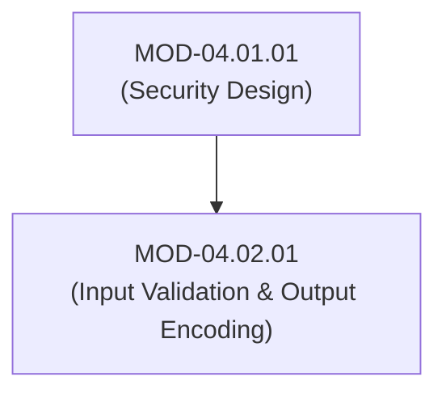
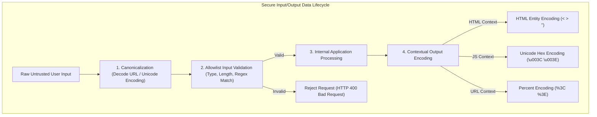

# Input Validation, Contextual Output Encoding & Sanitization

## 1. Overview & Purpose
Flaws in input processing and output rendering account for the vast majority of software vulnerabilities (Injection, XSS, Path Traversal).

This module details Allowlist (Positive) Validation vs Denylist (Negative) Filtering, Contextual Output Encoding (HTML Entity, Attribute, JavaScript, CSS, URL), Canonicalization, and Parameterized Input processing.

---

## 2. Prerequisites & Prerequisites Graph
- **Prerequisites**: `MOD-04.01.01` (Security Design Principles).



---

## 3. Learning Objectives & Taxonomy Alignment
- **L1 Awareness**: Contrast Allowlisting (Whitelisting) and Denylisting (Blacklisting).
- **L2 Understanding**: Explain Canonicalization vulnerabilities (Unicode/URL double encoding) and Context-Aware Output Encoding.
- **L3 Practical**: Implement strict Regex input validation schemas and contextual encoding in Python/Web applications.
- **L4 Engineering**: Design central validation and encoding middleware frameworks for enterprise software codebases.

---

## 4. L1 — Awareness (Overview & Core Terminology)
**Input Validation** verifies that incoming data matches expected type, length, format, and range *before* processing. **Contextual Output Encoding** translates dangerous control characters into safe representation forms *before* rendering data in an output context (e.g., converting `<script>` to `&lt;script&gt;`).

---

## 5. L2 — Understanding (Core Theory & Mechanics)



### Canonicalization Vulnerabilities:
Attackers bypass naive input filters by submitting double-encoded or alternate Unicode representations (e.g., submitting `%252e%252e%252f` for `../`). Applications MUST decode inputs to their canonical base representation *before* applying validation checks.

---

## 6. L3 — Practical (Commands & Configurations)

### Secure Input Validation & Encoding in Python:
```python
import re
import html

# 1. Allowlist Validation for Username (Alpha-numeric, 3-20 chars)
USERNAME_REGEX = re.compile(r"^[a-zA-Z0-9_-]{3,20}$")

def validate_username(username: str) -> str:
    if not USERNAME_REGEX.match(username):
        raise ValueError("Invalid username format")
    return username

# 2. Contextual HTML Output Encoding
def render_user_comment_html(user_input: str) -> str:
    # Encodes < > & " ' into HTML entities
    safe_html = html.escape(user_input, quote=True)
    return f"<div class='comment'>{safe_html}</div>"

# Test rendering
raw_input = "<script>alert('XSS')</script>"
print(render_user_comment_html(raw_input))
# Output: <div class='comment'>&lt;script&gt;alert(&#x27;XSS&#x27;)&lt;/script&gt;</div>
```

---

## 7. L4 — Engineering (Design Trade-offs & System Integration)
- **Why Input Validation is NOT Sufficient for XSS**: Valid inputs for one context (e.g., an email address containing `'`) are safe in a database but dangerous if rendered inside an inline JavaScript block without context-aware JS encoding. Output encoding MUST match the specific rendering destination.

---

## 8. Internal Architecture & Data Structures
Contextual Encoding Translation Matrix:
```text
┌──────────────────┬──────────────────────────┬─────────────────────────────┐
│ Output Context   │ Dangerous Characters     │ Safe Encoding Format        │
├──────────────────┼──────────────────────────┼─────────────────────────────┤
│ HTML Body        │ < > & " '                │ &lt; &gt; &amp; &quot; &#x27;│
│ HTML Attribute   │ < > & " ' [space]        │ &#xHH; (Hex Entity)         │
│ JavaScript Block │ < > & " ' \              │ \u00XX (Unicode Hex)        │
│ URL Parameter    │ [non-alphanumeric]      │ %XX (Percent Encoding)      │
└──────────────────┴──────────────────────────┴─────────────────────────────┘
```

---

## 9. Security Implications & Boundary Controls
- **Never Rely on Denylists**: Blacklisting specific strings (like `SELECT` or `<script>`) is easily bypassed using case variations (`sElEcT`), whitespace tricks, or alternate tags (``).

---

## 10. Attack Vectors & Exploitation Primitives
1. **Double URL Encoding Filter Bypass**: Submitting `%252f` to bypass single-pass path traversal filters.
2. **Context-Mismatch XSS**: Using standard HTML entity encoding inside an inline `<script>` tag.

---

## 11. Defense & Telemetry Verification
- Enforce **Strict Allowlist Validation** on all input endpoints.
- Enforce **Contextual Encoding** libraries (OWASP Java Encoder / Bleach).

---

## 12. Detection & Telemetry Verification

### WAF Input Validation Telemetry Alert:
```yaml
title: Input Validation Anomaly - Invalid Characters
id: b9102941-8210-41ab-b01b-920191fa882b
logsource:
  category: webserver
  product: nginx_waf
detection:
  selection:
    status: 400
    rule_id: '942100' # OWASP CRS Injection
  condition: selection
level: medium
```

---

## 13. Hands-On Lab Reference
- **Associated Lab**: `LAB-SEC003` (Canonicalization Bypasses & Contextual Encoding Remediation).

---

## 14. Related Projects & Applications
- **Associated Project**: `PRJ-SEC001` (Secure Healthcare Platform).

---

## 15. Troubleshooting & Diagnostics Matrix

| Symptom | Root Cause | Remediation / Diagnostic Command |
| :--- | :--- | :--- |
| Valid user names with apostrophes (O'Connor) rejected. | Overly restrictive regex or lack of parameterized encoding. | Allow apostrophes in validation regex, apply SQL parameterization and HTML encoding. |

---

## 16. Related Concepts & Cross-Domain Links
- `CON-SEC005`: Canonicalization Flaws (`DOM-04`)
- `CON-SEC006`: Contextual Output Encoding (`DOM-04`)

---

## 17. Technical Interview Preparation (Q&A)
**Q: Why must canonicalization be performed BEFORE input validation?**  
*Answer*: Canonicalization decodes encoded characters (such as URL percent-encoding or Unicode normalization) into their single simplest representation. If input validation runs before canonicalization, an attacker can supply encoded malicious payloads (e.g., `%2e%2e%2f` for `../`) that pass the raw string validation check, but are later decoded by the application into dangerous path traversal operations.

---

## 18. Self-Assessment & Mastery Checklist
- [ ] Understand canonicalization order of operations.
- [ ] Able to choose correct encoding formats for HTML, JS, and URL contexts.

---

## 19. References & Further Reading
- OWASP Proactive Controls: *C5: Validate All Inputs & C4: Encode Data*.
- OWASP Cheat Sheet: *Input Validation & Injection Prevention Cheat Sheet*.
