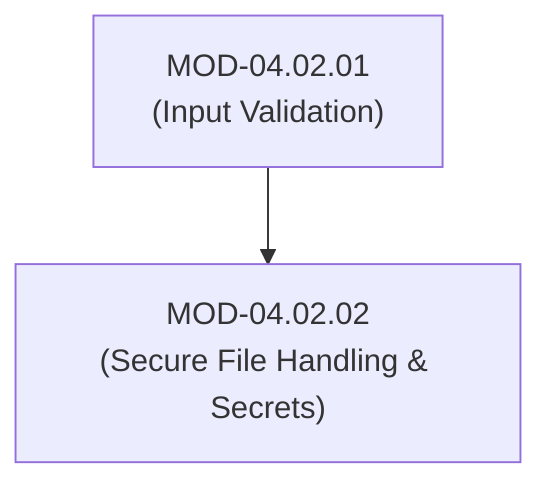

# Secure File Handling, Error Management & Secret Sanitization in Code

## 1. Overview & Purpose
Insecure file operations and improper error handling expose sensitive system data, leak credentials in logs, and allow arbitrary file overwrite or code execution.

This module details Secure File Path Normalization, Time-of-Check to Time-of-Use (TOCTOU) file race conditions, Safe Temporary File creation, Generic Error Handling (blocking stack trace leaks), and In-Memory Secret Sanitization (`explicit_bzero` / zeroization).

---

## 2. Prerequisites & Prerequisites Graph
- **Prerequisites**: `MOD-04.02.01` (Input Validation).



---

## 3. Learning Objectives & Taxonomy Alignment
- **L1 Awareness**: Identify hardcoded secrets and stack trace information leaks.
- **L2 Understanding**: Explain TOCTOU file race condition mechanics and in-memory zeroization of cryptographic keys.
- **L3 Practical**: Implement safe file upload validation and zeroization functions in C/Python.
- **L4 Engineering**: Design zero-leak error management frameworks for enterprise cloud microservices.

---

## 4. L1 — Awareness (Overview & Core Terminology)
Hardcoded secrets (API keys, private keys) committed to code repositories represent instant compromise vectors. Detailed stack traces returned in production HTTP 500 errors leak internal directory structures and library versions to attackers.

---

## 5. L2 — Understanding (Core Theory & Mechanics)

```mermaid
graph TD
    subgraph TOCTOU Race Condition Mechanics
        APP["Vulnerable Application"]
        ATTACKER["Attacker Process"]
        FILE["Target File (/tmp/temp_file.txt)"]
        SHADOW["Target File (/etc/shadow)"]

        APP -->|1. Check Permissions access('/tmp/temp_file.txt')| FILE
        ATTACKER -->|2. Race: Replace /tmp/temp_file.txt with symlink to /etc/shadow!| SHADOW
        APP -->|3. Open File open('/tmp/temp_file.txt', O_WRONLY)| SHADOW
    end
```

### Time-of-Check to Time-of-Use (TOCTOU) Flaw:
Occurs when an application checks a file's state (`access()`) and subsequently performs an operation (`open()`). Between the check and the operation, an attacker changes the file system state (e.g., swapping the file with a symbolic link to `/etc/shadow`), forcing the app to overwrite system files.

### In-Memory Secret Zeroization:
Standard compiler optimizations often strip out standard `memset(key, 0, len)` calls if the key buffer is not read again before function return. Secure software MUST use non-optimizable memory zeroization routines (`explicit_bzero` or Rust `zeroize` crate).

---

## 6. L3 — Practical (Commands & Configurations)

### Secure File Upload Path Verification in Python:
```python
import os
from pathlib import Path

UPLOAD_DIR = Path("/var/app/uploads").resolve()

def save_uploaded_file(filename: str, content: bytes):
    # 1. Sanitize filename & normalize target path
    safe_name = os.path.basename(filename)
    target_path = (UPLOAD_DIR / safe_name).resolve()

    # 2. Prevent Path Traversal (Directory Escape Check)
    if not str(target_path).startswith(str(UPLOAD_DIR)):
        raise PermissionError("Path Traversal Attempt Detected!")

    # 3. Write file securely with restricted permissions (0600)
    flags = os.O_WRONLY | os.O_CREAT | os.O_EXCL
    fd = os.open(target_path, flags, 0o600)
    with os.fdopen(fd, 'wb') as f:
        f.write(content)
```

---

## 7. L4 — Engineering (Design Trade-offs & System Integration)
- **Generic Error Responses vs Diagnostic Logging**: Production HTTP interfaces MUST return generic error messages (`"An internal system error occurred. Reference ID: ERR-94210"`) while logging full diagnostic stack traces to secure internal log aggregators, preventing information disclosure to external clients.

---

## 8. Internal Architecture & Data Structures
Secure Memory Zeroization in C (`explicit_bzero` / `memset_s`):
```c
#include <string.h>

void process_sensitive_key(unsigned char *key, size_t key_len) {
    // Perform cryptographic operation
    // ...

    // Securely wipe key from RAM (Guaranteed not to be optimized away by compiler)
    explicit_bzero(key, key_len);
}
```

---

## 9. Security Implications & Boundary Controls
- **Hardcoded Secret Detection**: Committing secrets to Git leaves permanent footprints in repository history even if the commit is subsequently reverted.

---

## 10. Attack Vectors & Exploitation Primitives
1. **TOCTOU Symlink Exploitation**: Winning file system race conditions to overwrite system files.
2. **Production Stack Trace Leakage**: Extracting database connection strings from HTTP 500 error pages.

---

## 11. Defense & Telemetry Verification
- Enforce **Git Pre-Commit Secret Scanners (Gitleaks / Trufflehog)**.
- Use **`explicit_bzero` / `zeroize`** for all temporary secret memory buffers.

---

## 12. Detection & Telemetry Verification

### Running Gitleaks Secret Scanner in CI/CD:
```bash
# Scan local git repository for committed API keys / certificates
gitleaks detect --source . --verbose
```

---

## 13. Hands-On Lab Reference
- **Associated Lab**: `LAB-SEC004` (TOCTOU Exploitation & Secret Zeroization Analysis).

---

## 14. Related Projects & Applications
- **Associated Project**: `PRJ-SEC001` (Secure Healthcare Platform).

---

## 15. Troubleshooting & Diagnostics Matrix

| Symptom | Root Cause | Remediation / Diagnostic Command |
| :--- | :--- | :--- |
| `FileExistsError` during secure file creation. | File creation used `O_CREAT \| O_EXCL` flags and file already exists. | Generate unique file names using cryptographically secure UUIDs (`uuid.uuid4()`). |

---

## 16. Related Concepts & Cross-Domain Links
- `CON-SEC007`: TOCTOU Race Conditions (`DOM-04`)
- `CON-SEC008`: In-Memory Secret Zeroization (`DOM-04`)

---

## 17. Technical Interview Preparation (Q&A)
**Q: Why does standard `memset(buf, 0, len)` fail to securely erase sensitive cryptographic keys from memory, and how is it fixed?**  
*Answer*: Modern C/C++ compilers perform dead-store elimination optimizations. If a memory buffer is zeroed using `memset` right before the buffer goes out of scope and is not read again, the compiler optimizes away the `memset` call entirely to save CPU cycles, leaving sensitive key material in RAM. Secure code must use `explicit_bzero()` (POSIX) or `memset_s()` (C11), which explicitly instruct the compiler never to optimize away the memory clearing operation.

---

## 18. Self-Assessment & Mastery Checklist
- [ ] Understand TOCTOU race condition mechanics.
- [ ] Able to configure pre-commit hooks for secret detection using Gitleaks.

---

## 19. References & Further Reading
- CERT C Secure Coding Standard: *FIO01-C. Be careful using functions that operate on paths*.
- OWASP Cheat Sheet: *Error Handling & Logging Cheat Sheet*.
