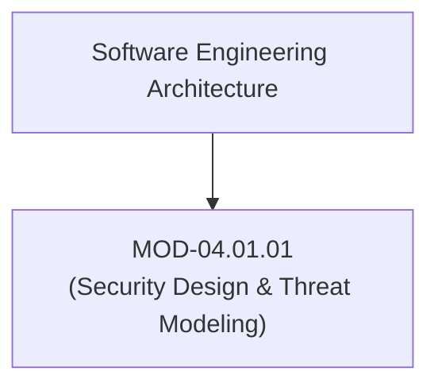
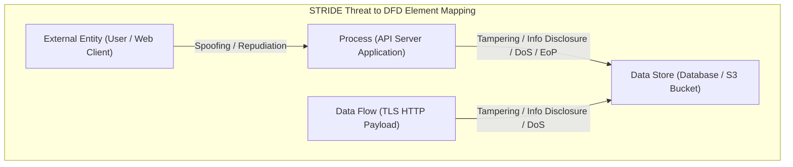

# Security Design Principles & Threat Modeling (STRIDE & PASTA)

## 1. Overview & Purpose
Secure software engineering begins during the design phase long before source code is written. Proactive threat modeling identifies architectural flaws when remediation costs are minimal.

This module details Saltzer and Schroeder's Secure Design Principles (Economy of Mechanism, Fail-Safe Defaults, Complete Mediation, Open Design, Separation of Privilege, Least Privilege, Least Common Mechanism, Psychological Acceptability), STRIDE threat classification, PASTA risk-centric threat modeling methodology, Data Flow Diagrams (DFDs), and Trust Boundary demarcation.

---

## 2. Prerequisites & Prerequisites Graph
- **Prerequisites**: Software engineering fundamentals, system architecture patterns.



---

## 3. Learning Objectives & Taxonomy Alignment
- **L1 Awareness**: Define the 8 Saltzer-Schroeder secure design principles and STRIDE threat categories.
- **L2 Understanding**: Detail STRIDE threat mapping against DFD elements (Processes, Data Stores, Data Flows, External Entities) and PASTA 7-stage risk modeling.
- **L3 Practical**: Construct Threat Dragon / PyTM threat modeling code for a cloud application.
- **L4 Engineering**: Design automated CI/CD threat modeling gates integrated with architectural change requests.

---

## 4. L1 — Awareness (Overview & Core Terminology)
Threat modeling is a structured methodology for identifying, quantifying, and addressing security risks in software architecture. **STRIDE** categorizes threats into: **S**poofing, **T**ampering, **R**epudiation, **I**nformation Disclosure, **D**enial of Service, and **E**levation of Privilege.

---

## 5. L2 — Understanding (Core Theory & Mechanics)



### STRIDE Category & Element Mapping:

| STRIDE Category | Security Property Violated | Primary DFD Target Elements | Mitigation Controls |
| :--- | :--- | :--- | :--- |
| **Spoofing** | Authenticity | External Entities, Processes | Strong AuthN, mTLS, Digital Signatures |
| **Tampering** | Integrity | Data Flows, Data Stores, Processes | HMAC, TLS, Digital Signatures |
| **Repudiation** | Non-Repudiability | Processes, Data Stores | Immutable Audit Logs, Digital Signatures |
| **Information Disclosure** | Confidentiality | Data Flows, Data Stores | AES-256 Encryption, Access Controls |
| **Denial of Service** | Availability | Processes, Data Flows, Data Stores | Rate Limiting, Redundancy, SYN Proxy |
| **Elevation of Privilege** | Authorization | Processes | RBAC, Least Privilege, Input Validation |

---

## 6. L3 — Practical (Commands & Configurations)

### Threat Modeling via Python (`pytm` Code-as-Threat-Model):
```python
from pytm import TM, Server, Datastore, User, Flow, Element

tm = TM("Enterprise Payment Gateway Threat Model")

# Define Data Flow Diagram (DFD) Elements
user = User("Customer Client")
api_gateway = Server("Payment API Gateway")
db = Datastore("PostgreSQL Payment DB")

# Define Data Flows & Trust Boundaries
user_to_api = Flow(user, api_gateway, "HTTPS REST Request (Credit Card Payload)")
api_to_db = Flow(api_gateway, db, "SQL Query over TLS")

# Execute Threat Analysis Engine
tm.resolve()
```

---

## 7. L4 — Engineering (Design Trade-offs & System Integration)
- **PASTA (Process for Attack Simulation and Threat Analysis)**: PASTA is a 7-stage risk-centric threat modeling methodology that aligns security mitigations directly with business impact and asset value, whereas STRIDE focuses purely on software component vulnerability classification.

---

## 8. Internal Architecture & Data Structures
PASTA 7-Stage Risk Lifecycle:
```text
Stage 1: Define Business Objectives
Stage 2: Define Technical Scope & Boundaries
Stage 3: Application Decomposition (DFDs)
Stage 4: Threat Analysis (STRIDE / MITRE ATT&CK)
Stage 5: Vulnerability & Flaw Analysis (CWE Mapping)
Stage 6: Attack Modeling & Exploitation Trees
Stage 7: Risk Mitigation & Countermeasure Engineering
```

---

## 9. Security Implications & Boundary Controls
- **Trust Boundary Demarcation**: A Trust Boundary occurs wherever data crosses from a lower-trust zone (e.g., public internet user) to a higher-trust zone (e.g., internal backend microservice). Every trust boundary crossing MUST enforce strict input validation and authentication.

---

## 10. Attack Vectors & Exploitation Primitives
1. **Unvalidated Trust Boundary Transition**: Assuming data coming from an internal microservice is benign, leading to internal SSRF or RCE.
2. **Fail-Open Design Flaws**: Error handling code falling back to permissive default access upon database connection timeouts.

---

## 11. Defense & Telemetry Verification
- Enforce **Fail-Safe Defaults**: Reject access unless explicitly granted.
- Perform mandatory **Threat Modeling Reviews** for every major architectural change.

---

## 12. Detection & Telemetry Verification

### Architectural Audit Checklist Verification:
```bash
# Validate open ports and external trust boundary endpoints
nmap -sV -T4 192.168.1.0/24
```

---

## 13. Hands-On Lab Reference
- **Associated Lab**: `LAB-SEC001` (STRIDE Threat Modeling & Trust Boundary Analysis).

---

## 14. Related Projects & Applications
- **Associated Project**: `PRJ-SEC001` (Secure Healthcare Platform).

---

## 15. Troubleshooting & Diagnostics Matrix

| Symptom | Root Cause | Remediation / Diagnostic Command |
| :--- | :--- | :--- |
| High rate of unmitigated architectural flaws in production. | Threat modeling conducted too late in SDLC (post-implementation). | Shift threat modeling left into Stage 1/2 of sprint planning. |

---

## 16. Related Concepts & Cross-Domain Links
- `CON-SEC001`: STRIDE Threat Categories (`DOM-04`)
- `CON-SEC002`: Saltzer-Schroeder Design Principles (`DOM-04`)

---

## 17. Technical Interview Preparation (Q&A)
**Q: Explain Saltzer and Schroeder's "Complete Mediation" principle and how it prevents authorization bypasses.**  
*Answer*: Complete Mediation mandates that every single access attempt to every resource must be explicitly checked for authorization, without relying on cached permissions or assuming previous authorization steps remain valid. Bypassing Complete Mediation occurs when applications check authorization once at session login but fail to re-verify permissions on individual resource operations (leading to IDOR vulnerabilities).

---

## 18. Self-Assessment & Mastery Checklist
- [ ] Understand all 6 STRIDE threat categories and mitigations.
- [ ] Able to draw a DFD with explicit trust boundaries for a microservice app.

---

## 19. References & Further Reading
- Saltzer & Schroeder: *The Protection of Information in Computer Systems (1975)*.
- Adam Shostack: *Threat Modeling: Designing for Security*.
- OWASP: *Threat Modeling Cheat Sheet*.
