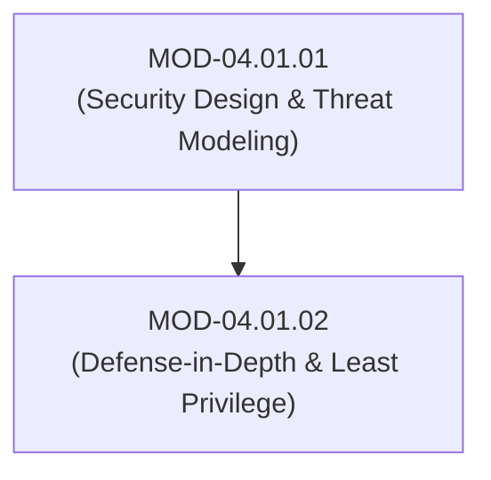
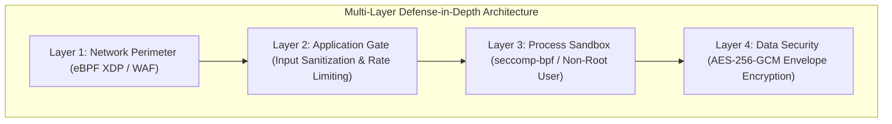

# Defense-in-Depth, Least Privilege & Attack Surface Reduction

## 1. Overview & Purpose
Single security controls inevitably fail. Defense-in-Depth ensures that software systems maintain security even when individual layers are compromised.

This module details Defense-in-Depth layered architecture, Principle of Least Privilege (PoLP), Attack Surface Reduction (ASR), Sandboxing, Principle of Least Common Mechanism, and Compartmentalization.

---

## 2. Prerequisites & Prerequisites Graph
- **Prerequisites**: `MOD-04.01.01` (Security Design Principles).



---

## 3. Learning Objectives & Taxonomy Alignment
- **L1 Awareness**: Explain Defense-in-Depth layering and Attack Surface Reduction concepts.
- **L2 Understanding**: Detail process sandboxing (seccomp, namespaces), capability drop mechanisms, and compartmentalization.
- **L3 Practical**: Configure Linux `seccomp-bpf` syscall filters and systemd security hardening directives.
- **L4 Engineering**: Design zero-trust multi-layer application architectures resilient to single-component compromises.

---

## 4. L1 — Awareness (Overview & Core Terminology)
**Defense-in-Depth** places redundant security controls across multiple layers (Network, Host, Application, Data). **Principle of Least Privilege (PoLP)** restricts processes to only the minimum permissions required to perform their designated tasks.

---

## 5. L2 — Understanding (Core Theory & Mechanics)



### Attack Surface Reduction (ASR):
Reduces system vulnerability by disabling unused features, closing unneeded ports, removing redundant dependencies, and stripping debug endpoints from production binaries.

---

## 6. L3 — Practical (Commands & Configurations)

### Systemd Process Security Hardening Directives (`/etc/systemd/system/payment-app.service`):
```ini
[Unit]
Description=Payment Microservice Engine
After=network.target

[Service]
ExecStart=/usr/bin/payment-app
User=www-data
Group=www-data

# Attack Surface Reduction & Process Sandboxing
ProtectSystem=strict
ProtectHome=true
PrivateTmp=true
NoNewPrivileges=true
CapabilityBoundingSet=
SystemCallFilter=@default @basic-io @file-system ~@clock ~@cpu-emulation
MemoryDenyWriteExecute=true
```

---

## 7. L4 — Engineering (Design Trade-offs & System Integration)
- **Least Common Mechanism vs Microservice Shared Libraries**: Sharing common utility libraries across microservices reduces code duplication, but violates the Principle of Least Common Mechanism if a vulnerability in the shared library compromises every connected microservice simultaneously.

---

## 8. Internal Architecture & Data Structures
`seccomp-bpf` System Call Filter Struct in C:
```c
struct sock_filter filter[] = {
    BPF_STMT(BPF_LD | BPF_W | BPF_ABS, (offsetof(struct seccomp_data, nr))),
    BPF_JUMP(BPF_JMP | BPF_JEQ | BPF_K, __NR_execve, 0, 1),
    BPF_STMT(BPF_RET | BPF_K, SECCOMP_RET_KILL), // Kill process if execve called!
    BPF_STMT(BPF_RET | BPF_K, SECCOMP_RET_ALLOW),
};
```

---

## 9. Security Implications & Boundary Controls
- **Privilege Separation**: Monolithic processes running as `root` represent single points of total system compromise. Applications must drop root privileges immediately after binding low ports.

---

## 10. Attack Vectors & Exploitation Primitives
1. **Container / Sandbox Escape**: Exploiting kernel vulnerabilities from within a permissive container to gain root access on the host.
2. **Debug Endpoint Exposure**: Exploiting forgotten `/debug/pprof` or `/actuator` endpoints left enabled in production.

---

## 11. Defense & Telemetry Verification
- Enforce `NoNewPrivileges=true` and non-root execution for all production processes.
- Implement **seccomp-bpf** syscall filtering on critical microservices.

---

## 12. Detection & Telemetry Verification

### Auditing Systemd Process Security Scores:
```bash
# Analyze security posture of running systemd services
systemd-analyze security payment-app.service
```

---

## 13. Hands-On Lab Reference
- **Associated Lab**: `LAB-SEC002` (Systemd Sandboxing & Seccomp Syscall Filtering).

---

## 14. Related Projects & Applications
- **Associated Project**: `PRJ-SEC001` (Secure Healthcare Platform).

---

## 15. Troubleshooting & Diagnostics Matrix

| Symptom | Root Cause | Remediation / Diagnostic Command |
| :--- | :--- | :--- |
| Application crashes immediately with `SIGSYS` (Bad system call). | `seccomp-bpf` filter blocked a required system call. | Inspect kernel `dmesg` or `auditd` logs to identify blocked syscall number. |

---

## 16. Related Concepts & Cross-Domain Links
- `CON-SEC003`: Principle of Least Privilege (`DOM-04`)
- `CON-SEC004`: Seccomp BPF Sandboxing (`DOM-04`)
- `CON-SYS002`: Linux Syscall Table (`DOM-01`)

---

## 17. Technical Interview Preparation (Q&A)
**Q: How does `seccomp-bpf` enforce Attack Surface Reduction at the OS process level?**  
*Answer*: `seccomp-bpf` allows a process to load a Berkley Packet Filter (BPF) program into the Linux kernel that inspects every system call invoked by the process. By creating a strict whitelist of allowed syscalls (e.g., allowing only `read`, `write`, `exit` while blocking `execve`, `ptrace`, `socket`), the application's kernel attack surface is drastically reduced, neutralizing weaponized exploit payloads even if code execution is achieved.

---

## 18. Self-Assessment & Mastery Checklist
- [ ] Understand Defense-in-Depth architectural layers.
- [ ] Able to audit systemd service security using `systemd-analyze security`.

---

## 19. References & Further Reading
- NIST SP 800-53: *Security and Privacy Controls for Information Systems and Organizations*.
- Linux Kernel Documentation: *seccomp BPF syscall filtering*.
