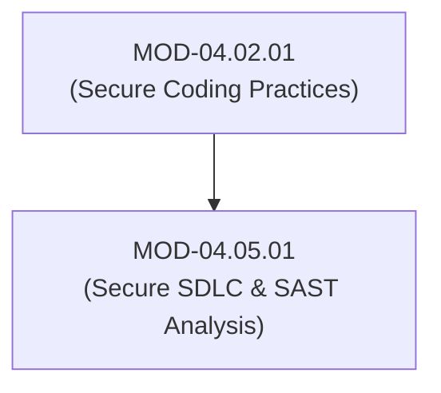
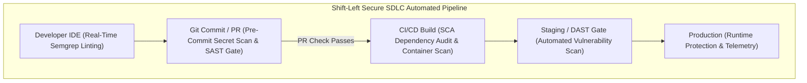

# Secure SDLC Integration, Code Review & SAST/SCA Analysis

## 1. Overview & Purpose
Integrating security into the Software Development Life Cycle (SDLC) shifts vulnerability identification left to pre-commit and build phases.

This module details Secure SDLC frameworks (BSIMM, OWASP SAMM), Shift-Left Security, Automated Static Application Security Testing (SAST using Semgrep / SonarQube), Software Composition Analysis (SCA), Security Code Review guidelines, and IDE Real-Time Linting.

---

## 2. Prerequisites & Prerequisites Graph
- **Prerequisites**: `MOD-04.02.01` (Secure Coding Practices).



---

## 3. Learning Objectives & Taxonomy Alignment
- **L1 Awareness**: Explain Shift-Left Security and BSIMM / OWASP SAMM frameworks.
- **L2 Understanding**: Detail Abstract Syntax Tree (AST) static analysis parsing and Semgrep rule matching mechanics.
- **L3 Practical**: Write custom Semgrep AST rules and configure GitHub Actions SAST scanning gates.
- **L4 Engineering**: Design enterprise automated security gate pipelines blocking vulnerable pull requests before code merge.

---

## 4. L1 — Awareness (Overview & Core Terminology)
**Shift-Left Security** embeds security automated testing early in the development cycle (IDE/Git), preventing vulnerabilities from reaching production deployment. **SAST** analyzes static source code; **SCA** audits third-party library dependencies.

---

## 5. L2 — Understanding (Core Theory & Mechanics)



### Abstract Syntax Tree (AST) Pattern Matching:
Legacy regex scanners trigger high false-positive rates because regex lacks code context. Modern SAST engines (Semgrep) parse source code into an **Abstract Syntax Tree (AST)**, evaluating semantic variable flow, function scopes, and taint propagation (`taint_from_source -> sink`).

---

## 6. L3 — Practical (Commands & Configurations)

### Writing a Custom Semgrep Rule to Detect Unparameterized SQL (`rules/sqli.yaml`):
```yaml
rules:
  - id: raw-sql-string-concatenation
    patterns:
      - pattern: $CURSOR.execute("..." % ...)
      - pattern-not: $CURSOR.execute("...", (...))
    message: "Detected raw string formatting inside cursor.execute(). Use parameterized placeholders instead."
    languages: [python]
    severity: ERROR
```

### Running Semgrep SAST CLI:
```bash
# Execute Semgrep scan against local codebase
semgrep --config=auto --config=./rules/ .
```

---

## 7. L4 — Engineering (Design Trade-offs & System Integration)
- **SAST Rule Tuning & False Positive Reduction**: Overly aggressive SAST rulesets cause "alert fatigue," leading developers to bypass security checks. Security teams must continuously tune SAST rulesets to achieve a <5% false positive rate before enforcing hard PR blocking gates.

---

## 8. Internal Architecture & Data Structures
SARIF (Static Analysis Results Interchange Format - JSON Standard):
```json
{
  "$schema": "https://json.schemastore.org/sarif-2.1.0.json",
  "version": "2.1.0",
  "runs": [{
    "tool": { "driver": { "name": "Semgrep", "version": "1.35.0" } },
    "results": [{
      "ruleId": "raw-sql-string-concatenation",
      "level": "error",
      "locations": [{ "physicalLocation": { "artifactLocation": { "uri": "db.py" }, "region": { "startLine": 42 } } }]
    }]
  }]
}
```

---

## 9. Security Implications & Boundary Controls
- **Bypassing CI/CD Security Checks**: Allowing developers to use `git commit --no-verify` or bypass mandatory GitHub PR status checks destroys SDLC enforcement.

---

## 10. Attack Vectors & Exploitation Primitives
1. **Malicious Dependency Ingestion**: Attacker publishing malicious packages with typosquatted names (e.g. `reqeusts` instead of `requests`).
2. **Pull Request Security Gate Bypass**: Direct force-pushing to `main` branch bypassing SAST checks.

---

## 11. Defense & Telemetry Verification
- Enforce **Mandatory GitHub Branch Protection Rules** requiring passing SAST/SCA checks.
- Deploy **OWASP Dependency-Check / Trivy** for automated SCA auditing.

---

## 12. Detection & Telemetry Verification

### GitHub Actions CI/CD Security Gate (`.github/workflows/security.yml`):
```yaml
name: Security Scan Gate
on: [pull_request]
jobs:
  sast:
    runs-on: ubuntu-latest
    steps:
      - uses: actions/checkout@v3
      - name: Run Semgrep SAST
        run: semgrep --config=p/ci --error
```

---

## 13. Hands-On Lab Reference
- **Associated Lab**: `LAB-SEC010` (Custom Semgrep Rule Writing & GitHub Actions Gate Setup).

---

## 14. Related Projects & Applications
- **Associated Project**: `PRJ-SEC001` (Secure Healthcare Platform).

---

## 15. Troubleshooting & Diagnostics Matrix

| Symptom | Root Cause | Remediation / Diagnostic Command |
| :--- | :--- | :--- |
| CI/CD pipeline fails with `Semgrep returned exit code 1`. | SAST rule identified high-severity code vulnerability. | Inspect SARIF output file to locate line number and apply remediation. |

---

## 16. Related Concepts & Cross-Domain Links
- `CON-SEC020`: Shift-Left Security (`DOM-04`)
- `CON-SEC021`: Abstract Syntax Tree AST Parsing (`DOM-04`)
- `CON-SEC022`: SARIF Output Standard (`DOM-04`)

---

## 17. Technical Interview Preparation (Q&A)
**Q: What is the main operational difference between SAST and SCA in a Secure SDLC pipeline?**  
*Answer*: SAST (Static Application Security Testing) analyzes custom source code written by internal developers for architectural and coding flaws (such as SQL injection, hardcoded secrets, or path traversal). SCA (Software Composition Analysis) inspects third-party open-source libraries and dependencies (e.g., `npm`, `pip`, `cargo` packages) against known vulnerability databases (NVD/CVE), auditing the software supply chain for outdated or vulnerable open-source components.

---

## 18. Self-Assessment & Mastery Checklist
- [ ] Understand AST static analysis pattern matching mechanics.
- [ ] Able to write custom Semgrep rules in YAML.

---

## 19. References & Further Reading
- OWASP: *Software Assurance Maturity Model (SAMM v2.0)*.
- Semgrep Documentation: *Writing Custom Semgrep Rules*.
- OASIS Standard: *SARIF Specification Version 2.1.0*.
