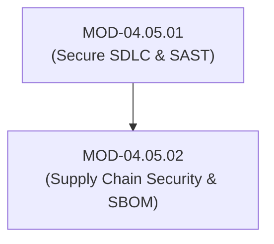

# Software Supply Chain Security, SBOM (CycloneDX/SPDX) & SLSA Framework

## 1. Overview & Purpose
Modern software codebases consist of up to 80-90% third-party open-source components, exposing organizations to software supply chain attacks.

This module details Software Bill of Materials (SBOM - CycloneDX / SPDX), Supply-chain Levels for Software Artifacts (SLSA v1.0), Sigstore / Cosign artifact signing, Typosquatting, Dependency Confusion, and Hermetic Build Environments.

---

## 2. Prerequisites & Prerequisites Graph
- **Prerequisites**: `MOD-04.05.01` (Secure SDLC & SAST Analysis).



---

## 3. Learning Objectives & Taxonomy Alignment
- **L1 Awareness**: Understand Software Bill of Materials (SBOM) and SLSA Levels 1–3.
- **L2 Understanding**: Explain Dependency Confusion attack mechanics, Cosign keyless OIDC artifact signing, and CycloneDX JSON schemas.
- **L3 Practical**: Generate CycloneDX SBOMs via `syft` and verify container signatures using `cosign`.
- **L4 Engineering**: Design hermetic build pipelines producing cryptographically signed, reproducible build artifacts.

---

## 4. L1 — Awareness (Overview & Core Terminology)
An **SBOM (Software Bill of Materials)** is a nested inventory listing all third-party libraries, modules, and licenses included in a software application. **SLSA (Supply-chain Levels for Software Artifacts)** provides a security framework preventing tampering with software build artifacts.

---

## 5. L2 — Understanding (Core Theory & Mechanics)

```mermaid
graph TD
    subgraph Cryptographically Verifiable Supply Chain (SLSA Level 3 + Cosign)
        DEV["Developer Source Code"] --> BUILD["Hermetic Isolated Build Pipeline (GitHub Actions / Tekton)"]
        BUILD --> PROD_ART["Compiled Container Image / Binary"]

        PROD_ART --> COSIGN["Sigstore Cosign (OIDC Short-Lived Cert + Fulcio / Rekor Log)"]
        COSIGN --> PROV["Cryptographic Provenance Attestation (.intoto.jsonl)"]

        PROV --> K8S["Production Kubernetes Cluster (Kyverno / OPA Gatekeeper Policy)"]
        K8S -->|Verifies Signature & Provenance BEFORE Deployment| RUN["Running Pod"]
    end
```

### Dependency Confusion Attack:
Occurs when an application uses internal private packages (e.g., `@corp/internal-utils`). If the public registry (`npm` or `PyPI`) lacks a package by that exact name, an attacker registers `@corp/internal-utils` with a higher version number on the public registry. Build servers configured improperly download the malicious public package instead of the internal private package.

---

## 6. L3 — Practical (Commands & Configurations)

### Generating a CycloneDX SBOM using Syft:
```bash
# Generate CycloneDX JSON SBOM for a container image or project directory
syft dir:. -o cyclonedx-json=sbom.json
```

### Signing and Verifying Container Images with Cosign (Sigstore):
```bash
# Sign container image using keyless OIDC identity
cosign sign ghcr.io/corp/payment-service:v1.0.0

# Verify container image signature in deployment pipeline
cosign verify ghcr.io/corp/payment-service:v1.0.0 \
  --certificate-identity "https://github.com/corp/workflows/.github/workflows/build.yml@refs/heads/main" \
  --certificate-oidc-issuer "https://token.actions.githubusercontent.com"
```

---

## 7. L4 — Engineering (Design Trade-offs & System Integration)
- **Hermetic Builds vs Dynamic Resolution**: Hermetic builds isolate the build environment from the internet, resolving dependencies exclusively from local, immutable vendor caches. This prevents build-time dependency tampering (e.g., SolarWinds style attacks), but requires automated dependency vendor sync jobs.

---

## 8. Internal Architecture & Data Structures
CycloneDX JSON SBOM Component Entry Schema:
```json
{
  "bomFormat": "CycloneDX",
  "specVersion": "1.5",
  "components": [
    {
      "type": "library",
      "name": "cryptography",
      "version": "41.0.3",
      "purl": "pkg:pypi/cryptography@41.0.3",
      "hashes": [
        { "alg": "SHA-256", "content": "0a941f..." }
      ]
    }
  ]
}
```

---

## 9. Security Implications & Boundary Controls
- **Never Run Unsigned Build Artifacts**: Kubernetes clusters without signature enforcement (OPA/Kyverno) can execute tampered container images injected via compromised registry credentials.

---

## 10. Attack Vectors & Exploitation Primitives
1. **Dependency Confusion**: Poisoning public registries with matching internal package names.
2. **Build Pipeline Hijacking**: Modifying build scripts inside compromised CI/CD runners to insert backdoors during compilation.

---

## 11. Defense & Telemetry Verification
- Mandate **CycloneDX SBOM Generation** for all releases.
- Enforce **Kyverno / OPA Gatekeeper Signature Verification** in Kubernetes.

---

## 12. Detection & Telemetry Verification

### Kyverno Admission Controller Policy (Enforce Signed Container Images):
```yaml
apiVersion: kyverno.io/v1
kind: ClusterPolicy
metadata:
  name: verify-image-cosign
spec:
  validationFailureAction: Enforce
  rules:
    - name: verify-signature
      match:
        resources:
          kinds: ["Pod"]
      verifyImages:
        - imageReferences: ["ghcr.io/corp/*"]
          attestors:
            - entries:
                - keys:
                    publickey: |
                      -----BEGIN PUBLIC KEY-----
                      ...
                      -----END PUBLIC KEY-----
```

---

## 13. Hands-On Lab Reference
- **Associated Lab**: `LAB-SEC011` (SBOM Generation via Syft & Cosign Image Signing).

---

## 14. Related Projects & Applications
- **Associated Project**: `PRJ-SEC001` (Secure Healthcare Platform).

---

## 15. Troubleshooting & Diagnostics Matrix

| Symptom | Root Cause | Remediation / Diagnostic Command |
| :--- | :--- | :--- |
| `cosign verify` fails with `no matching signatures`. | Image tag overwritten or signed with different OIDC identity. | Inspect Rekor transparency log via `rekor-cli search --sha <digest>`. |

---

## 16. Related Concepts & Cross-Domain Links
- `CON-SEC023`: Software Bill of Materials SBOM (`DOM-04`)
- `CON-SEC024`: Sigstore Cosign Artifact Signing (`DOM-04`)
- `CON-SEC025`: Dependency Confusion (`DOM-04`)

---

## 17. Technical Interview Preparation (Q&A)
**Q: How does a Dependency Confusion attack exploit package manager resolution logic, and how is it mitigated?**  
*Answer*: Dependency Confusion occurs when an organization uses internal private package names (e.g., `@corp/auth`). If a developer accidentally leaves public registries (`npm`/`PyPI`) enabled without scoping rules, an attacker registers a malicious package with the exact same name on the public registry with a higher semantic version (e.g., `v99.0.0`). The package manager prioritizes the higher version from the public registry, executing malicious install scripts. Mitigation requires setting up explicit internal package scope registries (`.npmrc` scopes), configuring private proxy registries (Artifactory), and reserving corporate namespace scopes on public registries.

---

## 18. Self-Assessment & Mastery Checklist
- [ ] Understand CycloneDX vs SPDX SBOM formats.
- [ ] Able to sign and verify container images using `cosign`.

---

## 19. References & Further Reading
- SLSA Specification: *Supply-chain Levels for Software Artifacts v1.0*.
- OWASP CycloneDX: *Lightweight Software Bill of Materials (SBOM) Standard*.
- Sigstore: *Cosign Container Signing Documentation*.
