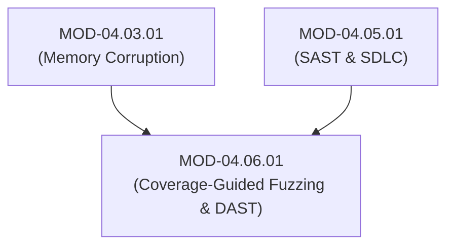
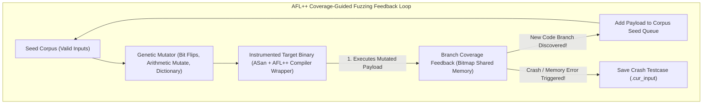

# Automated Security Testing, DAST & Coverage-Guided Fuzzing (AFL++)

## 1. Overview & Purpose
Static analysis identifies potential vulnerabilities in code structure, but dynamic testing and fuzzing validate actual runtime execution behavior under hostile inputs.

This module details Dynamic Application Security Testing (DAST using OWASP ZAP / Burp), Coverage-Guided Mutation Fuzzing (AFL++ / libFuzzer), Compiler Sanitizers (AddressSanitizer - ASan, MemorySanitizer - MSan, UndefinedBehaviorSanitizer - UBSan), Fuzzing Harnesses, and Crash Reproduction.

---

## 2. Prerequisites & Prerequisites Graph
- **Prerequisites**: `MOD-04.03.01` (Memory Corruption) & `MOD-04.05.01` (SAST).



---

## 3. Learning Objectives & Taxonomy Alignment
- **L1 Awareness**: Contrast Black-Box DAST, Grey-Box Fuzzing, and White-Box SAST.
- **L2 Understanding**: Detail Coverage-Guided Genetic Algorithm mutation mechanics (AFL++ Edge Coverage) and Compiler Sanitizer instrumentation.
- **L3 Practical**: Write a libFuzzer harness in C/C++ and execute AFL++ fuzzing campaigns against target binaries.
- **L4 Engineering**: Design continuous fuzzing infrastructure (ClusterFuzz / OSS-Fuzz) integrated into nightly CI build systems.

---

## 4. L1 — Awareness (Overview & Core Terminology)
**DAST (Dynamic Testing)** probes running applications over HTTP interfaces without access to source code. **Coverage-Guided Fuzzing** automatically feeds millions of mutated inputs into a target function while monitoring code coverage to discover unhandled memory crashes.

---

## 5. L2 — Understanding (Core Theory & Mechanics)



### Compiler Instrumentation & Edge Coverage:
AFL++ injects compile-time instrumentation hooks into every basic block branch (`cur_location ^ prev_location`). The fuzzer tracks branch transitions in a 64KB shared memory bitmap, instantly detecting when a mutated input reaches previously unexplored code branches.

---

## 6. L3 — Practical (Commands & Configurations)

### Writing a libFuzzer Harness in C++ (`fuzz_target.cc`):
```cpp
#include <stdint.h>
#include <stddef.h>
#include <string.h>

// Function to be fuzzed
extern "C" int ParseImageHeader(const uint8_t *data, size_t size);

// libFuzzer Entrypoint
extern "C" int LLVMFuzzerTestOneInput(const uint8_t *Data, size_t Size) {
    if (Size < 4) return 0; // Filter out inputs too small

    // Call target parser function
    ParseImageHeader(Data, Size);
    return 0;
}
```

### Compiling and Executing libFuzzer with AddressSanitizer:
```bash
# Compile harness with Clang libFuzzer + AddressSanitizer
clang++ -fsanitize=fuzzer,address -g fuzz_target.cc target_parser.cc -o fuzzer_bin

# Launch parallel fuzzing campaign with initial corpus directory
./fuzzer_bin ./corpus/
```

---

## 7. L4 — Engineering (Design Trade-offs & System Integration)
- **Fuzzing vs Static Analysis Trade-off**: SAST scans an entire codebase in minutes, but suffers from high false-positive rates. Fuzzing produces zero false positives (every reported crash is a proven bug), but requires significant CPU compute resources and hours/days of execution to reach high code coverage.

---

## 8. Internal Architecture & Data Structures
AFL++ Bitmap Shared Memory Coverage Tracking (C Assembly Hook):
```text
cur_location = <random_id>;
shared_mem[cur_location ^ prev_location]++;
prev_location = cur_location >> 1;
```

---

## 9. Security Implications & Boundary Controls
- **Fuzzing Harness Memory Leaks**: If a fuzzing harness leaks heap memory during target invocation, the fuzzer process will crash due to Out-Of-Memory (OOM) errors rather than true vulnerability crashes. Harnesses MUST clean up allocated resources on every iteration.

---

## 10. Attack Vectors & Exploitation Primitives
1. **Unchecked Buffer Processing in Parsers**: Exploiting missing length checks in binary file or network packet parsers.
2. **Integer Overflow Truncation Crashes**: Passing max integer values (`0xFFFFFFFF`) to trigger heap allocation under-sizing.

---

## 11. Defense & Telemetry Verification
- Integrate **OSS-Fuzz / ClusterFuzzLite** into nightly continuous integration builds.
- Mandate **ASan / UBSan / MSan** sanitizer checks on all fuzzer build targets.

---

## 12. Detection & Telemetry Verification

### Reproducing Fuzzer Crashes via GDB:
```bash
# Run compiled binary under GDB using crash testcase file saved by fuzzer
gdb --args ./target_parser crash-input-0941
(gdb) run
(gdb) backtrace
```

---

## 13. Hands-On Lab Reference
- **Associated Lab**: `LAB-SEC012` (libFuzzer Harness Writing & Crash Reproduction).

---

## 14. Related Projects & Applications
- **Associated Project**: `PRJ-SEC001` (Secure Healthcare Platform).

---

## 15. Troubleshooting & Diagnostics Matrix

| Symptom | Root Cause | Remediation / Diagnostic Command |
| :--- | :--- | :--- |
| libFuzzer warns `WARN: libFuzzer: 0 unique code paths explored`. | Target function not instrumented or returning early on size check. | Ensure binary compiled with `-fsanitize=fuzzer` and verify seed corpus contains valid inputs. |

---

## 16. Related Concepts & Cross-Domain Links
- `CON-SEC026`: Coverage-Guided Mutation Fuzzing (`DOM-04`)
- `CON-SEC027`: libFuzzer & AFL++ Instrumentation (`DOM-04`)
- `CON-SEC010`: AddressSanitizer ASan (`DOM-04`)

---

## 17. Technical Interview Preparation (Q&A)
**Q: How does coverage-guided fuzzing (e.g., AFL++ / libFuzzer) differ from naive random generation fuzzing?**  
*Answer*: Naive random fuzzing generates random byte streams without feedback, making it statistically impossible to hit deep conditional logic paths (e.g., passing a 4-byte magic header check `0xDEADBEEF`). Coverage-guided fuzzing injects compile-time instrumentation hooks into basic blocks to track execution paths in a shared memory bitmap. When a mutated input triggers a new execution path or branch, the fuzzer saves that input to its seed queue and uses it as the base for future mutations, systematically exploring complex codebases.

---

## 18. Self-Assessment & Mastery Checklist
- [ ] Understand genetic algorithm mutation feedback loops in AFL++.
- [ ] Able to write a libFuzzer target harness for a C/C++ parser function.

---

## 19. References & Further Reading
- AFL++ Project Documentation: *Fuzzing with AFL++*.
- LLVM libFuzzer Guide: *libFuzzer – a library for coverage-guided fuzz testing*.
- Google OSS-Fuzz: *Continuous Fuzzing Service for Open Source Software*.
