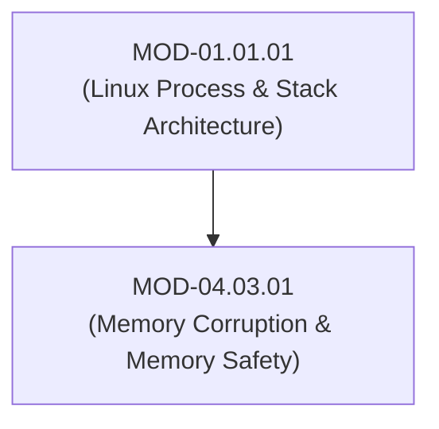

# Memory Corruption Primitives (Buffer Overflows, Use-After-Free & Memory Safety)

## 1. Overview & Purpose
Memory corruption vulnerabilities in unmanaged languages (C/C++) allow adversaries to overwrite stack/heap memory structures and hijack application control flow.

This module details Stack Buffer Overflows, Heap Chunk Corruption, Use-After-Free (UAF), Double Free, Integer Overflows, Compiler Mitigations (ASLR, DEP/NX, Stack Canaries, Control Flow Integrity - CFI), and Memory Safety paradigms (Rust Ownership/Borrow Checker vs Garbage Collection).

---

## 2. Prerequisites & Prerequisites Graph
- **Prerequisites**: `MOD-01.01.01` (x86_64 Stack Frame Architecture).



---

## 3. Learning Objectives & Taxonomy Alignment
- **L1 Awareness**: Contrast spatial memory errors (Buffer Overflow) and temporal memory errors (Use-After-Free).
- **L2 Understanding**: Detail Stack Canary placement, Return-Oriented Programming (ROP) chain construction bypassing DEP/NX, and Rust memory safety guarantees.
- **L3 Practical**: Analyze memory corruption crashes using GDB and compile code with AddressSanitizer (ASan).
- **L4 Engineering**: Architect software migration strategies transforming legacy C++ libraries into memory-safe Rust/Go modules.

---

## 4. L1 — Awareness (Overview & Core Terminology)
Spatial memory errors occur when a program writes beyond allocated buffer boundaries. Temporal memory errors occur when a program accesses memory after it has been freed (`Use-After-Free`).

---

## 5. L2 — Understanding (Core Theory & Mechanics)

```mermaid
graph TD
    subgraph x86_64 Stack Frame Buffer Overflow Mechanics
        BUF["Local Buffer char buf[64]"]
        CANARY["Stack Canary / Cookie (Random 8 Bytes - e.g. 0x00... Saved by Compiler)"]
        RBP["Saved Frame Pointer (RBP)"]
        RIP["Saved Return Address (RIP)"]

        BUF -->|Unchecked strcpy() Overwrites Memory| CANARY
        CANARY -->|Corrupted Canary Triggers __stack_chk_fail() -> CRASH!| RBP
        RBP -->|Prevented Overwriting Return Address| RIP
    end
```

### Modern Compiler Binary Protections:
- **Stack Canary (`-fstack-protector-strong`)**: Places a secret random integer before the saved frame pointer. Before returning, the function verifies the canary value. If modified, `__stack_chk_fail()` terminates execution immediately.
- **DEP/NX (Data Execution Prevention / No-Execute)**: Marks stack and heap memory pages as non-executable, preventing direct shellcode execution.
- **ASLR (Address Space Layout Randomization)**: Randomizes memory segment addresses (stack, heap, libraries) at launch, requiring ROP chains to locate gadgets via memory leaks.

---

## 6. L3 — Practical (Commands & Configurations)

### Compiling C Code with AddressSanitizer (ASan) to Detect UAF & Overflows:
```bash
# Compile code with GCC/Clang AddressSanitizer enabled
gcc -fsanitize=address -g -O1 memory_vulc.c -o memory_vulc

# Execute program to receive detailed memory corruption trace
./memory_vulc
```

### Memory-Safe Rust Alternative (Prevents Spatial/Temporal Memory Errors):
```rust
// Rust Borrow Checker enforces spatial and temporal memory safety at compile time!
fn process_buffer() {
    let mut vec = vec![1, 2, 3, 4, 5];
    let reference = &vec[0]; // Immutable borrow

    // vec.push(6); // COMPILE ERROR: Cannot mutate vec while borrowed!
    println!("Reference value: {}", reference);
}
```

---

## 7. L4 — Engineering (Design Trade-offs & System Integration)
- **Rust vs C++ Performance & Safety Trade-off**: Rust provides guaranteed compile-time memory safety without a runtime garbage collector (GC), matching C++ zero-cost abstractions while eliminating 70% of high-severity CVEs (which stem from memory corruption).

---

## 8. Internal Architecture & Data Structures
AddressSanitizer (ASan) Shadow Memory Architecture:
```text
Virtual Memory Address Space:
  [ 0x100000000000 - 0x7FFFFFFFFFFF ] High Address (Application Memory)
  [ 0x020080000000 - 0x100000000000 ] Shadow Memory (1 Byte Shadow maps 8 Bytes App Memory)
  [ 0x000000000000 - 0x020080000000 ] Low Address (Bad Region)
```

---

## 9. Security Implications & Boundary Controls
- **Use-After-Free (UAF)**: When memory is freed (`free(ptr)`), if the pointer is not set to `NULL`, calling methods on `ptr` executes code at the memory location, which an attacker can populate via heap spraying.

---

## 10. Attack Vectors & Exploitation Primitives
1. **Return-Oriented Programming (ROP)**: Chaining existing executable code snippets (gadgets) ending in `ret` instructions to bypass DEP/NX.
2. **Heap Exploitation (tcache poisoning)**: Corrupting metadata in glibc malloc allocation bins to force malloc to return arbitrary memory pointers.

---

## 11. Defense & Telemetry Verification
- Mandate **Compiler Security Flags (`-fstack-protector-strong -D_FORTIFY_SOURCE=2 -fPIE -pie -Wl,-z,relro,-z,now`)**.
- Transition core components to **Memory-Safe Languages (Rust / Go)**.

---

## 12. Detection & Telemetry Verification

### Checking Binary Protections via `checksec`:
```bash
# Check compiler hardening flags on compiled Linux binary
checksec --file=/usr/bin/target_app
```

---

## 13. Hands-On Lab Reference
- **Associated Lab**: `LAB-SEC005` (Stack Canary Bypass, ASan Tracing & Rust Conversion).

---

## 14. Related Projects & Applications
- **Associated Project**: `PRJ-SEC001` (Secure Healthcare Platform).

---

## 15. Troubleshooting & Diagnostics Matrix

| Symptom | Root Cause | Remediation / Diagnostic Command |
| :--- | :--- | :--- |
| Program crashes with `*** stack smashing detected ***: terminated`. | Buffer overflow attempted to overwrite Stack Canary. | Recompile with ASan (`-fsanitize=address`) to pinpoint exact buffer overflow location. |

---

## 16. Related Concepts & Cross-Domain Links
- `CON-SEC009`: Return-Oriented Programming ROP (`DOM-04`)
- `CON-SEC010`: AddressSanitizer ASan (`DOM-04`)
- `CON-SYS001`: Process Virtual Address Space (`DOM-01`)

---

## 17. Technical Interview Preparation (Q&A)
**Q: How does Return-Oriented Programming (ROP) bypass Data Execution Prevention (DEP/NX)?**  
*Answer*: Data Execution Prevention (DEP/NX) marks memory pages (stack and heap) as non-executable, stopping attackers from executing injected shellcode directly. ROP bypasses DEP by stitching together small sequences of legitimate, existing instructions ("gadgets") already present inside executable code sections (like `libc`). Each gadget ends in a `ret` instruction. By populating the stack with a chain of gadget addresses, the attacker redirects execution from gadget to gadget to call system functions (e.g. `mprotect()` or `execve()`) without executing unapproved memory regions.

---

## 18. Self-Assessment & Mastery Checklist
- [ ] Understand ASLR, DEP/NX, Stack Canaries, and RELRO binary protections.
- [ ] Able to run `checksec` and analyze ASan crash reports.

---

## 19. References & Further Reading
- GCC Documentation: *Options for Optimizing Code and Security Hardening*.
- The Rust Programming Language Book: *Understanding Ownership and Borrowing*.
