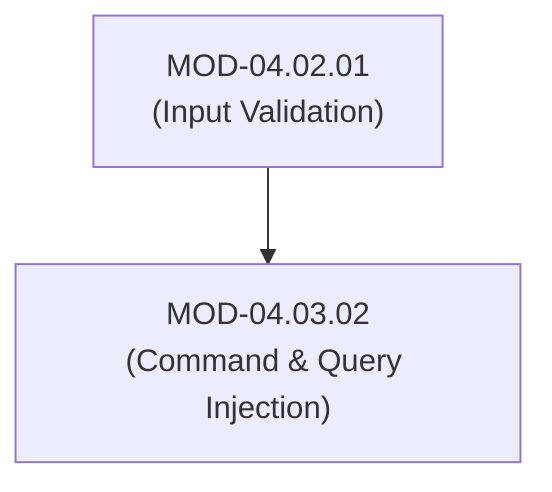
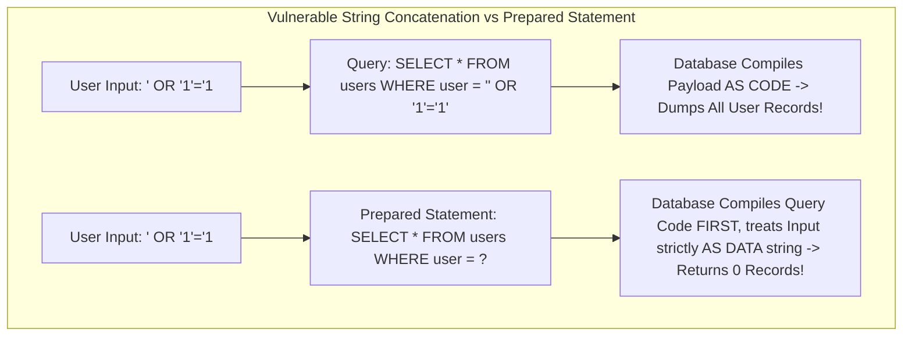

# Command & Query Injection Flaws (SQLi, Command Injection & Parameterized Remediation)

## 1. Overview & Purpose
Injection vulnerabilities occur when untrusted user data is concatenated directly into interpreter commands (SQL, OS Shell, LDAP, XPath), confusing data with code.

This module details In-Band SQL Injection (Union-based, Error-based), Blind SQL Injection (Boolean-based, Time-based), OS Command Injection, Parameterized Queries (Prepared Statements), and Safe System Call Execution APIs.

---

## 2. Prerequisites & Prerequisites Graph
- **Prerequisites**: `MOD-04.02.01` (Input Validation).



---

## 3. Learning Objectives & Taxonomy Alignment
- **L1 Awareness**: Contrast In-Band SQLi and Blind SQLi.
- **L2 Understanding**: Explain why Prepared Statements separate SQL code compilation from data evaluation.
- **L3 Practical**: Detect SQLi vulnerabilities using `sqlmap` and refactor vulnerable queries into parameterized statements in Python.
- **L4 Engineering**: Design zero-injection database access abstraction layers for enterprise platforms.

---

## 4. L1 — Awareness (Overview & Core Terminology)
Injection flaws allow attackers to execute arbitrary database queries or shell commands on the host operating system. **SQL Injection (SQLi)** manipulates database logic; **Command Injection** executes arbitrary shell primitives (`sh -c`).

---

## 5. L2 — Understanding (Core Theory & Mechanics)



### Parameterized Queries (Prepared Statements):
When using Prepared Statements, the database engine compiles the SQL command structure *first* into a binary execution plan. When the parameter value is bound later, the database engine evaluates it strictly as literal data, making it mathematically impossible for user input to alter the query logic.

---

## 6. L3 — Practical (Commands & Configurations)

### Vulnerable vs Secure Python Database Operations:

```python
import sqlite3

# VULNERABLE SQL Injection Code (String Formatting)
def get_user_vulnerable(cursor, username: str):
    # NEVER DO THIS: Concatenating input directly into SQL string
    query = f"SELECT * FROM users WHERE username = '{username}'"
    cursor.execute(query) # Vulnerable to: admin' --

# SECURE Parameterized Query Code
def get_user_secure(cursor, username: str):
    # ALWAYS DO THIS: Use parameterized placeholders (?)
    query = "SELECT * FROM users WHERE username = ?"
    cursor.execute(query, (username,)) # Input bound strictly as data parameter
```

### Vulnerable vs Secure OS Command Execution in Python:
```python
import subprocess

# VULNERABLE Command Injection (shell=True)
def ping_vulnerable(ip_address: str):
    # Vulnerable to: 127.0.0.1; cat /etc/passwd
    subprocess.run(f"ping -c 1 {ip_address}", shell=True)

# SECURE Command Execution (Argument Vector List + shell=False)
def ping_secure(ip_address: str):
    # Passes arguments directly to execve() syscall without shell invocation
    subprocess.run(["/usr/bin/ping", "-c", "1", ip_address], shell=False, check=True)
```

---

## 7. L4 — Engineering (Design Trade-offs & System Integration)
- **ORMs and SQL Injection Risks**: Object-Relational Mappers (ORMs like SQLAlchemy or Prisma) use parameterized queries by default. However, developers introduce SQLi if they fallback to raw SQL string concatenation inside `orm.raw_query()` methods.

---

## 8. Internal Architecture & Data Structures
Time-Based Blind SQLi Payload Structure:
```text
Payload: admin' AND (SELECT 1 FROM (SELECT(SLEEP(5)))a)--
Database Logic: Evaluates SLEEP(5) function. If response delay is >= 5 seconds, boolean condition evaluated to True.
```

---

## 9. Security Implications & Boundary Controls
- **Never Use `shell=True` or `eval()`**: Passing string commands to system shells (`bash`, `cmd.exe`) allows attackers to use command separators (`;`, `&&`, `|`, `$(...)`) to chain arbitrary shell commands.

---

## 10. Attack Vectors & Exploitation Primitives
1. **Union-Based SQLi**: Appending `UNION SELECT null, username, password FROM users--` to extract database tables.
2. **Blind Time-Based SQLi**: Inferring password hashes bit-by-bit by measuring response latency.

---

## 11. Defense & Telemetry Verification
- Enforce **Parameterized Queries / Prepared Statements** for 100% of database access.
- Avoid OS shell invocation; use **native API bindings** or argument vectors (`shell=False`).

---

## 12. Detection & Telemetry Verification

### Suricata Detection Rule (SQL Injection union-select Pattern):
```text
alert http $EXTERNAL_NET any -> $HOME_NET any (msg:"WEB-ATTACK SQL Injection - UNION SELECT Attempt"; content:"union"; nocase; content:"select"; nocase; distance:0; sid:4000001; rev:1;)
```

---

## 13. Hands-On Lab Reference
- **Associated Lab**: `LAB-SEC006` (SQLi Exploitation via Sqlmap & Parameterized Refactoring).

---

## 14. Related Projects & Applications
- **Associated Project**: `PRJ-SEC001` (Secure Healthcare Platform).

---

## 15. Troubleshooting & Diagnostics Matrix

| Symptom | Root Cause | Remediation / Diagnostic Command |
| :--- | :--- | :--- |
| `sqlite3.OperationalError: near "'": syntax error`. | Unescaped single quote in user input concatenated into raw SQL string. | Convert raw query to parameterized statement with placeholder binding. |

---

## 16. Related Concepts & Cross-Domain Links
- `CON-SEC011`: Parameterized Queries (`DOM-04`)
- `CON-SEC012`: Blind Time-Based SQLi (`DOM-04`)
- `CON-SYS003`: `execve` Syscall Mechanics (`DOM-01`)

---

## 17. Technical Interview Preparation (Q&A)
**Q: Why does passing an array of arguments to `subprocess.run(["ping", ip], shell=False)` prevent command injection?**  
*Answer*: When `shell=True` is used, Python spawns a command shell (`/bin/sh -c "ping <ip>"`). The shell parses metacharacters like `;`, `&&`, or `|` to execute multiple commands. Setting `shell=False` and passing an argument array causes Python to invoke the `execve()` system call directly. The operating system kernel treats every array element after index 0 as literal argument data passed to the `/usr/bin/ping` binary, rendering command separators inert.

---

## 18. Self-Assessment & Mastery Checklist
- [ ] Understand prepared statement query compilation mechanics.
- [ ] Able to audit codebases for `shell=True` and unparameterized SQL queries.

---

## 19. References & Further Reading
- OWASP: *SQL Injection Prevention Cheat Sheet*.
- OWASP: *Command Injection Prevention Cheat Sheet*.
