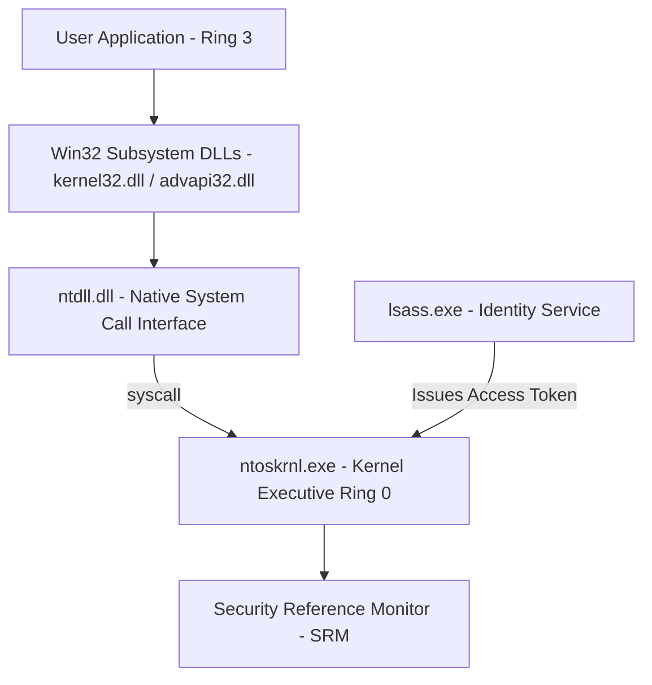
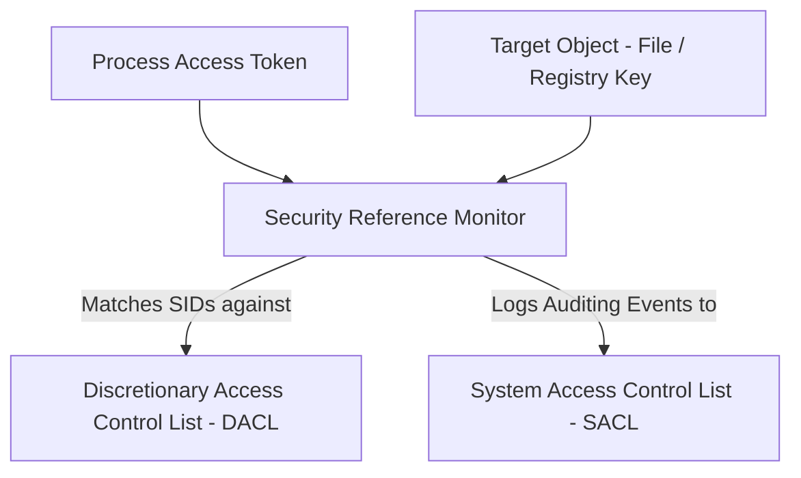
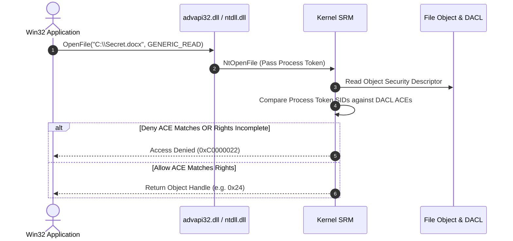

# P-03: Windows System Foundations

> **Module ID:** P-03  
> **Category:** Operating Systems & Systems Engineering  
> **Difficulty:** Intermediate  
> **Estimated Time:** 8 Hours  
> **Prerequisites:** Basic Command Line Literacy  
> **Related Topics:** Windows Architecture, Registry, Active Directory, LSASS, PowerShell, System Services  
> **Framework Standard:** Cyber Act Universal Engineering Framework (v2 Standard)

---

# Part I — Understanding

## Overview

### Definition
* **Definition:** Windows is a hybrid-kernel, multi-user operating system family developed by Microsoft, built around the Object Manager, Win32 Subsystem APIs, Registry database, Local Security Authority Subsystem Service (LSASS), and PowerShell automation framework.
* **One-Line Summary:** A hybrid-kernel OS featuring object-oriented security descriptors, central Registry configuration, Win32 APIs, and Active Directory enterprise management.

### Purpose & Problem Statement
* **Purpose:** Powers enterprise corporate workstations, server infrastructure, Active Directory domain federations, and GUI-centric enterprise software applications.
* **Problem it Solves:** Eliminates unmanaged workstation deployments, fragmented local user access controls, and non-standard enterprise policy management.
* **Why it Exists:** Developed by Microsoft starting with Windows NT in 1993 to deliver an extensible, 32/64-bit multi-tasking operating system for business environments.

### History & Evolution
* **Origins & Evolution:** Evolved from Windows NT 3.1 to Windows 10/11 and Server 2022, introducing Active Directory (Windows 2000), PowerShell (2006), UAC, Defender, and Virtualization-Based Security (VBS).

### Mental Model & Analogy
* **Real-World Analogy:** A high-security corporate headquarters: The Registry is the central archive holding company policies, LSASS is the ID verification desk issuing security badges (Access Tokens), and the Security Reference Monitor (SRM) checks security badge permissions at every office door.
* **Mental Model:** Applications request kernel resources by opening handles to named object Manager entities, authorized via Access Tokens matched against Discretionary Access Control Lists (DACLs).

> [!NOTE]
> Unlike Linux's "Everything is a file" philosophy, Windows adheres to an "Everything is an Object" model managed by the Kernel Object Manager.

---

## Terminology

### Key Terms & Definitions

#### **Hybrid Kernel (`ntoskrnl.exe`)**
* **Definition:** The core Windows kernel architecture combining monolithic kernel performance with microkernel modularity.
* **Context / Scope:** Ring 0 Kernel Executive.
* **Key Properties:** Runs kernel executive managers, device drivers, and the Security Reference Monitor in Ring 0.

#### **Security Identifier (SID)**
* **Definition:** A unique variable-length alphanumeric string (e.g. `S-1-5-21-...`) identifying a user, group, or computer account across Windows security databases.
* **Context / Scope:** Identity Security Descriptor.
* **Key Properties:** `S-1-5-18` represents `LOCAL SYSTEM`; `S-1-5-500` represents the built-in `Administrator`.

#### **Access Token**
* **Definition:** A kernel security object generated by LSASS during authentication containing the user's SID, group SIDs, and security privileges (`SeDebugPrivilege`).
* **Context / Scope:** Process Security Context.
* **Key Properties:** Attached to every process spawned by the user; evaluated during object access checks.

#### **Windows Registry**
* **Definition:** A hierarchical database storing system-wide, hardware, software, and user configuration settings across key root hives (`HKLM`, `HKCU`, `HKCR`, `HKU`, `HKCC`).
* **Context / Scope:** System Configuration Database.
* **Key Properties:** Replaces individual configuration files; accessed via Registry APIs or `regedit`.

#### **LSASS (`lsass.exe`)**
* **Definition:** Local Security Authority Subsystem Service: User Mode process responsible for authenticating users, generating Access Tokens, and managing security policies.
* **Context / Scope:** Identity Authentication Service.
* **Key Properties:** Primary target for credential harvesting attacks (Mimikatz).

---

## Big Picture

### Domain & Ecosystem Placement
* **Domain:** Operating Systems & Enterprise Architecture
* **Parent Topic:** Operating Systems Foundations
* **Child Topics:** Windows Hybrid Kernel, Windows Registry, LSASS, Access Tokens, DACLs/SACLs, Event Viewer, PowerShell, Windows Security Hardening
* **Prerequisites:** Basic Computer Hardware Literacy
* **Topics Enabled:** Windows Internals (P-15), Active Directory Architecture, Windows Incident Response, EDR Telemetry Analysis, Threat Hunting

### Architectural Placement
* **Technology Ecosystem:** Windows Kernel, Win32 Subsystems, PowerShell, Active Directory, Sysinternals Suite.
* **Architecture Placement:** Operating System & Enterprise Services Layer.
* **Stack Placement:** Workstation & Enterprise Infrastructure Layer.

### System Ecosystem Map


---

# Part II — Internal Engineering

## Architecture

### Core Subsystems & Components
* **User Mode (Ring 3):** Environment Subsystems (Win32), Service Control Manager (`services.exe`), LSASS (`lsass.exe`), Subsystem DLLs (`kernel32.dll`, `user32.dll`, `advapi32.dll`), `ntdll.dll`.
* **Kernel Mode (Ring 0):** Executive Managers (`ntoskrnl.exe`), Object Manager, Security Reference Monitor (SRM), Hardware Abstraction Layer (`hal.dll`).

### Registry Root Hives Structure
* `HKLM` (`HKEY_LOCAL_MACHINE`): System-wide hardware and software settings.
* `HKCU` (`HKEY_CURRENT_USER`): Configuration for the currently logged-in user.
* `HKU` (`HKEY_USERS`): Profiles for all loaded user accounts on the host.
* `HKCR` (`HKEY_CLASSES_ROOT`): File association and COM object registration.
* `HKCC` (`HKEY_CURRENT_CONFIG`): Current hardware profile settings.

### Component Architecture Map


---

## Mechanism

### Core Execution Workflow (Object Access Check)
1. Process requests access to file object `C:\Secret.docx` with `READ_DATA` access rights.
2. Kernel Object Manager intercepts call and passes process Access Token and object Security Descriptor to SRM.
3. SRM traverses the Discretionary Access Control List (DACL) looking for Access Control Entries (ACEs).
4. If an explicit **Deny ACE** matches the process SID, access is immediately denied (`STATUS_ACCESS_DENIED`).
5. If an explicit **Allow ACE** covers requested rights, access is granted and a Handle is returned.

### Execution Sequence Map


---

## Relationships

### Upstream & Downstream Dependencies
* **Depends On:** X86-64 Architecture, UEFI Firmware, Storage Drivers.
* **Used By:** Enterprise Software, Active Directory Workstations, MSSQL, IIS Server, Defender EDR.
* **Communicates With:** Active Directory Domain Controllers via Kerberos / LDAP over Network Sockets.

### Resource Lifecycle
* **Creates / Uses:** Allocates Object Handles, Process Tokens, Registry Keys, Event Logs.
* **Execution Ordering:** UEFI ➔ `bootmgr` ➔ `winload.exe` ➔ `ntoskrnl.exe` ➔ `smss.exe` ➔ `csrss.exe` / `winlogon.exe` ➔ `lsass.exe` ➔ User Desktop.

---

## Runtime Environment

### Execution & System Context
* **Execution Environment:** Workstation / Cloud Hypervisor VM.
* **Location:** System Drive (`C:\Windows\System32`).
* **Space:** User Mode & Kernel Mode.
* **Storage Unit:** Objects, Handles & Registry Keys.
* **Deployment Model:** Enterprise Desktop / Server OS Image.
* **Lifetime:** Continuous runtime session.

---

# Part III — Operations

## Installation & Configuration

### Management Console Utilities
* `sysdm.cpl`: System Properties.
* `services.msc`: Service Control Manager GUI.
* `regedit.exe`: Registry Editor GUI.
* `eventvwr.msc`: Event Viewer GUI.

---

## Interfaces

### PowerShell Cmdlets & CLI Reference

#### `whoami`
* **Purpose:** Displays active user identity, group SIDs, and active token privileges.
* **Syntax:** `whoami [options]`
* **Parameters:** `/priv` (display privileges), `/groups` (display group SIDs), `/all` (display all token metadata).
* **Example:** `whoami /priv`

---

#### `Get-Service`, `Start-Service`, `Stop-Service`
* **Purpose:** Queries and manages Windows background system services.
* **Syntax:** `Get-Service -Name <service-name>`
* **Example:**
  ```powershell
  Get-Service -Name "WinDefend"
  Start-Service -Name "Spooler"
  Stop-Service -Name "Spooler"
  ```

---

#### `Get-Process` & `tasklist` & `taskkill`
* **Purpose:** Queries and terminates active processes.
* **Syntax:** `Get-Process -Name <name>` / `taskkill /PID <pid> /F`
* **Example:**
  ```powershell
  Get-Process -Name "lsass"
  tasklist | Select-String "python"
  taskkill /PID 4321 /F
  ```

---

#### `Get-Acl` & `Set-Acl` & `icacls`
* **Purpose:** Queries and modifies file or Registry DACL access control lists.
* **Syntax:** `Get-Acl -Path <path>` / `icacls <path> /grant <user>:<permission>`
* **Example:**
  ```powershell
  Get-Acl -Path "C:\Windows\System32\config\SAM"
  icacls "C:\Shares" /grant "Users:(OI)(CI)F"
  ```

---

#### `Get-WinEvent` & `Get-EventLog`
* **Purpose:** Queries Windows Event Logs (`Security`, `System`, `Application`, `Sysmon`).
* **Syntax:** `Get-WinEvent -ListLog <log-name>`
* **Example:**
  ```powershell
  Get-WinEvent -LogName Security -MaxEvents 10
  Get-WinEvent -FilterHashtable @{LogName='Security'; ID=4624}
  ```

---

#### `Get-ItemProperty` & `Set-ItemProperty` & `reg.exe`
* **Purpose:** Reads and writes Windows Registry key properties.
* **Syntax:** `Get-ItemProperty -Path <reg-path>` / `reg query <key>`
* **Example:**
  ```powershell
  Get-ItemProperty -Path "HKLM:\SOFTWARE\Microsoft\Windows\CurrentVersion"
  reg query "HKLM\SYSTEM\CurrentControlSet\Control\Lsa"
  ```

---

#### `netstat` & `ipconfig`
* **Purpose:** Displays network interface configuration and active socket connections.
* **Example:**
  ```cmd
  ipconfig /all
  netstat -ano | findstr LISTENING
  ```

---

#### `sc.exe`
* **Purpose:** Low-level Service Control Manager command line tool.
* **Example:**
  ```cmd
  sc query Spooler
  sc qc WinDefend
  ```

---

#### `logman`
* **Purpose:** Manages Event Tracing for Windows (ETW) sessions.
* **Example:**
  ```cmd
  logman query -ets
  ```

---

### APIs & Libraries
* **SDKs & Libraries:** Win32 API (`Windows.h`), .NET Framework / .NET Core, PowerShell SDK.

### Data Formats & Protocols
* **Formats:** PE (`Portable Executable` `.exe`/`.dll`), `.evtx` (Event Logs), Registry Hives.

---

# Part IV — Observation

## Monitoring

### Telemetry & Inspection Tools
* **Tools:** Sysinternals Suite (`Process Explorer`, `ProcMon`, `Autoruns`), Event Viewer (`eventvwr.msc`), PowerShell `Get-WinEvent`.
* **Log Sources:** Windows Security Log (`Security.evtx`), Sysmon Log (`Microsoft-Windows-Sysmon/Operational`).

---

## Debugging

### Step-by-Step Debugging Workflow
1. **Inspect Running Processes:** Open `Process Explorer` to check parent-child process trees and signed verification.
2. **Inspect Process Handles:** In `Process Explorer`, open Lower Pane -> Handles to inspect active DLLs and file locks.
3. **Trace System Activity:** Run `ProcMon` with filter `Process Name is target.exe` to capture file/registry operations.

> [!TIP]
> Use `Autoruns` from Sysinternals to identify persistence mechanisms hiding in Registry Run keys, Scheduled Tasks, and Services.

---

# Part V — Security

## Security

### Threat Model & Attack Surface
* **Threat Model:** Privilege escalation via weak service permissions, LSASS memory dumping, malicious Registry persistence, token impersonation attacks, UAC bypasses.
* **Attack Surface:** Registry Run keys, unquoted service paths, LSASS process memory, writable `System32` directories.

### Attack Vectors & Vulnerabilities
* **LSASS Credential Dumping:** Adversaries with local administrative privileges dumping `lsass.exe` process memory to extract plaintext passwords or NTLM hashes using Mimikatz.

### Detection & Telemetry
* **Detection Opportunities:** Security Event ID 4624 (Logon), Event ID 4688 (Process Creation), Sysmon Event ID 10 (ProcessAccess targeting LSASS).
* **MITRE ATT&CK Mapping:** T1003.001 (OS Credential Dumping: LSASS Memory).

### Hardening & Security Best Practices
* Enable **LSA Protection (RunAsPPL)** to secure LSASS from untrusted memory reads.
* Enable **Credential Guard** via Virtualization-Based Security (VBS).
* Disable legacy **LM / NTLMv1** authentication protocols.

- [ ] Is LSA Protection (RunAsPPL) enabled?
- [ ] Is User Account Control (UAC) set to Always Notify?
- [ ] Is Defender Antivirus active and updated?

> [!CAUTION]
> Granting users `SeDebugPrivilege` allows them to attach debuggers to any system process, including `lsass.exe`.

---

# Part VI — Engineering

## Engineering Analysis

### Design Rationale & Philosophy
* Object-oriented Security Descriptor model provides centralized, granular access control across files, registry keys, services, and processes.

### Technology Comparison Matrix
| Attribute | Windows | Linux |
| :--- | :--- | :--- |
| **Kernel Type** | Hybrid (`ntoskrnl.exe`) | Monolithic (`vmlinuz`) |
| **Security Context** | SIDs & Access Tokens | UID / GID & Capabilities |
| **Central Config** | Windows Registry | `/etc/` Plaintext Files |

---

# Part VII — Practical

## Basic Lab
```powershell
# Display operating system and identity details
Get-WmiObject -Class Win32_OperatingSystem | Select-Object Caption, Version, OSArchitecture
whoami /all
```

## Observation Lab
```powershell
# Query recent Security Event Log login events
Get-WinEvent -FilterHashtable @{LogName='Security'; ID=4624} -MaxEvents 5
```

## Internal Lab (Registry Audit)
```powershell
# Query LSA Registry protection state
Get-ItemProperty -Path "HKLM:\SYSTEM\CurrentControlSet\Control\Lsa" -Name "RunAsPPL" -ErrorAction SilentlyContinue
```

## Security Lab (Process Token Inspection)
```powershell
# Query process token privileges for active PowerShell session
whoami /priv
```

---

# Part VIII — Reference

## Quick Reference & Cheat Sheet
* `whoami /priv` | `Get-Service` | `Get-Acl <path>` | `Get-WinEvent -LogName Security`
* `reg query "HKLM\..."` | `tasklist` | `taskkill /PID <pid> /F` | `sc query <service>`
* Key Hives: `HKLM`, `HKCU`, `HKU`, `HKCR`, `HKCC`.

---

# Part IX — Professional

## Interview Questions

### Fundamental & Architecture Questions
* **Question 1:** *How does the Windows Object Manager enforce access control when a process attempts to open a file?*
  > [!NOTE]
  > The Object Manager passes the process Access Token and object Security Descriptor to the Security Reference Monitor (SRM). SRM compares token SIDs against the object's DACL entries.

### Security & Troubleshooting Questions
* **Question 2:** *What is LSASS and why is it a primary target for credential harvesting?*
  > [!IMPORTANT]
  > LSASS (`lsass.exe`) manages authentication and stores active logon credentials, Kerberos tickets, and NTLM hashes in memory. Tools like Mimikatz target LSASS memory to harvest credentials.

---

## Revision

### Executive Summary & Revision
* **Key Takeaways:** Windows is a hybrid-kernel OS featuring Object Manager security descriptors, central Registry configuration, Win32 APIs, and LSASS identity authentication.
* **One-Minute Revision:** Win32 API ➔ `ntdll.dll` ➔ `syscall` ➔ `ntoskrnl.exe` ➔ SRM DACL Check ➔ Object Handle Granted.

---

## Master Completion Checklist

### Understanding
- [x] Can define it
- [x] Can explain why it exists
- [x] Understand terminology
- [x] Know where it fits

### Internal Engineering
- [x] Can explain architecture
- [x] Can explain workflow
- [x] Can draw diagrams
- [x] Understand lifecycle

### Operations
- [x] Can install/configure
- [x] Can use CLI commands
- [x] Understand APIs/protocols

### Observation
- [x] Can monitor telemetry
- [x] Can debug failures
- [x] Know log sources

### Security
- [x] Know attack vectors
- [x] Know mitigations
- [x] Know detection telemetry

### Engineering
- [x] Can compare alternatives
- [x] Understand trade-offs
- [x] Know performance limits

### Practical
- [x] Completed basic lab
- [x] Completed observation lab
- [x] Completed security lab

### Professional
- [x] Can answer interview questions
- [x] Can explain to an engineer
- [x] Can implement independently
