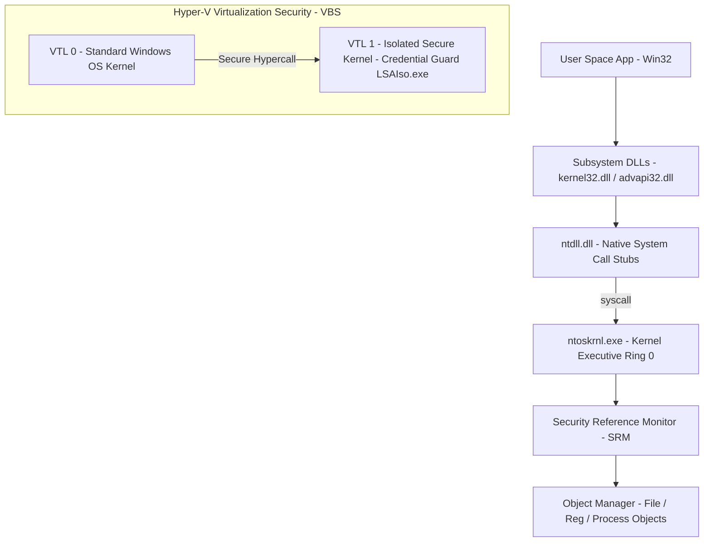
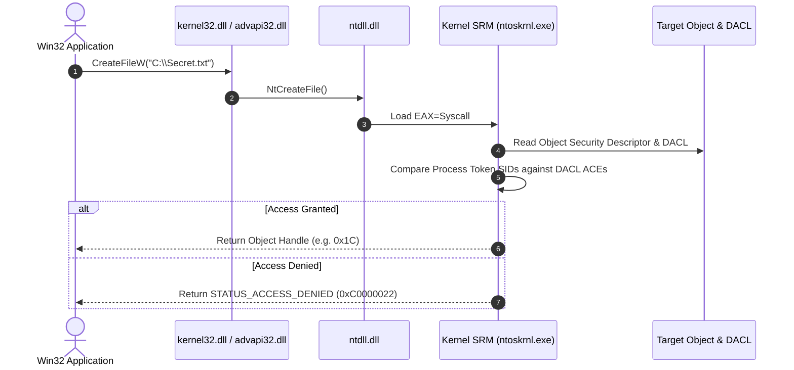

# P-15: Windows Architecture, Security Model & Kernel Subsystems

> **Module ID:** P-15  
> **Category:** Advanced OS Internals & Security  
> **Difficulty:** Advanced  
> **Estimated Time:** 12 Hours  
> **Prerequisites:** Windows System Foundations (P-03)  
> **Related Topics:** Windows Hybrid Kernel, Executive Managers, SRM, LSASS, Access Tokens, DACLs/SACLs, VBS, Credential Guard, Sysinternals  
> **Framework Standard:** Cyber Act Universal Engineering Framework (v2 Standard)

---

# Part I — Understanding

## Overview

### Definition
* **Definition:** Windows Architecture & Security Model encompasses the hybrid kernel executive (`ntoskrnl.exe`), Object Manager, Security Reference Monitor (SRM), Local Security Authority Subsystem Service (LSASS), Virtualization-Based Security (VBS/VTL1), and Win32 Subsystem APIs that govern resource allocation, identity verification, access control, and memory protection.
* **One-Line Summary:** Hybrid kernel executive (`ntoskrnl.exe`) managing Object Manager handles, SRM access token checks, LSASS identity authentication, and VBS hardware isolation.

### Purpose & Problem Statement
* **Purpose:** Provides enterprise operating system stability, object-oriented privilege separation, centralized security auditing, hardware-enforced credential isolation (Credential Guard), and uniform Win32 API execution.
* **Problem it Solves:** Eliminates un-audited object manipulation, direct user-space hardware access, credential harvesting from raw memory (mitigated via VBS), and insecure process execution.
* **Why it Exists:** Architected by David Cutler starting with Windows NT in 1993 to deliver a portable, secure, multi-threaded, enterprise operating system architecture.

### History & Evolution
* **Origins & Evolution:** Evolved from Windows NT 3.1 to Windows 10/11 and Server 2022, introducing 64-bit architecture, UAC, PatchGuard (KPP), Driver Signature Enforcement (DSE), Virtualization-Based Security (VBS), and Hypervisor-Protected Code Integrity (HVCI).

### Mental Model & Analogy
* **Real-World Analogy:** High-security embassy: User Mode applications are embassy visitors in public waiting rooms (Ring 3 User Mode). When visitors request confidential file folders (Object Handles), embassy security guards (SRM) verify identity badges (Access Tokens) against permission lists (DACLs). Highly classified cryptographic keys are stored in an underground armored vault accessible only via secure biometric airlocks (VBS / VTL 1 Credential Guard).
* **Mental Model:** Win32 Application ➔ Call Subsystem DLL (`kernel32.dll`) ➔ Pass to `ntdll.dll` ➔ Execute `syscall` ➔ Ring 0 Kernel Executive (`ntoskrnl.exe`) ➔ SRM Access Verification ➔ Object Handle returned.

> [!NOTE]
> Windows enforces security boundaries at the **Object Manager** level. Files, Registry keys, Services, Processes, and Threads are all Objects protected by Security Descriptors.

---

## Terminology

### Key Terms & Definitions

#### **Kernel Executive (`ntoskrnl.exe`)**
* **Definition:** The upper layer of the Windows kernel mode containing core subsystem managers: Object Manager, Process Manager, Memory Manager, Security Reference Monitor (SRM), I/O Manager, and Plug and Play Manager.
* **Context / Scope:** Ring 0 Kernel Core.
* **Key Properties:** Runs in privilege Ring 0; manages kernel objects and system calls.

#### **Security Reference Monitor (SRM)**
* **Definition:** The in-kernel security component of `ntoskrnl.exe` responsible for enforcing access validation checks (comparing Access Tokens against DACLs) and generating security audit log events (SACLs).
* **Context / Scope:** Kernel Security Enforcement Engine.
* **Key Properties:** Sole authority in the kernel performing object access decisions.

#### **Access Token**
* **Definition:** A kernel security object containing the User SID, Group SIDs, Restricted SIDs, and Security Privileges (`SeDebugPrivilege`, `SeImpersonatePrivilege`) assigned to a process session.
* **Context / Scope:** Identity Security Context.
* **Key Properties:** Created by LSASS during successful authentication; duplicated by child processes.

#### **Security Descriptor (DACL & SACL)**
* **Definition:** A data structure attached to every Windows Object containing:
  * **Owner SID:** Account owning the object.
  * **DACL (Discretionary Access Control List):** Grants or denies explicit access rights to SIDs.
  * **SACL (System Access Control List):** Configures security auditing logging for access attempts.
* **Context / Scope:** Object Access Control.
* **Key Properties:** Evaluated by SRM during `NtOpenFile` / `NtOpenKey`.

#### **VBS (Virtualization-Based Security)**
* **Definition:** A hardware-enforced security architecture using the Hyper-V hypervisor to create isolated Virtual Trust Levels: **VTL 0** (Standard OS) and **VTL 1** (Secure Kernel storing credentials - Credential Guard / `LSAIso.exe`).
* **Context / Scope:** Hardware-Enforced Credential Defense.
* **Key Properties:** Prevents rootkit memory dumping of LSASS secrets from VTL 0.

---

## Big Picture

### Domain & Ecosystem Placement
* **Domain:** Advanced Operating System Internals & Security Architecture
* **Parent Topic:** Advanced Operating System Internals
* **Child Topics:** Windows Hybrid Kernel, Executive Managers, SRM, Access Tokens, DACLs/SACLs, VBS, Credential Guard, Sysinternals Suite, ETW Telemetry
* **Prerequisites:** Windows System Foundations (P-03)
* **Topics Enabled:** Windows Reverse Engineering, Exploit Analysis, Kernel Rootkit Analysis, EDR Telemetry Engineering, Windows Memory Forensics

### Architectural Placement
* **Technology Ecosystem:** Windows Kernel (`ntoskrnl.exe`), `ntdll.dll`, Win32 API, Sysinternals (`ProcMon`, `Process Explorer`), Hyper-V VBS, WinDbg.
* **Architecture Placement:** Operating System Core Security & Kernel Layer.
* **Stack Placement:** Foundation OS Kernel Layer.

### System Ecosystem Map


---

# Part II — Internal Engineering

## Architecture

### Executive Subsystem Managers Table
| Executive Manager | Architectural Function |
| :--- | :--- |
| **Object Manager** | Creates, maintains, and secures all Windows kernel objects (Files, Keys, Processes). |
| **Security Reference Monitor (SRM)** | Enforces DACL access checks and SACL audit logging. |
| **Process Manager** | Creates and terminates processes and threads (`EPROCESS` / `ETHREAD`). |
| **Memory Manager** | Manages virtual address spaces, working sets, and page files. |
| **I/O Manager** | Dispatches I/O Request Packets (IRPs) to hardware device drivers. |

---

## Mechanism

### Core Execution Workflow (Native Syscall Execution)
1. Application calls `CreateFileW("C:\\Secret.txt", ...)` in `kernel32.dll`.
2. `kernel32.dll` calls `NtCreateFile()` in `ntdll.dll`.
3. `ntdll.dll` moves System Call Number into register `EAX` and issues CPU `syscall` instruction.
4. CPU switches to Ring 0, jumping to `KiSystemCall64` in `ntoskrnl.exe`.
5. SRM validates process Access Token against target File Object DACL. If authorized, Object Manager returns Handle table index to user space.

### Execution Sequence Map


---

## Relationships

### Upstream & Downstream Dependencies
* **Depends On:** X86-64 Hardware Architecture, Hyper-V Hypervisor (for VBS), Storage Drivers.
* **Used By:** Win32 Software, Enterprise Security Agents, Defender EDR, Active Directory Workstations.
* **Communicates With:** Peripherals via I/O Request Packets (IRPs) and hardware drivers.

### Resource Lifecycle
* **Creates / Uses:** Allocates Object Handles, `EPROCESS` structures, Access Tokens, ETW Trace Sessions.
* **Execution Ordering:** UEFI ➔ `bootmgr` ➔ `winload.exe` ➔ Hyper-V (VBS Init) ➔ `ntoskrnl.exe` ➔ `smss.exe` ➔ `lsass.exe` ➔ Desktop.

---

## Runtime Environment

### Execution & System Context
* **Execution Environment:** User Mode (Ring 3) & Kernel Mode (Ring 0 / VTL 0) & Secure Kernel (VTL 1).
* **Location:** System Memory & Hypervisor VTL isolated space.
* **Space:** User Mode, Kernel Mode, VTL 1 Secure Space.
* **Storage Unit:** Kernel Object Handles & RAM Pages.
* **Deployment Model:** Enterprise Desktop / Server OS Image.
* **Lifetime:** Continuous persistent runtime session.

---

# Part III — Operations

## Installation & Setup

### Management Utilities
* `WinDbg`: Microsoft Windows Kernel & User Mode Debugger.
* `Sysinternals Suite`: `Process Explorer`, `ProcMon`, `WinObj`, `Autoruns`.

---

## Interfaces

### Tools & Commands Reference

#### PowerShell Privileges & Identity Audit
* **Purpose:** Queries process Access Token privileges and group SIDs.
* **Examples:**
  ```powershell
  whoami /priv
  whoami /groups
  whoami /all
  ```

---

#### Security Descriptor Management (`Get-Acl` & `icacls`)
* **Purpose:** Queries and modifies file or registry Object DACLs.
* **Examples:**
  ```powershell
  Get-Acl -Path "C:\Windows\System32\config\SAM" | Format-List
  icacls "C:\Shares\Confidential" /grant "Administrators:(OI)(CI)F"
  ```

---

#### Sysinternals Core Inspection Tools
* **`Process Explorer` (`procexp.exe`):** Displays process tree hierarchy, active handles, loaded DLLs, and token privileges.
* **`Process Monitor` (`procmon.exe`):** Real-time monitoring of file system, Registry, process, thread, and DLL activity.
* **`WinObj` (`winobj.exe`):** Displays the Object Manager namespace tree (`\Device`, `\Driver`, `\KernelObjects`).
* **`Autoruns` (`autoruns.exe`):** Displays comprehensive autostart persistence locations across Registry and disk.

---

#### Query LSA Protection & VBS State via Registry / PowerShell
* **Purpose:** Verifies hardware-enforced LSA Protection (`RunAsPPL`) and Credential Guard state.
* **Examples:**
  ```powershell
  # Check LSA Protection (RunAsPPL)
  Get-ItemProperty -Path "HKLM:\SYSTEM\CurrentControlSet\Control\Lsa" -Name "RunAsPPL" -ErrorAction SilentlyContinue

  # Check Virtualization-Based Security (VBS) State
  Get-CimInstance -ClassName Win32_DeviceGuard -Namespace root\Microsoft\Windows\DeviceGuard | Select-Object SecurityServicesConfigured, SecurityServicesRunning
  ```

---

### APIs & Libraries
* **SDKs & Libraries:** Native API (`ntdll.dll`), Win32 API (`advapi32.dll`, `kernel32.dll`).

### Data Formats & Protocols
* **Formats:** PE (`Portable Executable`), EVTX, Registry Hives.

---

# Part IV — Observation

## Monitoring

### Telemetry & Inspection Tools
* **Tools:** `Process Explorer`, `ProcMon`, `WinObj`, `WinDbg`, `Get-WinEvent`, `logman`.
* **Log Sources:** Windows Security Log (`Security.evtx`), Sysmon Log (`Microsoft-Windows-Sysmon/Operational`).

---

## Debugging

### Step-by-Step Debugging Workflow
1. **Inspect Object Manager Tree:** Open `WinObj.exe` to inspect named kernel objects.
2. **Inspect Process Handles:** Open `Process Explorer`, select target process, and enable Lower Pane -> Handles.
3. **Trace System Activity:** Run `ProcMon.exe` with filter `Process Name is target.exe`.

> [!TIP]
> Use `ProcMon` with filter `Result is ACCESS DENIED` to quickly troubleshoot permission issues on files or registry keys.

---

# Part V — Security

## Security

### Threat Model & Attack Surface
* **Threat Model:** LSASS memory dumping (Mimikatz), token manipulation / impersonation (`SeAssignPrimaryTokenPrivilege`), privilege escalation via unquoted service paths, driver loading bypasses (DSE).
* **Attack Surface:** LSASS process memory, process Access Tokens, kernel driver loading (`sys_load_driver`).

### Attack Vectors & Vulnerabilities
* **Token Impersonation Attack:** Adversaries possessing `SeImpersonatePrivilege` or `SeAssignPrimaryTokenPrivilege` (e.g. compromised IIS service accounts) stealing an elevated SYSTEM token and executing code as `NT AUTHORITY\SYSTEM`.

### Detection & Telemetry
* **Detection Opportunities:** Sysmon Event ID 10 (ProcessAccess to LSASS), Security Event ID 4672 (Special privileges assigned).
* **MITRE ATT&CK Mapping:** T1134.001 (Access Token Manipulation: Token Impersonation/Access).

### Hardening & Security Best Practices
* Enable **LSA Protection (RunAsPPL = 1)** to block unauthorized memory reading of `lsass.exe`.
* Enable **Credential Guard** via VBS to isolate credentials inside VTL 1 memory.
* Enable **Hypervisor-Protected Code Integrity (HVCI)** to block unsigned driver loading.

- [ ] Is LSA Protection (RunAsPPL) enabled?
- [ ] Is Credential Guard active via VBS?
- [ ] Is HVCI enabled to block malicious driver execution?

> [!CAUTION]
> Granting service accounts `SeImpersonatePrivilege` (e.g., RoguePotato, JuicyPotato attacks) allows local attackers to escalate instantly to `NT AUTHORITY\SYSTEM`.

---

# Part VI — Engineering

## Engineering Analysis

### Design Rationale & Philosophy
* Windows Object Manager structures all kernel resources into named, reference-counted entities protected by standardized Security Descriptors (DACLs/SACLs).

### Technology Comparison Matrix
| Attribute | Windows Security Model | Linux Security Model |
| :--- | :--- | :--- |
| **Object Model** | Centralized Object Manager | Virtual Filesystem (VFS) |
| **Access Control** | SIDs, Access Tokens, DACLs/SACLs | UID/GID, POSIX Permissions, Capabilities |
| **Hardware Auth Isolation** | Credential Guard (VBS VTL 1) | Intel SGX / TrustZone |

---

# Part VII — Practical

## Basic Lab
```powershell
# Display process token privileges
whoami /priv
```

## Observation Lab
```powershell
# Query VBS and Credential Guard status
Get-CimInstance -ClassName Win32_DeviceGuard -Namespace root\Microsoft\Windows\DeviceGuard | Select-Object VirtualizationBasedSecurityStatus, SecurityServicesRunning
```

## Internal Lab (Registry LSA Audit)
```powershell
# Query LSA Protection registry value
Get-ItemProperty -Path "HKLM:\SYSTEM\CurrentControlSet\Control\Lsa" -Name "RunAsPPL" -ErrorAction SilentlyContinue
```

## Security Lab (Access Token Group Audit)
```powershell
# Query user group SIDs
whoami /groups
```

---

# Part VIII — Reference

## Quick Reference & Cheat Sheet
* `whoami /priv` | `whoami /groups` | `Get-Acl <path>` | `icacls <path>`
* Sysinternals: `Process Explorer` (`procexp`), `Process Monitor` (`procmon`), `WinObj`, `Autoruns`.

---

# Part IX — Professional

## Interview Questions

### Fundamental & Architecture Questions
* **Question 1:** *How does the Security Reference Monitor (SRM) enforce access control when an application attempts to open a protected kernel object?*
  > [!NOTE]
  > SRM compares the process Access Token (User SID, Group SIDs, Privileges) against the object's Discretionary Access Control List (DACL). If an explicit Deny ACE matches, access is rejected immediately; if matching Allow ACEs satisfy requested access rights, access is granted.

### Security & Troubleshooting Questions
* **Question 2:** *What is Credential Guard and how does Virtualization-Based Security (VBS) protect LSASS credentials from Mimikatz?*
  > [!IMPORTANT]
  > Credential Guard uses the Hyper-V hypervisor to isolate LSASS secrets in **VTL 1** (Secure Kernel). Even if an attacker gains root/administrator privileges in **VTL 0** (Standard OS Kernel), VTL 0 memory reads cannot access VTL 1 memory, blocking Mimikatz LSASS memory dumping.

---

## Revision

### Executive Summary & Revision
* **Key Takeaways:** Windows Architecture relies on the hybrid kernel executive (`ntoskrnl.exe`), SRM DACL checks, Object Manager handles, and VBS hardware credential isolation.
* **One-Minute Revision:** Win32 API ➔ `ntdll.dll` ➔ `syscall` ➔ `ntoskrnl.exe` ➔ SRM DACL Check ➔ Object Handle Returned.

---

## Master Completion Checklist

### Understanding
- [x] Can define it
- [x] Can explain why it exists
- [x] Understand terminology
- [x] Know where it fits

### Internal Engineering
- [x] Can explain architecture
- [x] Can explain workflow
- [x] Can draw diagrams
- [x] Understand lifecycle

### Operations
- [x] Can install/configure
- [x] Can use CLI commands
- [x] Understand APIs/protocols

### Observation
- [x] Can monitor telemetry
- [x] Can debug failures
- [x] Know log sources

### Security
- [x] Know attack vectors
- [x] Know mitigations
- [x] Know detection telemetry

### Engineering
- [x] Can compare alternatives
- [x] Understand trade-offs
- [x] Know performance limits

### Practical
- [x] Completed basic lab
- [x] Completed observation lab
- [x] Completed security lab

### Professional
- [x] Can answer interview questions
- [x] Can explain to an engineer
- [x] Can implement independently
