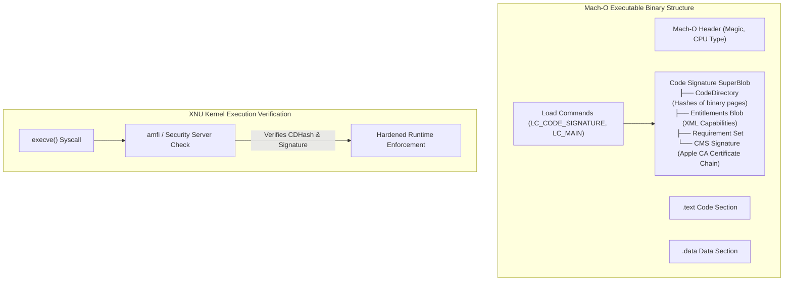

# macOS Code Signing Architecture, Entitlements & Hardened Runtime

## 1. Overview & Purpose
On macOS and iOS, executable binaries cannot run without satisfying Apple's mandatory **Code Signing** and **Hardened Runtime** verification pipeline.

This module covers the structure of Mach-O Code Signatures (Code Directory, CDHash), Entitlements XML schemas, Provisioning Profiles, Library Validation, and Hardened Runtime flags. Understanding macOS code signing is essential for analyzing application security controls, malware bypass tradecraft, and Endpoint Security Framework (ESF) validation.

---

## 2. Architecture & Key Components



---

## 3. Detailed Mechanics & Internal Structures

### 3.1 Mach-O Code Signature SuperBlob Layout
Code signatures in Mach-O binaries are stored at the end of the file, pointed to by `LC_CODE_SIGNATURE`:
1. **CodeDirectory**: Contains array of cryptographic hashes (SHA-256) computed for every 4KB page of executable code.
2. **CDHash**: The SHA-256 hash of the `CodeDirectory` structure itself. Serves as the unique cryptographic fingerprint of the binary.
3. **Entitlements**: XML property list embedded inside the signature blob defining granted system capabilities (e.g., `com.apple.security.device.camera`).
4. **CMS Signature**: PKCS#7 digital signature signed by a developer certificate chaining to Apple Root CA.

---

### 3.2 Hardened Runtime Flags
The **Hardened Runtime** imposes strict memory and execution security policies on macOS processes:
- **Library Validation**: Blocks loading third-party `.dylib` libraries unless signed by the same team ID as the host executable.
- **Disable `DYLD_INSERT_LIBRARIES`**: Neutralizes dynamic library injection via environment variables.
- **Debugging Protection**: Blocks ptrace attach and task port access unless `com.apple.security.get-task-allow` entitlement is present.

---

## 4. Security Implications & Entitlement Boundaries

- **Entitlements as Security Boundaries**: Entitlements determine whether an application can access raw disk devices, intercept network traffic, or record the screen.
- **AMFI (Apple Mobile File Integrity)**: Kernel extension that enforces code signing policies at binary load time.

---

## 5. Attack Vectors & Exploitation Primitives

1. **Entitlement Abuse & Dylib Hijacking**:
   Targeting applications with weak entitlements (e.g., `com.apple.security.cs.disable-library-validation`) to inject malicious dynamic libraries (`.dylib`) into a privileged binary's execution context.
2. **CDHash Collisions / Signature Mismatch**:
   Manipulating unsigned non-code Mach-O data sections to bypass legacy security scanner checks while maintaining valid CDHash signatures.

---

## 6. Defense & Telemetry Verification

### Telemetry Tracing Sources:
- **Endpoint Security Framework**: `ES_EVENT_TYPE_NOTIFY_EXEC` (captures CDHash, Signing ID, Team ID, and Entitlements).

---

## 7. Engineering & Hands-On Implementation

### Inspecting Code Signatures & Entitlements via `codesign`:
```bash
# Display detailed signature info and Team ID
codesign -dvv /Applications/Safari.app

# Extract XML Entitlements
codesign -d --entitlements :- /Applications/Safari.app
```

---

## 8. Troubleshooting & Diagnostics

| Symptom | Root Cause | Remediation / Diagnostic Command |
| :--- | :--- | :--- |
| Application killed on launch with `Killed: 9` (SIGKILL). | AMFI code signing validation failed (modified binary or invalid entitlement). | Re-sign binary using `codesign --force --deep --sign - /path/to/binary`. |
| `.dylib` fails to load into signed binary. | Hardened Runtime Library Validation blocked unsigned library. | Sign `.dylib` with matching Developer Team ID or grant `disable-library-validation`. |

---

## 9. References
- Jonathan Levin, *macOS and iOS Internals, Volume 3: Security*.
- Apple Developer Documentation: *Hardened Runtime & Code Signing Guide*.
