# macOS System Integrity Protection (SIP) & Gatekeeper Architecture

## 1. Overview & Purpose
On macOS, standard root permissions (`uid 0`) are restricted by hardware and kernel-level enforcement mechanisms designed to prevent full system modification even if an attacker gains root access.

This module details **System Integrity Protection (SIP / Rootless)**, **Gatekeeper**, Quarantine extended attributes (`com.apple.quarantine`), Notarization requirements, and XProtect malware scanning. Understanding these system protections is essential for macOS defense engineering, threat hunting, and security bypass research.

---

## 2. Architecture & Key Components

```mermaid
graph TD
    subgraph macOS Hardware & Kernel Isolation
        NVRAM["NVRAM Flags (csr-active-config)"]
        SIP["System Integrity Protection (SIP / Rootless Kext)<br/>Restricts Root from modifying System Folders (/System, /usr, /bin)"]
    end

    subgraph Gatekeeper & Notarization Execution Pipeline
        DOWNLOAD["Downloaded Binary / App from Web"]
        QUARANTINE["Quarantine Extended Attribute Attached<br/>(com.apple.quarantine)"]
        GATEKEEPER["Gatekeeper Verification Service<br/>(syspolic daemon)"]
        NOTARIZATION["Apple Notarization Check<br/>(Verifies Ticket on Apple Cloud)"]
        XPROTECT["XProtect / MRT Scanner<br/>(YARA-like Rule Scan)"]

        DOWNLOAD --> QUARANTINE
        QUARANTINE --> GATEKEEPER
        GATEKEEPER --> NOTARIZATION
        NOTARIZATION --> XPROTECT
        XPROTECT -->|Passes All Checks| EXECUTE["Binary Execution Granted"]
    end

    NVRAM --> SIP
```



---

## 3. Detailed Mechanics & Internal Structures

### 3.1 System Integrity Protection (SIP / Rootless)
SIP restricts the actions that the `root` user (`uid 0`) can perform on macOS.

#### Monitored Protected Paths:
- `/System`, `/usr` (except `/usr/local`), `/bin`, `/sbin`, `/var/db/locationd`.
- Active system processes (Blocks `task_for_pid` and `ptrace` on Apple-signed binaries).
- Kernel Extensions (Blocks loading unsigned kexts).

#### NVRAM Configuration (`csr-active-config`):
SIP status is controlled via NVRAM variables set during Recovery Mode:
- `CSR_ALLOW_UNTRUSTED_KEXTS` (`0x1`)
- `CSR_ALLOW_UNRESTRICTED_FS` (`0x2`)
- `CSR_ALLOW_TASK_FOR_PID` (`0x4`)

---

### 3.2 Gatekeeper & Quarantine Attributes
When a file is downloaded via a web browser or email client, macOS attaches a extended attribute: `com.apple.quarantine`.

#### Gatekeeper Execution Workflow:
1. When a user launches a app marked with `com.apple.quarantine`:
2. The `syspolic` daemon evaluates:
   - Is the binary signed with a valid Apple Developer ID?
   - Has the binary been **Notarized** by Apple's cloud scanning service?
3. If signed and notarized, Gatekeeper prompts a one-time user confirmation dialog before removing the quarantine flag.

---

## 4. Security Implications & Root Restrictions

- **Root is no longer all-powerful**: Even with `sudo su`, a root user cannot delete `/System/Library` or modify `SIP-protected` files without disabling SIP in Recovery Mode (`csrutil disable`).

---

## 5. Attack Vectors & Bypasses

1. **Quarantine Attribute Removal (`xattr -d`)**:
   Malware or initial access scripts remove the `com.apple.quarantine` extended attribute directly (`xattr -d com.apple.quarantine /path/to/app`), causing Gatekeeper to skip notarization checks.
2. **Path Traversals in Gatekeeper Bundles**:
   Packaging malicious executable payloads inside benign notarized disk image (`.dmg`) archives to bypass Gatekeeper bundle evaluation.

---

## 6. Defense & Telemetry Verification

### Telemetry Tracing Sources:
- **Unified Logs**: `log stream --predicate 'process == "syspolic"'`.
- **Endpoint Security Framework**: `ES_EVENT_TYPE_NOTIFY_AUTHENTICATE` & `ES_EVENT_TYPE_NOTIFY_EXEC`.

---

## 7. Engineering & Hands-On Implementation

### Auditing SIP and Quarantine Status:
```bash
# View SIP status
csrutil status

# Inspect extended attributes on downloaded file
xattr -l ~/Downloads/SampleApp.dmg

# Display Gatekeeper policy assessment
spctl --assess --verbose /Applications/TargetApp.app
```

---

## 8. Troubleshooting & Diagnostics

| Symptom | Root Cause | Remediation / Diagnostic Command |
| :--- | :--- | :--- |
| App blocked: "cannot be opened because it is from an unidentified developer". | Gatekeeper blocked un-notarized binary with quarantine flag. | Remove attribute via `xattr -d com.apple.quarantine /Applications/TargetApp.app`. |
| `sudo rm /System/file` returns `Operation not permitted`. | System Integrity Protection (SIP) blocking root write. | Requires booting to macOS Recovery Mode to execute `csrutil disable`. |

---

## 9. References
- Jonathan Levin, *macOS and iOS Internals, Volume 3: Security*.
- Apple Documentation: *Safely Opening Apps on macOS & Gatekeeper*.
