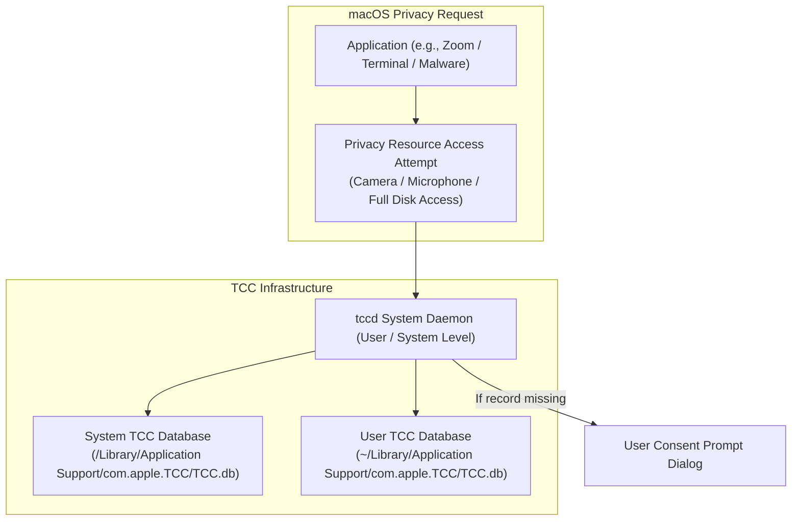

# macOS Transparency, Consent, and Control (TCC) Framework

## 1. Overview & Purpose
The Transparency, Consent, and Control (TCC) framework manages application access to sensitive user privacy resources on macOS (Camera, Microphone, Contacts, Location, Photos, Desktop Folder, Full Disk Access).

This module details the TCC database architecture (`TCC.db`), the `tccd` system daemon, privacy entitlements (`kTCCServiceSystemPolicyAllFiles`), TCC prompt mechanics, and TCC bypass exploitation primitives. Understanding TCC is critical for macOS privacy engineering, detection of spyware/infostealers, and macOS security auditing.

---

## 2. Architecture & Key Components



---

## 3. Detailed Mechanics & Internal Structures

### 3.1 The `TCC.db` SQLite Schema
TCC permissions are stored in SQLite databases protected by SIP:
- **System Database**: `/Library/Application Support/com.apple.TCC/TCC.db` (System-wide services like Full Disk Access).
- **User Database**: `~/Library/Application Support/com.apple.TCC/TCC.db` (User-specific services like Camera, Contacts).

#### Key Columns in `access` Table:
- `service`: String ID of requested service (`kTCCServiceSystemPolicyAllFiles`, `kTCCServiceCamera`).
- `client`: Bundle ID or binary path (`com.apple.Terminal` or `/usr/bin/tsh`).
- `client_type`: `0` for Bundle ID, `1` for absolute path.
- `allowed`: `1` (Granted), `0` (Denied).
- `csreq`: Binary Blob representing the app's Code Directory requirement string.

---

### 3.2 Key Privacy Service Identifiers
- `kTCCServiceSystemPolicyAllFiles`: **Full Disk Access (FDA)**. Grants permission to read user documents, Mail, Safari history, and TCC databases.
- `kTCCServiceCamera`: Access to hardware video camera.
- `kTCCServiceMicrophone`: Access to hardware audio microphone.
- `kTCCServiceScreenCapture`: Screen Recording permission.

---

## 4. Security Implications & TCC Database Protections

- **SIP Guarding of `TCC.db`**: To prevent malware from opening `TCC.db` and executing `UPDATE access SET allowed = 1`, SIP blocks all non-apple applications from writing to TCC databases—**even if running as root**.
- **Full Disk Access Requirement**: To read another process's TCC database, an application must possess Full Disk Access (`kTCCServiceSystemPolicyAllFiles`).

---

## 5. Attack Vectors & TCC Bypasses

1. **Environment Variable Injection / Dynamic Library Loading**:
   Injecting a custom `.dylib` into an application that already possesses Full Disk Access or Camera privileges (e.g., abusing apps compiled without Hardened Runtime or missing `disable-library-validation`).
2. **Sub-process Inheritance & Terminal Abuse**:
   Executing malicious shell scripts from inside `Terminal.app` or `iTerm2` when the user has already granted Full Disk Access to Terminal.
3. **App Bundle Hijacking**:
   Overwriting executable code inside a signed application bundle that holds active TCC prompts if code signature validation is incomplete.

---

## 6. Defense & Telemetry Verification

### Telemetry Tracing Sources:
- **Unified Log Tracing**: `log stream --predicate 'subsystem == "com.apple.TCC"'`.
- **Endpoint Security Framework**: `ES_EVENT_TYPE_NOTIFY_ACCESS` (Monitors attempts to query or access TCC-protected privacy folders).

---

## 7. Engineering & Hands-On Implementation

### Inspecting TCC Database (Requires Terminal with Full Disk Access):
```bash
# Query User TCC Database using sqlite3
sqlite3 ~/Library/Application\ Support/com.apple.TCC/TCC.db \
"SELECT service, client, allowed FROM access;"

# Example Output:
# kTCCServiceCamera|com.apple.FaceTime|1
# kTCCServiceSystemPolicyAllFiles|com.apple.Terminal|1
```

---

## 8. Troubleshooting & Diagnostics

| Symptom | Root Cause | Remediation / Diagnostic Command |
| :--- | :--- | :--- |
| `sqlite3: Error: unable to open database`: `TCC.db`. | Terminal application lacks Full Disk Access. | Grant Terminal Full Disk Access in `System Settings -> Privacy & Security`. |
| App cannot record screen despite prompt acceptance. | TCC record corrupted or stale. | Reset TCC permission using `tccutil reset ScreenCapture [Bundle_ID]`. |

---

## 9. References
- Csaba Fitzl, *Exploring macOS Privacy Protections (TCC Mechanics)*.
- Apple Developer Documentation: *Requesting Access to Protected Resources*.
