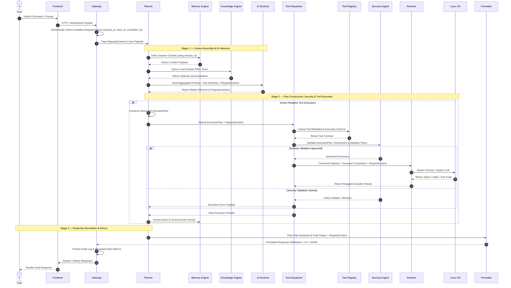

# 03 Request Lifecycle

> Status: Active
> Version: 1.1
> Last Updated: 2026-07-24

---

# Purpose

This document defines the complete end-to-end lifecycle of a single user request within the Ultron engineering platform.

It details how a request flows through the architecture—from initial user input to final response delivery—explaining component interactions, security validation points, reasoning execution, operating system calls, and failure boundaries.

---

# Engineering Rationale

A well-defined request lifecycle is essential for building a deterministic, maintainable, and secure AI engineering platform.

Without a strict request lifecycle:

- Components become tightly coupled through ad-hoc calls.
- Security validation becomes inconsistent or easily bypassed.
- Debugging state transitions across AI reasoning and Linux execution becomes difficult.
- Observability and audit logging become fragmented.
- Subsystems cannot be developed or tested in isolation.

Defining the request lifecycle ensures that every request follows an identical, auditable execution pathway.

---

# Core Architectural Concepts

## RequestContext

Every request entering the Gateway is immediately transformed into a immutable `RequestContext` object that accompanies the request throughout its entire lifecycle. 

Rather than passing loose parameters between components, `RequestContext` provides shared execution state, security scope, and distributed traceability.

A `RequestContext` encapsulates:
- `request_id`: Unique identifier for the individual request lifecycle.
- `trace_id`: Distributed trace identifier across system boundaries.
- `correlation_id`: Identifier grouping related multi-step user sessions.
- `session_id`: Active user session reference.
- `user` / `permissions`: Authenticated caller identity and authorization scopes.
- `project`: Target workspace or active platform context.
- `timestamps`: Microsecond-precision ingestion and step timers.
- `runtime_config`: Active flags, LLM parameters, and execution constraints.

All components down the execution chain receive, inspect, or attach metadata to the `RequestContext`.

---

## ExecutionPlan

The Planner does not dispatch loose tool calls. Instead, after receiving inference from the AI Runtime, the Planner constructs a formal `ExecutionPlan`.

An `ExecutionPlan` encapsulates:
- `reasoning`: The AI rationale and step-by-step logic summary.
- `tool_calls`: An array of target tools, capability requests, and parameter payloads.
- `risk_assessment`: Evaluated risk score and permission requirements.
- `confidence`: Model confidence metrics for the proposed action.
- `dependencies`: Execution order and prerequisite step constraints.
- `metadata`: State flags and expected return schema constraints.

The `ExecutionPlan` serves as the strict contract passed from the Planner to the Tool Dispatcher.

---

# High-Level Request Pipeline

```
User Input
↓
Frontend
↓
Gateway (Authentication, Payload Normalization & RequestContext Creation)
↓
Planner (Context Assembly & Workflow Orchestration)
├── Memory Engine (Session History & Active Context)
├── Knowledge Engine (RAG & Local System Specs)
└── AI Runtime (Model Inference & Raw Action Generation)
↓
Planner Constructs ExecutionPlan
↓
Tool Dispatcher (Schema Retrieval & Plan Resolution)
├── Tool Registry (Tool Definitions & Capabilities)
└── Security Engine (Permission Checks, Sanitization & Confirmation)
↓
Runtime (Execution Supervision & Process Isolation)
↓
Linux OS (Command Execution / System IO)
↓
Formatter (Response Packaging & Output Structuring)
↓
Gateway
↓
Frontend (User Presentation)
```

---

# Component Architecture & Sequence Diagram



---

# Stage-by-Stage Execution Lifecycle

## Stage 1 — Request Ingestion & RequestContext Creation

### 1. Frontend
- **Responsibility**: Captures user input (CLI prompt, web interface action, or API request) and forwards it to the Gateway.
- **Transition Trigger**: User executes a command or sends a prompt.

### 2. Gateway
- **Responsibility**: Serves as the single entry point for all incoming requests.
  - Authenticates the client session.
  - Generates `trace_id`, `correlation_id`, and `request_id`.
  - Instantiates the `RequestContext` object.
  - Initializes audit logging linked to the trace context.
  - Normalizes the request into a standard internal event object.
- **Transition Trigger**: Passes `RequestContext` and normalized request object to the **Planner**.
- **Security Checkpoint**: Client authentication and payload size validation occur here.

---

## Stage 2 — Context Retrieval & AI Inference

### 3. Planner
- **Responsibility**: Orchestrates the overall workflow.
  - Coordinates context assembly by querying the **Memory Engine** (short-term session history) and **Knowledge Engine** (long-term local RAG / documentation).
  - Prepares the complete context payload for AI inference.
- **Transition Trigger**: Passes assembled prompt and tool schemas to the **AI Runtime**.

> [!NOTE]
> **Architectural Note**: The current baseline implementation assumes the Planner handles context assembly directly. A future ADR will formally decouple a dedicated **Context Builder** component to manage memory/knowledge aggregation independently.

### 4. Memory Engine & Knowledge Engine
- **Responsibility**:
  - **Memory Engine**: Maintains conversation state, recent system interactions, and working context.
  - **Knowledge Engine**: Retrieves relevant local system documentation, architecture notes, or code context.
- **Transition Trigger**: Returns context data to the **Planner**.

### 5. AI Runtime
- **Responsibility**: Hosts local LLMs (via Ollama, llama.cpp, etc.) to perform inference.
  - Processes system prompts, context, and schemas.
  - Returns raw completion containing reasoning text or proposed tool calls.
- **Transition Trigger**: Returns raw inference output back to the **Planner**.
- **AI Point**: All model inference occurs strictly within this component. The AI Runtime owns inference; the Planner owns orchestration.

---

## Stage 3 — ExecutionPlan Construction, Security & Dispatch

### 6. ExecutionPlan Construction (Planner)
- **Responsibility**: The **Planner** parses the AI Runtime output and constructs a formal `ExecutionPlan` containing structured tool calls, risk assessments, confidence metrics, and dependency ordering.
- **Transition Trigger**: Passes the `ExecutionPlan` and `RequestContext` to the **Tool Dispatcher**.

### 7. Tool Dispatcher
- **Responsibility**: Manages the resolution and execution flow of the plan.
  - Interrogates the **Tool Registry** to verify tool parameters against strict schemas.
  - Formulates the exact system command or action payload.
- **Transition Trigger**: Forwards the tool execution payload to the **Security Engine** before any system execution occurs.

### 8. Security Engine
- **Responsibility**: Enforces security-by-design policy across all execution pathways.
  - Validates command safety (prevents command injection, illegal flags, destructive operations).
  - Enforces permission models (verifies user privilege level against requested tool action).
  - Scans payloads for secret exposure.
  - Triggers human confirmation flows if a tool action is flagged as high-risk.
- **Transition Trigger**: If authorized, signals approval to the **Tool Dispatcher**, which routes the action to the **Runtime**. If blocked, returns a security violation event.
- **Security Checkpoint**: Mandatory security gate. No tool execution can bypass the Security Engine.

---

## Stage 4 — System Execution & OS Interaction

### 9. Runtime
- **Responsibility**: Execution supervisor.
  - Supervises physical process lifecycle, monitors execution timeouts, resource limits (CPU/Memory), and captures standard output streams.
- **Transition Trigger**: Spawns process execution in the **Linux OS**.

> [!NOTE]
> **Architectural Note**: The baseline implementation includes process sandboxing and environment isolation within the Runtime layer. A future ADR will evaluate migrating sandboxing mechanisms entirely into the Security Engine, leaving Runtime strictly as an execution supervisor.

### 10. Linux OS
- **Responsibility**: Executes kernel system calls, filesystem operations, container commands, or terminal processes.
- **Transition Trigger**: Returns execution outputs (`stdout`, `stderr`, exit code) back to the **Runtime**.
- **Linux Execution Point**: All physical operating system interaction occurs exclusively here.

---

## Stage 5 — Synthesis, Formatting, and Return

### 11. Result Aggregation & Memory Update
- **Responsibility**: The **Runtime** returns execution results to the **Tool Dispatcher**, which passes them to the **Planner**.
- **Action**: The **Planner** writes the tool execution event and output into the **Memory Engine** for context retention.

### 12. Formatter
- **Responsibility**: Formats raw text, code blocks, terminal outputs, or JSON data into a clean, structured presentation layout tailored for the active interface.
- **Transition Trigger**: Forwards the formatted payload to the **Gateway**.

### 13. Gateway to Frontend Return
- **Responsibility**: The **Gateway** terminates the request lifecycle, records final execution metrics in audit logs against the `RequestContext`, and returns/streams the response payload to the **Frontend** for user presentation.

---

# Request Flow Summary Table

| Stage | Subsystem | Input | Output | Primary Responsibility |
| :--- | :--- | :--- | :--- | :--- |
| **Ingestion** | Gateway | Raw HTTP / CLI Payload | `RequestContext` + Request Event | Auth, `request_id`/`trace_id`/`correlation_id` generation, initial audit log |
| **Context** | Memory & Knowledge | `RequestContext` | Historical & Domain Context | Retrieve session state & local RAG knowledge |
| **Inference** | AI Runtime | Prompt + Context + Schemas | Raw Inference Output | Model inference and action proposal |
| **Planning** | Planner | Raw Inference Output | `ExecutionPlan` | Parse inference, risk assessment, dependency ordering |
| **Resolution** | Tool Registry | Tool Name | Tool Schema & Parameter Contract | Schema lookup & parameter validation |
| **Security Gate** | Security Engine | `ExecutionPlan` + `RequestContext` | Approval / Denial Event | Privilege check, command sanitization, sandbox policy |
| **Execution** | Runtime & Linux | Validated Command | stdout, stderr, Exit Code | Isolated process execution supervision on Linux OS |
| **Synthesis** | Planner & Memory | Tool Results | Final Response State | Update context history & synthesize output |
| **Presentation** | Formatter & Gateway | Raw Synthesis | Formatted UI / Terminal Output | Stream / deliver formatted response to user |

---

# Security Checkpoints & Guardrails

Security validation is distributed across three strict tiers:

```
[ Tier 1: Gateway ] ──► Session Authentication, RequestContext Scoping & Payload Size Limits
         ↓
[ Tier 2: Security Engine ] ──► Command Sanitization, Permission Checks & Confirmation Flow
         ↓
[ Tier 3: Runtime ] ──► Process Supervision, Resource Constraints & Path Jailing
```

1. **Tier 1 (Gateway)**: Prevents unauthenticated access, rate-limit abuses, and malformed payload injection.
2. **Tier 2 (Security Engine)**: Validates AI-generated `ExecutionPlan` against security policies. Ensures AI never executes arbitrary commands directly.
3. **Tier 3 (Runtime)**: Isolates physical execution to prevent system compromise, privilege escalation, or unauthorized filesystem access.

---

# Error Handling & Failure Paths

### 1. Gateway Authentication / Rate Limit Error
- **Trigger**: Invalid credentials or request threshold exceeded.
- **Handling**: Request terminates immediately at the Gateway. Returns HTTP 401/429 error.

### 2. Context Retrieval / RAG Failure
- **Trigger**: Database lock, corrupt index, or missing memory store.
- **Handling**: Planner logs a warning to `RequestContext`, falls back to raw user prompt without extra context, and proceeds to AI Runtime.

### 3. AI Reasoning Failure / Malformed Output
- **Trigger**: LLM timeout, context window overflow, or non-JSON tool call output.
- **Handling**: Planner catches formatting error, prompts AI Runtime with a repair template, or falls back to an error response.

### 4. Security Policy Violation
- **Trigger**: AI requests restricted command execution or unauthorized file access in `ExecutionPlan`.
- **Handling**: Security Engine blocks execution, emits a security alert, logs the event to audit storage linked to `trace_id`, and returns an "Execution Denied" error to the Planner.

### 5. Runtime / Tool Execution Error
- **Trigger**: Command non-zero exit code, process timeout, or missing Linux binary.
- **Handling**: Runtime captures `stderr` and exit status, wraps error payload, and passes it to the Planner to allow the AI model to reason over the error or report it to the user.

---

# Observability & Distributed Tracing

Every request leaves an immutable trace tied to the `RequestContext` across the lifecycle:

- **Ingestion Log**: `[Gateway]` Timestamp, `request_id`, `trace_id`, `correlation_id`, Client ID, Route.
- **Prompt Log**: `[Planner]` System prompt hash, context size, token count, `trace_id`.
- **Inference Log**: `[AI Runtime]` Model name, latency, prompt tokens, completion tokens, `trace_id`.
- **Security Audit Log**: `[Security Engine]` Target tool, command string, authorization status, rule match IDs, `trace_id`.
- **Execution Log**: `[Runtime]` Process PID, execution duration, memory peak, exit code, `trace_id`.
- **Lifecycle Completion**: `[Gateway]` Total latency, status code, response size, `request_id`.

---

# Core Engineering Principles

- **Components own responsibilities**: Each component performs one clearly defined responsibility only.
- **Requests move through contracts**: All communication occurs via structured contracts (`RequestContext`, `ExecutionPlan`, Tool Schemas).
- **Security cannot be bypassed**: No tool execution can occur without explicit authorization from the Security Engine.
- **AI never executes directly**: Artificial Intelligence proposes actions; system engines validate and execute.
- **Runtime never reasons**: System execution layers supervise processes without interpreting user intent.
- **Planner never executes**: Orchestration layers coordinate workflow without directly invoking system calls.
- **Linux never decides**: Operating system kernel executes binary processes without knowledge of platform policy.

---

# Architectural Assumptions & Notes

> [!NOTE]
> The current lifecycle design assumes single-node execution where Runtime and Linux OS share host resources or local container sockets. Multi-node distributed execution would require introducing an external message queue between Tool Dispatcher and Runtime.
