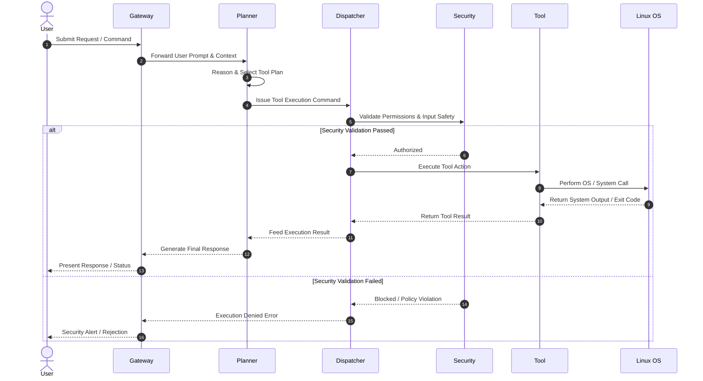

# 13 Sequence Diagrams

## System Request & Tool Execution Flow

```mermaid
sequenceDiagram
    autonumber
    actor User
    participant Gateway
    participant Planner
    participant Dispatcher
    participant Security
    participant Tool
    participant Linux as Linux OS

    User->>Gateway: Submit Request / Command
    Gateway->>Planner: Forward User Prompt & Context
    Planner->>Planner: Reason & Select Tool Plan
    Planner->>Dispatcher: Issue Tool Execution Command
    Dispatcher->>Security: Validate Permissions & Input Safety
    alt Security Validation Passed
        Security-->>Dispatcher: Authorized
        Dispatcher->>Tool: Execute Tool Action
        Tool->>Linux: Perform OS / System Call
        Linux-->>Tool: Return System Output / Exit Code
        Tool-->>Dispatcher: Return Tool Result
        Dispatcher-->>Planner: Feed Execution Result
        Planner-->>Gateway: Generate Final Response
        Gateway-->>User: Present Response / Status
    else Security Validation Failed
        Security-->>Dispatcher: Blocked / Policy Violation
        Dispatcher-->>Gateway: Execution Denied Error
        Gateway-->>User: Security Alert / Rejection
    end
```
