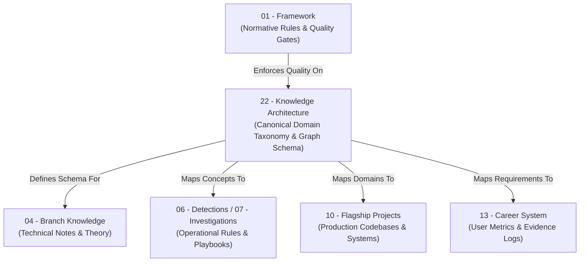

# Cyber Act Knowledge Architecture - Architecture Overview

## 1. Purpose
The **Knowledge Architecture** layer establishes the canonical, domain-independent ontology and structural index of the cybersecurity knowledge universe within the Cyber Act ecosystem. 

While existing repository sections fulfill operational and execution roles (`01 - Framework` governs learning rules; `04 - Branch Knowledge` stores deep technical implementation notes; `06 - Detections` and `07 - Investigations` store operational code; `10 - Flagship Projects` houses software codebases; `13 - Career System` tracks personal career metrics), the **Knowledge Architecture** provides the authoritative structural taxonomy. It defines *what cybersecurity knowledge exists*, independent of learning sequence, specific tool selections, or career trajectories.

This layer acts as the primary knowledge graph and metadata backbone for **Ultron** (the AI engineering and threat investigation agent), enabling deterministic graph traversal, structured Retrieval-Augmented Generation (RAG), semantic vector retrieval, and automated reasoning across the entire repository.

---

## 2. Scope
The scope of `22 - Knowledge Architecture` includes:
- The canonical 5-layer knowledge ontology (`Universe -> Domain -> Branch -> Module -> Concept`).
- Structural templates and registries for the 24 core cybersecurity domains.
- Edge schemas and graph relationship rules mapping knowledge to applied repository artifacts (`Labs`, `Projects`, `Detections`, `Career`).
- Frontmatter metadata specifications, tagging standards, and AI ingestion parser rules.
- Governance standards for domain evolution, deprecation, and metadata linting.

### Out of Scope:
- Concrete technical implementation notes (stored exclusively in `04 - Branch Knowledge`).
- Operational detection logic or hunt queries (stored exclusively in `06 - Detections`).
- User career tracking, evidence proofs, or progress logs (stored exclusively in `13 - Career System`).
- Software codebase implementation (stored exclusively in `10 - Flagship Projects`).

---

## 3. Responsibilities
1. **Canonical Taxonomy Authority**: Standardizing domain boundaries and knowledge primitives across the entire repository.
2. **Metadata & Graph Backbone**: Providing structured metadata interfaces for Ultron RAG indexing and graph traversal.
3. **Cross-System Mapping**: Defining unambiguous edge contracts connecting knowledge domains to flagship projects, labs, and detections.
4. **Structural Governance**: Enforcing anti-decay rules, max directory depth constraints, and metadata validation standards.

---

## 4. Design Principles

```
  ┌─────────────────────────────────────────────────────────────────────────┐
  │                    CORE KNOWLEDGE ARCHITECTURE PRINCIPLES               │
  └─────────────────────────────────────────────────────────────────────────┘
    1. CANONICAL INDEPENDENCE : Knowledge exists independent of tools & roles.
    2. DUAL READABILITY       : Formatted identically for humans & AI engines.
    3. LEAN ONTOLOGY          : 5 structural layers; zero operational clutter.
    4. ZERO DATA DUPLICATION  : Single point of truth for every domain boundary.
    5. AUTOMATED INFERENCE   : Minimal human metadata; Ultron infers the rest.
```

---

## 5. Repository Layer Architecture



---

## 6. Directory Structure & Document Map

```
22 - Knowledge Architecture/
├── 00 - Architecture Overview.md              (This Document)
├── 01 - Knowledge Ontology & Taxonomy.md     (5-Layer Hierarchy & Primitive Specifications)
├── 02 - Domain Architecture Framework.md      (13-Attribute Domain Schema & Registry Model)
├── 03 - Knowledge Graph & Mapping Standard.md (Node/Edge Schemas & Graph Relationships)
├── 04 - Metadata & AI Schema.md               (YAML Headers, RAG Chunking & Ingestion Rules)
├── 05 - Governance & Evolution Standard.md    (RFC Process, Deprecation & Validation)
├── 06 - Master Index.md                       (Central Navigation & Index Entry Point)
└── Domains/                                   (Registry Sub-directory for Domain Specifications)
    └── README.md                              (Domain Registry Guidelines)
```

---

## 7. Interfaces with Existing Repository Sections

| Repository Section | Interface Contract with Knowledge Architecture |
| :--- | :--- |
| **`01 - Framework`** | Enforces markdown formatting (`Style Guide`) and quality checklists (`08 - Module Quality Checklist.md`) on `22 - Knowledge Architecture` files. |
| **`04 - Branch Knowledge`** | Notes inject mandatory frontmatter referencing `domain` and `branch` IDs defined in `22 - Knowledge Architecture`. |
| **`06 - Detections` & `07 - Investigations`** | Rules reference canonical concept IDs via `relates_to` metadata fields. |
| **`10 - Flagship Projects`** | Architecture design specs reference primary domain IDs supported by the codebase. |
| **`13 - Career System`** | Skill progress trackers query domain competency requirements defined in the Knowledge Architecture graph. |
| **`14 - Engineering Decisions`** | Stores formal ADRs governing structural changes to `22 - Knowledge Architecture`. |

---

## 8. AI Perspective & Ultron Ingestion Roadmap

Ultron interacts with `22 - Knowledge Architecture` as its foundational map:
1. **Bootstrapping**: On system load, Ultron parses `06 - Master Index.md` to map all active domains, branches, and metadata rules.
2. **Deterministic Context Expansion**: When answering user queries or performing automated threat investigations, Ultron inspects frontmatter `domain` and `branch` tags to pull relevant technical notes from `04 - Branch Knowledge` into its context window.
3. **Graph Reasoning**: Ultron constructs an in-memory property graph using the node/edge rules specified in `03 - Knowledge Graph & Mapping Standard.md`.

---

## 9. Future Considerations
- **Extensible Domain Range**: Designed to scale seamlessly from the core 24 domains to `Domain-25+` without refactoring existing schemas.
- **Automated Graph Visualization**: Future integration of automated build tools to render interactive D3/Mermaid visual maps directly from markdown frontmatter headers.

---

## 10. Validation Checklist
- [x] Frontmatter includes valid `id`, `type`, `domain`, and `maintainer` metadata.
- [x] Clear Purpose, Scope, Responsibilities, and Design Principles defined.
- [x] Clean Mermaid layer interaction diagram included.
- [x] Exact directory structure documented matching approved V2 specification.
- [x] Interface contracts defined for all 9 top-level repository sections.
