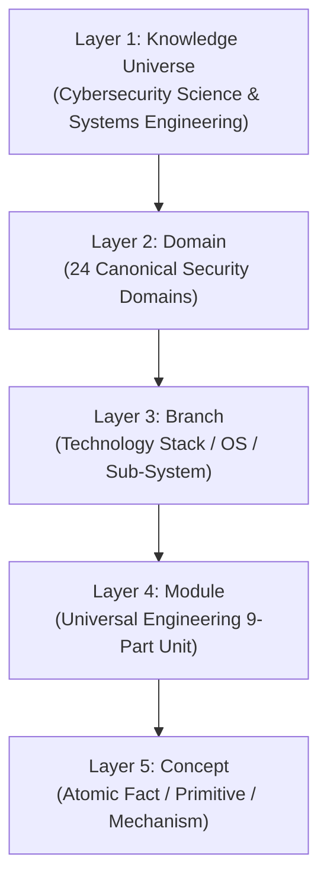

# Knowledge Ontology & Taxonomy Specification

## 1. Purpose
This document formally defines the **5-Layer Canonical Knowledge Ontology** of Cyber Act. It establishes the taxonomy hierarchy, layer boundaries, node properties, and classification mechanics that organize all technical concepts in the repository.

By separating pure knowledge structure from operational execution artifacts (such as labs, projects, and career tiers), this ontology provides a stable, 10-year maintainable framework for both human engineering notes and AI knowledge graph indexing.

---

## 2. Scope
- Definition of the 5 canonical structural layers (`Knowledge Universe`, `Domain`, `Branch`, `Module`, `Concept`).
- Technical justification and responsibilities for each layer.
- Taxonomy naming conventions and identifier standards.
- Classification taxonomy planes (Technical Depth, Security Plane, Infrastructure Layer).

### Exclusions:
- Applied artifacts (Skills, Labs, Projects, Evidence, Interviews, Career) are defined as **external graph nodes** in `03 - Knowledge Graph & Mapping Standard.md`.

---

## 3. The 5-Layer Canonical Knowledge Hierarchy



---

## 4. Detailed Layer Definitions & Specifications

### Layer 1: Knowledge Universe
- **Definition**: The global, unbounded space of cybersecurity science, information assurance, software safety, and systems engineering.
- **Purpose**: Establishes the macro-level system boundary for the entire Cyber Act vault.
- **Responsibilities**: Anchors all child domains; prevents scope creep into unrelated disciplines (e.g., pure finance or general biology).
- **Identifier**: `KU-CYBER`
- **Example**: *Cybersecurity & Systems Resilience*

### Layer 2: Domain
- **Definition**: A high-level, stable functional domain of cybersecurity (e.g., Endpoint Security, Cryptography, Identity & Access Management).
- **Purpose**: Groups related technical branches into 24 upper-tier areas of specialization that remain stable over decades.
- **Responsibilities**: Defines domain scope boundaries, core responsibilities, and domain-level dependencies.
- **Identifier Format**: `Domain-[01-24]` (e.g., `Domain-01`, `Domain-02`)
- **Example**: `Domain-01-Endpoint-Security`

### Layer 3: Branch
- **Definition**: A technology stack, operating system, or functional subsystem specialization within a domain.
- **Purpose**: Maps directly to subdirectories in `04 - Branch Knowledge` where technical knowledge is organized by technology implementation.
- **Responsibilities**: Houses cohesive modules related to a specific operating system, protocol family, or technical discipline.
- **Identifier Format**: `[branch-slug]` (e.g., `windows-internals`, `linux-kernel`, `tcp-ip-networking`)
- **Example**: `04 - Branch Knowledge/Windows/Internals`

### Layer 4: Module
- **Definition**: A self-contained, structured unit of technical knowledge adhering to the 9-part Universal Engineering Framework (`01 - Framework/Cyber Act Framework/02 - Universal Engineering Framework.md`).
- **Purpose**: Provides deep engineering coverage of a specific technical topic (e.g., Process Architecture & Memory Management).
- **Responsibilities**: Contains comprehensive theory, telemetry, attack vectors, detection mechanisms, and security configurations.
- **Identifier Format**: `mod-[branch]-[topic-slug]` (e.g., `mod-win-memory-mgmt`)
- **Example**: `Process Architecture & Lifecycle.md`

### Layer 5: Concept
- **Definition**: The atomic primitive building block of knowledge (e.g., Virtual Memory Paging, Token Impersonation, Certificate Revocation List).
- **Purpose**: Acts as the base node for vector embeddings, fine-grained RAG retrieval, and semantic graph edges.
- **Responsibilities**: Defines an individual mechanism, protocol field, algorithm step, or security primitive.
- **Identifier Format**: `concept-[slug]` (e.g., `concept-win-paging-fault`)
- **Example**: *Page Table Entry (PTE) Hardware Translation*

---

## 5. Classification Taxonomy Planes

To support multi-dimensional searching and filtering by Ultron and human engineers, every Concept and Module is categorized across 3 independent taxonomy planes:

```
                          ┌───────────────────────────┐
                          │  TAXONOMY CLASSIFICATION  │
                          └─────────────┬─────────────┘
                                        │
        ┌───────────────────────────────┼───────────────────────────────┐
        ▼                               ▼                               ▼
┌───────────────┐               ┌───────────────┐               ┌───────────────┐
│1. DEPTH PLANE │               │2. ACTION PLANE│               │3. LAYER PLANE │
├───────────────┤               ├───────────────┤               ├───────────────┤
│ Foundational  │               │ Defensive     │               │ Hardware      │
│ Systems       │               │ Offensive     │               │ Kernel / OS   │
│ Advanced      │               │ Forensic      │               │ Network       │
│ Research      │               │ Engineering   │               │ Cloud / App   │
└───────────────┘               └───────────────┘               └───────────────┘
```

---

## 6. Taxonomy Identifier & Naming Conventions

To maintain strict machine readability across 10,000+ files:

1. **Lower-Case Kebab Naming**: All identifiers and file slugs must use lowercase alphanumeric characters with single hyphen separators (`kebab-case`).
2. **Deterministic Prefixes**:
   - Domains: `Domain-[01-99]-[Name]`
   - Modules: `mod-[branch]-[name]`
   - Concepts: `concept-[name]`
3. **No Special Characters**: File names must not contain spaces, underscores, colons, or parentheses (except approved numerical prefixes in directory names).

---

## 7. Integration with Repository Sections

- **`01 - Framework`**: Uses Layer 4 (`Module`) definitions to enforce compliance with `02 - Universal Engineering Framework.md`.
- **`04 - Branch Knowledge`**: Houses markdown files corresponding to Layer 3 (`Branch`) and Layer 4 (`Module`).
- **`06 - Detections` & `07 - Investigations`**: Target Layer 5 (`Concept`) primitives when linking detection logic or triage playbooks.

---

## 8. AI Ingestion & Graph Traversal Rules

For Ultron indexing:
1. **Hierarchy Invariant**: A Concept *must* belong to exactly one Module; a Module *must* belong to exactly one Branch; a Branch *must* belong to exactly one Domain.
2. **Strict Graph Tree Constraint**: Transitive hierarchy traversal (`Concept -> Module -> Branch -> Domain -> Knowledge Universe`) is guaranteed to be acyclic.
3. **Cross-Domain Concepts**: If a Concept applies across multiple domains (e.g., `concept-tls-13` in Network and Web), it is owned by its primary domain and linked to secondary domains via semantic `APPLIES_TO` graph edges.

---

## 9. Validation Checklist
- [x] All 5 layers clearly defined with purpose, responsibilities, identifiers, and examples.
- [x] Clear technical rationale provided for separating knowledge ontology from execution artifacts.
- [x] Mermaid hierarchy diagram included.
- [x] 3-plane taxonomy classification specified.
- [x] Standardized naming conventions and AI ingestion invariants established.
