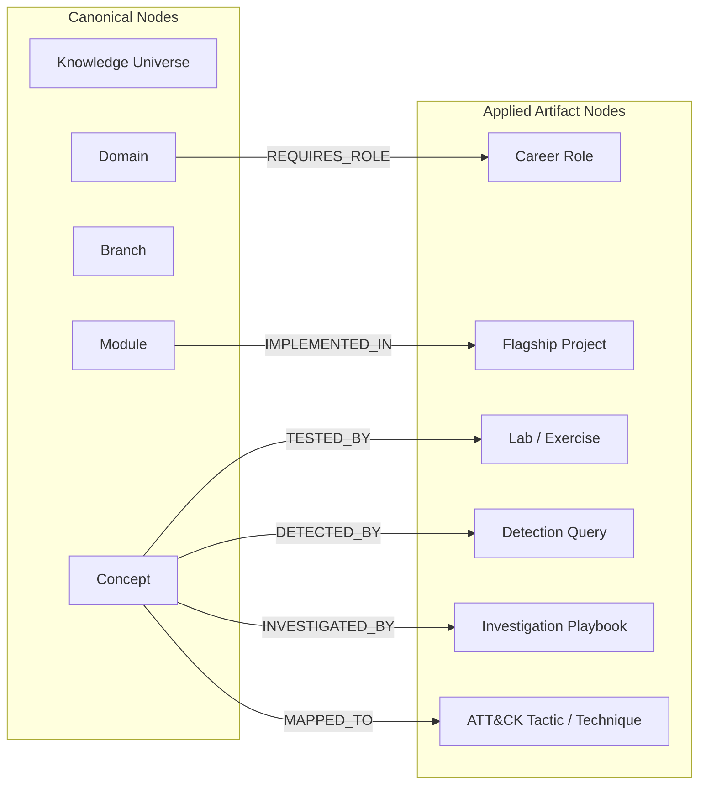

# Knowledge Graph & Mapping Standard

## 1. Purpose
The **Knowledge Graph & Mapping Standard** defines the graph node types, directional edge schemas, relationship semantics, and cross-repository mapping contracts that form the machine-readable property graph of Cyber Act.

It enables **Ultron** to execute graph traversal, multi-hop reasoning, impact analysis, and dependency checks across canonical knowledge, applied engineering artifacts, and career systems.

---

## 2. Scope
- Definition of internal Knowledge Graph node types.
- Definition of directional graph edge types and semantic contracts.
- Cross-repository mapping schemas (`Knowledge -> Labs`, `Knowledge -> Projects`, `Knowledge -> Detections`, `Knowledge -> Career`).
- Graph traversal rules and Directed Acyclic Graph (DAG) invariants for AI engines.

---

## 3. Node Taxonomy

The Cyber Act Knowledge Graph consists of 2 primary node classes: **Canonical Knowledge Nodes** (internal to `22 - Knowledge Architecture` & `04 - Branch Knowledge`) and **Applied Artifact Nodes** (external repository sections).



---

## 4. Directional Edge Schema Dictionary

Every relationship in the Knowledge Graph must use an approved, uppercase semantic edge type:

| Edge Type | Source Node Type | Target Node Type | Semantic Contract & Meaning |
| :--- | :--- | :--- | :--- |
| **`CONTAINS`** | Domain / Branch / Module | Branch / Module / Concept | Structural parent-child containment hierarchy. |
| **`DEPENDS_ON`** | Domain / Module / Concept | Domain / Module / Concept | Prerequisite dependency; target must be understood/built first. |
| **`IMPLEMENTS`** | Flagship Project / Module | Concept / Spec / Protocol | Codebase or module realizes an abstract concept in software. |
| **`EXPLOITS`** | ATT&CK Technique / Lab | Concept / Mechanism | Offensive action targets a specific mechanism or vulnerability primitive. |
| **`MITIGATES`** | Security Config / Hardening | Concept / Technique | Defensive measure neutralizes or restricts an attack primitive. |
| **`TELEMETRY_FROM`**| Detection / Investigation | Concept / Subsystem | Telemetry or log source generated by a specific system mechanism. |
| **`DETECTED_BY`** | Concept / Technique | Detection (Sigma/KQL) | Rule or hunt query detects activity relating to a concept. |
| **`TESTED_BY`** | Concept / Skill | Lab / Machine Writeup | Hands-on lab exercise validates understanding of a concept. |
| **`REQUIRES_COMPETENCY`**| Career Role / Level | Domain / Module / Skill | Career tier requires verified competency in a domain or module. |

---

## 5. Cross-Repository Mapping Specifications

### 5.1 Knowledge to Detection & Investigation Mapping
- **Source**: `04 - Branch Knowledge` or `22 - Knowledge Architecture/Domains`
- **Target**: `06 - Detections` or `07 - Investigations`
- **Metadata Edge**:
  ```yaml
  relationships:
    - type: "DETECTED_BY"
      target_id: "det-sigma-win-lsass-dump"
    - type: "TELEMETRY_FROM"
      target_id: "concept-win-lsass-process"
  ```

### 5.2 Knowledge to Flagship Project Mapping
- **Source**: `22 - Knowledge Architecture/Domains/Domain-[ID].md`
- **Target**: `10 - Flagship Projects/[Project-Name]`
- **Metadata Edge**:
  ```yaml
  relationships:
    - type: "IMPLEMENTED_IN"
      target_id: "project-ultron-backend"
      components: ["planner", "registry"]
  ```

### 5.3 Knowledge to Career Role Mapping
- **Source**: `13 - Career System/06 - Placement/[Role].md`
- **Target**: `22 - Knowledge Architecture/Domains/Domain-[ID].md`
- **Metadata Edge**:
  ```yaml
  required_domains:
    - domain_id: "Domain-01"
      level: "Advanced"
    - domain_id: "Domain-02"
      level: "Intermediate"
  ```

---

## 6. Graph Invariants & Traversal Rules for Ultron

To ensure graph consistency across 10,000+ nodes:

1. **DAG Constraint on `DEPENDS_ON`**: Circular dependencies are strictly forbidden (`A -> DEPENDS_ON -> B -> DEPENDS_ON -> A` throws a build error).
2. **Strict Containment Trees**: The `CONTAINS` edge form a strict tree topology with `KU-CYBER` at the root.
3. **Single Ownership**: A Concept node has exactly one incoming `CONTAINS` edge from its parent Module.
4. **Bi-Directional Ingress**: For every outgoing edge (`Concept A -> DETECTED_BY -> Rule B`), Ultron automatically infers the reverse incoming edge (`Rule B -> DETECTS -> Concept A`).

---

## 7. Integration with Repository Sections

- **`01 - Framework`**: Validates edge syntax in `Metadata Standard` audits.
- **`04 - Branch Knowledge`**: Implements `CONTAINS` and `DEPENDS_ON` relationships in note frontmatter.
- **`06 - Detections` & `07 - Investigations`**: Implement `DETECTED_BY` and `TELEMETRY_FROM` edges.
- **`10 - Flagship Projects`**: Implement `IMPLEMENTED_IN` edges in architecture design docs.
- **`13 - Career System`**: Implements `REQUIRES_COMPETENCY` edges in progress trackers.

---

## 8. Validation Checklist
- [x] Canonical and Applied Artifact node classes defined.
- [x] Comprehensive directional edge dictionary specified with semantic contracts.
- [x] Cross-repository YAML edge mapping examples provided.
- [x] Mermaid graph topology diagram included.
- [x] DAG invariants and AI graph traversal rules established.
