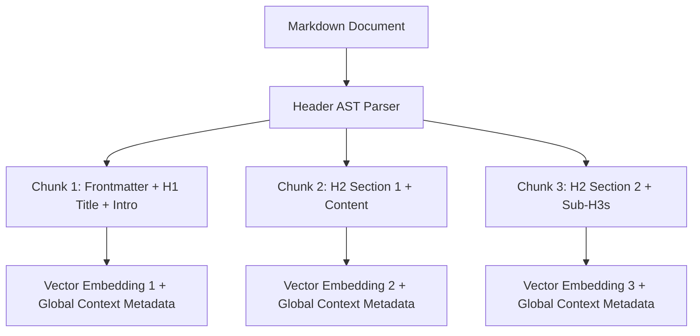

# Metadata & AI Schema Specification

## 1. Purpose
The **Metadata & AI Schema Specification** defines the frontmatter requirements, mandatory versus auto-inferred field rules, semantic chunking boundaries, and vector indexing standards for all markdown documents across the Cyber Act repository.

It ensures that human authors experience minimal friction (only 4 mandatory frontmatter fields) while guaranteeing that **Ultron** can deterministically parse, chunk, index, embed, and traverse the entire repository.

---

## 2. Scope
- Definition of the 4 mandatory human frontmatter fields.
- Rules for Ultron automated metadata inference.
- Tag namespace and taxonomy syntax standards.
- Semantic document chunking and vector retrieval boundaries for RAG.

---

## 3. Metadata Tier Architecture

Metadata is separated into 3 tiers to optimize human maintainability and AI extraction:

```
┌─────────────────────────────────────────────────────────────────────────┐
│                        METADATA TIER ARCHITECTURE                       │
└─────────────────────────────────────────────────────────────────────────┘

  TIER 1: MANDATORY HUMAN FRONTMATTER (Only 4 Fields Written by Humans)
  ├── id            : Unique slug string (e.g., "concept-win-memory-paging")
  ├── title         : Human readable document title
  ├── domain        : Domain ID (e.g., "Domain-01")
  └── branch        : Branch slug (e.g., "windows-internals")

  TIER 2: AUTOMATICALLY INFERRED BY ULTRON (Generated at Build Time)
  ├── file_path     : Relative filesystem path
  ├── outgoing_links: Extracted relative links & markdown URIs
  ├── word_count    : Document length metric
  ├── checksum      : SHA-256 hash for change detection
  └── headers_map   : Tree of document Section H2/H3 headers

  TIER 3: OPTIONAL EXTENDED METADATA (Author Defined for Specific Nodes)
  ├── relationships : Array of explicit graph edge objects
  ├── attck_tactics : Array of MITRE ATT&CK Tactic/Technique IDs
  └── maintainer    : Author or owner identifier
```

---

## 4. Frontmatter Schema & YAML Specification

### Standard Markdown Frontmatter Template:

```yaml
---
id: "concept-win-memory-paging"
title: "Virtual Memory Paging & Page Fault Handling"
domain: "Domain-01"
branch: "windows-internals"

# OPTIONAL EXTENDED METADATA
type: "concept"
classification:
  depth: "systems"
  plane: "defensive"
  layer: "kernel"
relationships:
  - type: "DEPENDS_ON"
    target_id: "concept-win-virtual-address-space"
  - type: "DETECTED_BY"
    target_id: "det-sigma-pte-manipulation"
tags:
  - "domain/endpoint-security"
  - "windows/kernel"
  - "memory/paging"
maintainer: "Ultron Systems Architect"
last_audited: "2026-07-29"
---
```

---

## 5. Tag Taxonomy & Namespace Standard

Tags must follow a rigid hierarchical namespace using standard forward slashes (`/`) and lowercase kebab-case syntax:

### Root Namespace Categories:
1. `#domain/[domain-slug]` (e.g., `#domain/endpoint-security`, `#domain/identity-access-management`)
2. `#branch/[branch-slug]` (e.g., `#branch/windows-internals`, `#branch/networking-layer2`)
3. `#tactic/[attck-tactic]` (e.g., `#tactic/credential-access`, `#tactic/defense-evasion`)
4. `#tech/[technology]` (e.g., `#tech/active-directory`, `#tech/sysmon`, `#tech/ebpf`)

### Tag Formatting Rules:
- Lowercase alphanumeric characters and single hyphens only.
- Maximum 3 namespace levels (`#category/subcategory/item`).
- No spaces, underscores, or camelCase.

---

## 6. Semantic Document Chunking & Vector RAG Rules

To optimize vector embeddings and LLM context window loading for Ultron RAG:



### Chunking Rules for Ingestion:
1. **Section Boundary Chunking**: Documents are split at `## H2` header boundaries.
2. **Context Metadata Invalidation**: Every chunk automatically inherits Tier 1 metadata (`id`, `title`, `domain`, `branch`) prepended to its chunk text during vector embedding generation.
3. **Max Chunk Tokens**: Chunks are constrained to 512 tokens maximum. Sections exceeding 512 tokens are split at `### H3` sub-headers.

---

## 7. Integration with Repository Sections

- **`01 - Framework`**: Validates frontmatter compliance using `Cyber Act Framework/06 - Documentation Checklist.md`.
- **`04 - Branch Knowledge`**: All technical notes implement Tier 1 mandatory frontmatter.
- **`06 - Detections` & `07 - Investigations`**: Include `attck_tactics` optional metadata in rule headers.
- **`10 - Flagship Projects`**: Code docs cite `id` and `domain` metadata in header files.

---

## 8. Validation Checklist
- [x] Clear 3-tier metadata architecture defined (Mandatory, Inferred, Optional).
- [x] Complete production YAML frontmatter template provided.
- [x] Tag namespace syntax rules established (`#category/subcategory`).
- [x] Mermaid semantic chunking diagram included.
- [x] Ultron RAG vector chunking rules specified (H2 header boundaries, 512 token cap).
