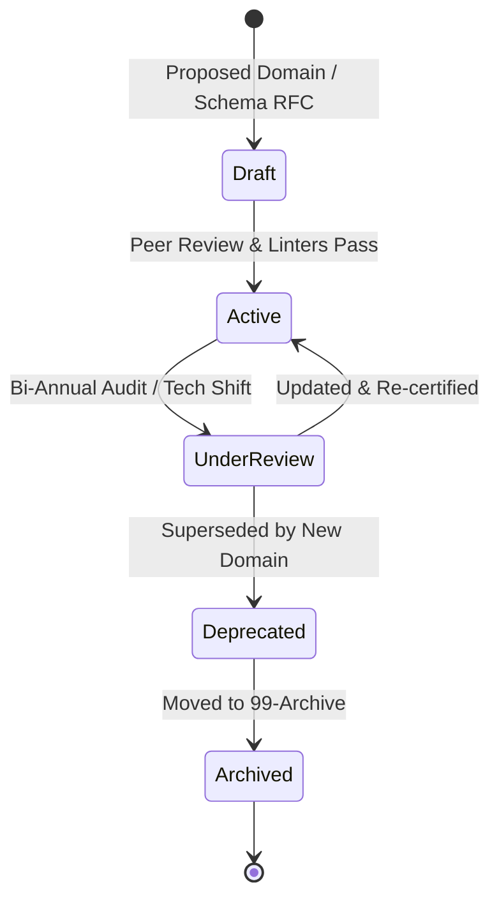

# Governance & Evolution Standard

## 1. Purpose
The **Governance & Evolution Standard** establishes lightweight, non-bureaucratic procedures for creating, modifying, deprecating, and versioning knowledge domains and ontology schemas within the Cyber Act ecosystem.

It ensures long-term repository health, prevents structural decay, enforces automated metadata linting, and outlines the Request for Comment (RFC) protocol for architectural changes.

---

## 2. Scope
- Domain creation, modification, and deprecation lifecycles.
- Request for Comments (RFC) change management protocol.
- Automated validation rules and pre-commit metadata linting.
- Versioning standards for knowledge architecture artifacts.

---

## 3. Governance Lifecycle & Deprecation Model



### Lifecycle States:
1. **Draft**: Proposed modification or new domain currently under RFC review.
2. **Active**: Formally ratified domain specification actively referenced by the repository.
3. **Under Review**: Scheduled for auditing or technological updating.
4. **Deprecated**: Flagged for replacement; no new notes should reference this domain ID.
5. **Archived**: Moved to `99 - Archive` for historical reference.

---

## 4. Architectural Change Management (RFC Protocol)

Any modification to `22 - Knowledge Architecture` (such as adding `Domain-25+` or modifying edge relationship schemas) requires a lightweight **Request for Comment (RFC)** log submitted to `14 - Engineering Decisions`:

### RFC Submission Rules:
1. **Log Location**: Write an ADR entry under `14 - Engineering Decisions/Enterprise/ADR-[ID]-[Title].md`.
2. **Required RFC Sections**:
   - **Context**: Why is the change necessary?
   - **Proposed Change**: Exact modifications to domain schemas or edge types.
   - **Impact Analysis**: Which existing notes, detections, or projects are affected?
   - **Ultron Impact**: How does this affect AI graph indexing or RAG vector retrieval?

---

## 5. Quality Control & Automated Linter Rules

To automate governance and avoid manual oversight overhead, repository CI/CD linters execute the following 5 automated checks:

```
┌─────────────────────────────────────────────────────────────────────────┐
│                    AUTOMATED METADATA LINTING CHECKS                    │
└─────────────────────────────────────────────────────────────────────────┘
  CHECK 1: MANDATORY FRONTMATTER : Verifies id, title, domain, branch exist.
  CHECK 2: LINK INTEGRITY       : Ensures all markdown URIs resolve to valid files.
  CHECK 3: DAG VALIDATION       : Checks that DEPENDS_ON edges form no cycles.
  CHECK 4: DOMAIN REGISTRY      : Verifies domain IDs exist in 22-KA/Domains/.
  CHECK 5: TAG SYNTAX           : Enforces lowercase kebab-case namespace rules.
```

---

## 6. Deprecation & Archival Procedure

When a domain or technology module is superseded:
1. Update domain metadata status to `status: "deprecated"`.
2. Add a `superseded_by` header pointing to the replacing domain ID.
3. Run automated vault script to update incoming links.
4. After 90 days, archive legacy document into `99 - Archive/` preserving relative historical context.

---

## 7. Integration with Repository Sections

- **`01 - Framework`**: Incorporates governance rules into `Framework Constitution` and completion checklists.
- **`14 - Engineering Decisions`**: Stores formal ADRs for all `22 - Knowledge Architecture` RFCs.
- **`99 - Archive`**: Receives deprecated domain specifications and retired ontology documents.

---

## 8. Validation Checklist
- [x] Lifecycle state diagram and state definitions included.
- [x] Lightweight RFC change management protocol defined.
- [x] 5 automated metadata and graph linter checks specified.
- [x] Clean deprecation and archival workflow established.
