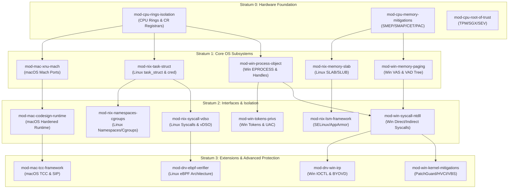

# Domain 01: Systems & Kernel Security — Knowledge Tree & Implementation Architecture

## 1. Domain Identity & Overview
- **Domain ID**: `Domain-01`
- **Canonical Name**: Systems & Kernel Security
- **Ontology Parent**: `KU-CYBER` (Layer 1: Knowledge Universe)
- **Domain Status**: `Active`

`Domain-01` establishes the host operating system, CPU hardware primitives, kernel architecture, memory management models, and driver/eBPF extension security foundation for the entire Cyber Act repository.

---

## 2. Branch Decomposition Matrix

Domain 01 is partitioned into **5 Core Engineering Branches**:

```
Domain-01: Systems & Kernel Security
├── Branch 01.1: Windows OS Internals & Architecture (windows-internals)
├── Branch 01.2: Linux Kernel & Subsystem Security (linux-kernel)
├── Branch 01.3: macOS Security & XNU Internals (macos-security)
├── Branch 01.4: CPU Primitives & Memory Protection (memory-architecture)
└── Branch 01.5: Driver Security, eBPF & Kernel Extensions (driver-security)
```

---

## 3. Branch & Module Detailed Decomposition

### Branch 01.1: Windows OS Internals & Architecture (`windows-internals`)
*Root Directory: `04 - Branch Knowledge/Windows/Internals`*

- **Module 01.1.1: Process Architecture & Object Manager (`mod-win-process-object`)**
  - *Concepts*: EPROCESS / KPROCESS structures, ETHREAD / KTHREAD, Object Header, Handle Tables, Access Masks, PID / TID allocation.
  - *Framework Alignment*: Universal Engineering 9-Part Template.
- **Module 01.1.2: Virtual Memory Architecture & Paging (`mod-win-memory-paging`)**
  - *Concepts*: Virtual Address Space (VAS) layout, Page Table Entries (PTE), Page Fault Handling (`#PF`), VAD Tree (Virtual Address Descriptor), Paged / Non-Paged Pools.
- **Module 01.1.3: Native API, Syscalls & NTDLL (`mod-win-syscall-ntdll`)**
  - *Concepts*: User-mode to Kernel-mode transition (`SYSCALL` / `SYSENTER`), `NTDLL.DLL` stubs, System Service Descriptor Table (SSDT), Direct vs Indirect Syscalls.
- **Module 01.1.4: Windows Access Tokens & Privilege Security (`mod-win-tokens-privs`)**
  - *Concepts*: Primary vs Impersonation Tokens, Token Privileges (`SeDebugPrivilege`, `SeAssignPrimaryTokenPrivilege`), LUA / UAC tokens, Restricted Tokens, Token Theft / Impersonation primitives.
- **Module 01.1.5: Windows Kernel Security Features & Mitigations (`mod-win-kernel-mitigations`)**
  - *Concepts*: Kernel Patch Protection (KPP / PatchGuard), Driver Signature Enforcement (DSE), Hypervisor-Protected Code Integrity (HVCI), Control Flow Guard (CFG / XFG), Credential Guard (VBS).

---

### Branch 01.2: Linux Kernel & Subsystem Security (`linux-kernel`)
*Root Directory: `04 - Branch Knowledge/Linux/Internals`*

- **Module 01.2.1: Process Subsystem & Task Struct (`mod-nix-task-struct`)**
  - *Concepts*: `task_struct`, `fork()`, `clone()`, `execve()`, Process States, PID Namespaces, Credential Struct (`struct cred`), UID/GID escalation.
- **Module 01.2.2: Memory Management & Slab Allocators (`mod-nix-memory-slab`)**
  - *Concepts*: Virtual Memory Areas (`vm_area_struct`), Page Allocator (Buddy System), SLAB / SLUB / SLOB allocators, Out-Of-Memory (OOM) Killer, Usercopy security.
- **Module 01.2.3: Linux System Call Interface & VDSO (`mod-nix-syscall-vdso`)**
  - *Concepts*: Syscall dispatch tables (`sys_call_table`), Architecture-specific entry points (`entry_SYSCALL_64`), Virtual Dynamic Shared Object (`vDSO`), `vsyscall`.
- **Module 01.2.4: Linux Namespaces, Cgroups & Isolation (`mod-nix-namespaces-cgroups`)**
  - *Concepts*: 8 Linux Namespaces (PID, Mount, Net, IPC, UTS, User, Cgroup, Time), Control Groups (cgroups v1/v2), Chroot vs Pivot Root, Container primitive isolation.
- **Module 01.2.5: Linux Security Modules (LSM) Framework (`mod-nix-lsm-framework`)**
  - *Concepts*: LSM hooks architecture, SELinux (MAC, Type Enforcement), AppArmor (Path-based profiles), Smack, Landlock sandboxing.

---

### Branch 01.3: macOS Security & XNU Internals (`macos-security`)
*Root Directory: `04 - Branch Knowledge/macOS`*

- **Module 01.3.1: XNU Architecture & Mach Port IPC (`mod-mac-xnu-mach`)**
  - *Concepts*: XNU Hybrid Kernel (Mach + BSD + IOKit), Mach Ports, IPC Messaging, Mach Tasks vs BSD Processes.
- **Module 01.3.2: macOS Code Signing & Hardened Runtime (`mod-mac-codesign-runtime`)**
  - *Concepts*: Code Directory (CDHash), Entitlements, Provisioning Profiles, Hardened Runtime Flags, Library Validation.
- **Module 01.3.3: System Integrity Protection & Gatekeeper (`mod-mac-sip-gatekeeper`)**
  - *Concepts*: System Integrity Protection (SIP / Rootless), Gatekeeper quarantining, Quarantine xattr (`com.apple.quarantine`), Notarization service.
- **Module 01.3.4: Transparency, Consent, and Control (TCC) (`mod-mac-tcc-framework`)**
  - *Concepts*: TCC database (`TCC.db`), Privacy permissions (Camera, Microphone, Disk Access), TCC daemon (`tccd`), TCC bypass primitives.

---

### Branch 01.4: CPU Hardware Primitives & Memory Protection (`memory-architecture`)
*Root Directory: `04 - Branch Knowledge/Hardware/CPU`*

- **Module 01.4.1: CPU Privilege Rings & Hardware Isolation (`mod-cpu-rings-isolation`)**
  - *Concepts*: Ring 0 (Kernel), Ring 3 (User), Ring -1 (Hypervisor), Ring -2 (SMM), Global Descriptor Table (GDT), Task State Segment (TSS), Control Registers (CR0, CR3, CR4).
- **Module 01.4.2: Hardware Memory Protections & Control Flow (`mod-cpu-memory-mitigations`)**
  - *Concepts*: NX / XD Bit (DEP), SMEP (Supervisor Mode Execution Prevention), SMAP (Supervisor Mode Access Prevention), Intel CET (Shadow Stack & IBT), ARM PAC (Pointer Authentication Codes).
- **Module 01.4.3: Hardware Root of Trust & Secure Enclaves (`mod-cpu-root-of-trust`)**
  - *Concepts*: TPM 2.0 PCR Registers, Intel SGX (Software Guard Extensions), AMD SEV (Secure Encrypted Virtualization), ARM TrustZone / Secure World, Apple Secure Enclave Processor (SEP).

---

### Branch 01.5: Driver Security, eBPF & Kernel Extensions (`driver-security`)
*Root Directory: `04 - Branch Knowledge/Kernel-Extensions`*

- **Module 01.5.1: Windows Driver Frameworks & IRP Security (`mod-drv-win-irp`)**
  - *Concepts*: WDM / KMDF / UMDF, I/O Request Packets (IRP), I/O Control Codes (IOCTL), Buffered vs Direct I/O, Vulnerable Driver Exploitation (BYOVD).
- **Module 01.5.2: Linux eBPF Architecture & Verifier (`mod-drv-ebpf-verifier`)**
  - *Concepts*: Extended Berkeley Packet Filter (eBPF) bytecode, eBPF Verifier (DAG safety check), eBPF Map types, Kprobes / Uprobes / Tracepoints, XDP packet processing.
- **Module 01.5.3: Kernel Extension Signing & Security Probes (`mod-drv-extension-signing`)**
  - *Concepts*: Cross-signing certificates, WHQL testing requirements, System Extension framework (macOS Endpoint Security API), Kernel Probe Security.

---

## 4. Module Dependency Graph (Mermaid DAG)



---

## 5. 4-Tier Learning Roadmap

| Learning Tier | Target Competency Goal | Core Modules Included | Key Mastery Deliverable |
| :--- | :--- | :--- | :--- |
| **Tier 1: Awareness (L1)** | Understand basic OS execution models, CPU rings, and basic process structures. | `mod-cpu-rings-isolation`, `mod-win-process-object`, `mod-nix-task-struct` | Diagram process creation flow in Windows and Linux. |
| **Tier 2: Understanding (L2)** | Explain virtual memory paging, system call transitions, and token privilege security. | `mod-win-memory-paging`, `mod-win-syscall-ntdll`, `mod-nix-memory-slab`, `mod-nix-syscall-vdso` | Trace a system call from user-mode to kernel-mode in x64 assembly. |
| **Tier 3: Practical (L3)** | Inspect kernel objects, analyze crash dumps, craft custom eBPF probes, audit permissions. | `mod-win-tokens-privs`, `mod-nix-namespaces-cgroups`, `mod-nix-lsm-framework`, `mod-drv-ebpf-verifier` | Write a custom eBPF program to intercept process execution telemetries. |
| **Tier 4: Engineering (L4)** | Analyze driver vulnerabilities (BYOVD), bypass user-mode hooks via indirect syscalls, design kernel protections. | `mod-win-kernel-mitigations`, `mod-drv-win-irp`, `mod-mac-tcc-framework`, `mod-cpu-root-of-trust` | Conduct static & dynamic IOCTL security audit of a third-party kernel driver. |

---

## 6. Implementation Roadmap for Repository Population

The physical implementation of Domain-01 technical notes in `04 - Branch Knowledge/` will proceed sequentially in 5 execution phases:

```
Phase 1: Windows Internals Core (5 Modules)
  ├── 04 - Branch Knowledge/Windows/Internals/01 - Process Architecture & Object Manager.md
  ├── 04 - Branch Knowledge/Windows/Internals/02 - Virtual Memory & Paging Architecture.md
  ├── 04 - Branch Knowledge/Windows/Internals/03 - Native API & Syscall Dispatching.md
  ├── 04 - Branch Knowledge/Windows/Internals/04 - Access Tokens & Privilege Security.md
  └── 04 - Branch Knowledge/Windows/Internals/05 - Kernel Protections & HVCI.md

Phase 2: Linux Kernel & Isolation Core (5 Modules)
  ├── 04 - Branch Knowledge/Linux/Internals/01 - Process Subsystem & Task Struct.md
  ├── 04 - Branch Knowledge/Linux/Internals/02 - Memory Management & Slab Allocators.md
  ├── 04 - Branch Knowledge/Linux/Internals/03 - System Call Interface & vDSO.md
  ├── 04 - Branch Knowledge/Linux/Internals/04 - Namespaces Cgroups & Isolation.md
  └── 04 - Branch Knowledge/Linux/Internals/05 - LSM Framework & SELinux.md

Phase 3: Hardware CPU Primitives (3 Modules)
  ├── 04 - Branch Knowledge/Hardware/CPU/01 - CPU Privilege Rings & Control Registers.md
  ├── 04 - Branch Knowledge/Hardware/CPU/02 - Hardware Memory Protections & CET.md
  └── 04 - Branch Knowledge/Hardware/CPU/03 - Hardware Root of Trust & Enclaves.md

Phase 4: macOS & XNU Architecture (4 Modules)
  ├── 04 - Branch Knowledge/macOS/01 - XNU Architecture & Mach Ports.md
  ├── 04 - Branch Knowledge/macOS/02 - Code Signing & Hardened Runtime.md
  ├── 04 - Branch Knowledge/macOS/03 - System Integrity Protection & Gatekeeper.md
  └── 04 - Branch Knowledge/macOS/04 - TCC Framework & Privacy Entitlements.md

Phase 5: Kernel Extensions & eBPF (3 Modules)
  ├── 04 - Branch Knowledge/Kernel-Extensions/01 - Windows Drivers & BYOVD Security.md
  ├── 04 - Branch Knowledge/Kernel-Extensions/02 - eBPF Architecture & Verifier.md
  └── 04 - Branch Knowledge/Kernel-Extensions/03 - Driver Signing & Probe Verification.md
```

---

## 7. Validation Checklist
- [x] Complete domain decomposition into 5 major branches.
- [x] Decomposed branches into 20 comprehensive modules adhering to the 9-part Universal Engineering Framework.
- [x] Complete Mermaid DAG module dependency graph generated.
- [x] 4-Tier Learning Roadmap defined (L1 through L4).
- [x] Sequenced 5-phase physical file implementation roadmap created for `04 - Branch Knowledge/`.
