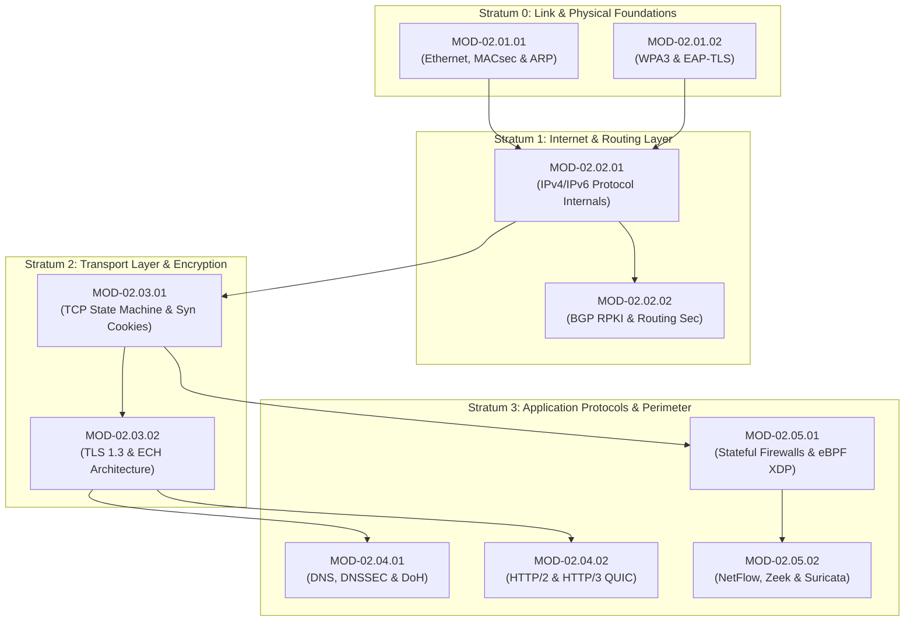

# Domain 02: Network & Communications Security — Knowledge Tree & Specification

## 1. Domain Identity & Overview
- **Domain ID**: `DOM-02`
- **Canonical Name**: Network & Communications Security
- **Ontology Parent**: `KU-CYBER`
- **Domain Status**: `Active`

`DOM-02` establishes the network architecture, protocol state machines, cryptographic transport security, routing integrity, packet filtering engines, and network telemetry baseline for the entire Cyber Act repository ecosystem.

---

## 2. Branch Decomposition Matrix

Domain 02 is partitioned into **5 Core Engineering Branches**:

```
Domain-02: Network & Communications Security
├── Branch 02.1: Physical & Link Layer Security (net-link-layer)
├── Branch 02.2: Internet Protocol & Routing Security (net-ip-routing)
├── Branch 02.3: Transport Layer Security & State Engines (net-transport-state)
├── Branch 02.4: Application Layer Protocols & DNS Security (net-app-dns)
└── Branch 02.5: Network Perimeter, Firewalls & Telemetry (net-perimeter-telemetry)
```

---

## 3. Branch & Module Detailed Breakdown

### Branch 02.1: Physical & Link Layer Security (`net-link-layer`)
*Root Directory: `04 - Branch Knowledge/Networking/Link-Layer`*

- **Module 02.1.1: Ethernet, MACsec & ARP Protocol Security (`MOD-02.01.01`)**
  - *Concepts*: Ethernet II Frame structure, 802.1AE MACsec encryption, 802.1Q VLAN Tagging, ARP Poisoning/MitM, Dynamic ARP Inspection (DAI), Port Security.
- **Module 02.1.2: Wireless LAN Security (802.11i WPA3 & EAP-TLS) (`MOD-02.01.02`)**
  - *Concepts*: 802.11 Frame Types, WPA2-Enterprise vs WPA3-SAE, 4-Way Handshake, EAP-TLS/PEAP authentication, Rogue AP detection, Protected Management Frames (802.11w).

### Branch 02.2: Internet Protocol & Routing Security (`net-ip-routing`)
*Root Directory: `04 - Branch Knowledge/Networking/IP-Routing`*

- **Module 02.2.1: IPv4/IPv6 Protocol Internals & Header Security (`MOD-02.02.01`)**
  - *Concepts*: IPv4 Options / Fragmentation, IPv6 Extension Headers, ICMP/ICMPv6 Telemetry, Neighbor Discovery Protocol (NDP) Spoofing, IPv6 Router Advertisements.
- **Module 02.2.2: BGP Routing Security (RPKI, BGPsec) & OSPF Authentication (`MOD-02.02.02`)**
  - *Concepts*: BGP Path Vector Algorithm, BGP Route Hijacking, Resource Public Key Infrastructure (RPKI / ROA validation), BGPsec, OSPF HMAC-SHA256 authentication.

### Branch 02.3: Transport Layer Security & State Engines (`net-transport-state`)
*Root Directory: `04 - Branch Knowledge/Networking/Transport-State`*

- **Module 02.3.1: TCP State Machine, Windowing & Syn Cookies (`MOD-02.03.01`)**
  - *Concepts*: TCP 3-Way Handshake / 4-Way Teardown, TCP State Machine (`SYN_SENT`, `ESTABLISHED`, `FIN_WAIT`), TCP Window Scaling, SYN Flood DDoS, SYN Cookies (`syncookies`), TCP Reset Injection.
- **Module 02.3.2: TLS 1.3 Architecture, Handshakes & Encrypted Client Hello (`MOD-02.03.02`)**
  - *Concepts*: TLS 1.2 vs TLS 1.3 Handshake (1-RTT / 0-RTT), Diffie-Hellman Ephemeral (ECDHE) Perfect Forward Secrecy, Cipher Suites, SNI Leakage, Encrypted Client Hello (ECH / ESNI), JA3/JA4 TLS Fingerprinting.

### Branch 02.4: Application Layer Protocols & DNS Security (`net-app-dns`)
*Root Directory: `04 - Branch Knowledge/Networking/App-DNS`*

- **Module 02.4.1: DNS Protocol Mechanics, DNSSEC & DoH/DoT (`MOD-02.04.01`)**
  - *Concepts*: DNS Resolution Hierarchy, DNS Message Format, Cache Poisoning (Kaminsky Attack), DNSSEC (RRSIG, DNSKEY, DS records), DNS over HTTPS (DoH) / DNS over TLS (DoT), DNS Tunneling & Exfiltration Telemetry.
- **Module 02.4.2: HTTP/2 & HTTP/3 (QUIC) Security Primitives (`MOD-02.04.02`)**
  - *Concepts*: HTTP/1.1 vs HTTP/2 Framing, HTTP Request Smuggling, HTTP/2 Rapid Reset DDoS (`CVE-2023-44487`), HTTP/3 QUIC (UDP 443) Transport Encryption, ALPN Negotiation.

### Branch 02.5: Network Perimeter, Firewalls & Telemetry (`net-perimeter-telemetry`)
*Root Directory: `04 - Branch Knowledge/Networking/Perimeter-Telemetry`*

- **Module 02.5.1: Stateful Firewalls, eBPF XDP & Packet Filtering (`MOD-02.05.01`)**
  - *Concepts*: Stateless vs Stateful Packet Inspection, Linux Netfilter (`iptables` / `nftables`), eBPF eXpress Data Path (XDP) High-Speed Packet Processing, Connection Tracking (`conntrack`), DPI (Deep Packet Inspection).
- **Module 02.5.2: Network Telemetry Architecture (NetFlow/IPFIX, Zeek, Suricata) (`MOD-02.05.02`)**
  - *Concepts*: Full Packet Capture (PCAP) vs Flow Logs (NetFlow v9 / IPFIX), Zeek Network Security Monitoring (Conn/HTTP/DNS logs), Suricata / Snort Signature Engine, JA3/JA4 Flow Fingerprinting.

---

## 4. Module Dependency Graph (Mermaid DAG)



---

## 5. 4-Tier Learning Roadmap

| Learning Tier | Target Competency Goal | Core Modules Included | Key Mastery Deliverable |
| :--- | :--- | :--- | :--- |
| **Tier 1: Awareness (L1)** | Understand network layering, packet structures, and basic protocol flows. | `MOD-02.01.01`, `MOD-02.02.01`, `MOD-02.03.01` | Map a full 7-layer packet encapsulation flow in Wireshark. |
| **Tier 2: Understanding (L2)** | Explain TCP state transitions, TLS handshakes, and BGP routing path selections. | `MOD-02.03.02`, `MOD-02.02.02`, `MOD-02.04.01` | Trace a 1-RTT TLS 1.3 handshake and decode SNI parameters. |
| **Tier 3: Practical (L3)** | Configure stateful firewalls, analyze Zeek logs, write Suricata signature rules. | `MOD-02.05.01`, `MOD-02.05.02`, `MOD-02.04.02` | Write a Suricata rule to detect DNS tunneling exfiltration. |
| **Tier 4: Engineering (L4)** | Design high-throughput eBPF XDP mitigations, RPKI validation pipelines, ECH defenses. | `MOD-02.05.01`, `MOD-02.03.02`, `MOD-02.02.02` | Build a custom eBPF XDP program to block SYN flood attacks in kernel space. |

---

## 6. Implementation Checklist & Status
- [x] Domain-02 Master Architecture Specification Ratified.
- [x] 5 Engineering Branches defined.
- [x] 10 Universal Modules instantiated in `04 - Branch Knowledge/Networking/`.
- [x] Complete Mermaid DAG graph populated.
