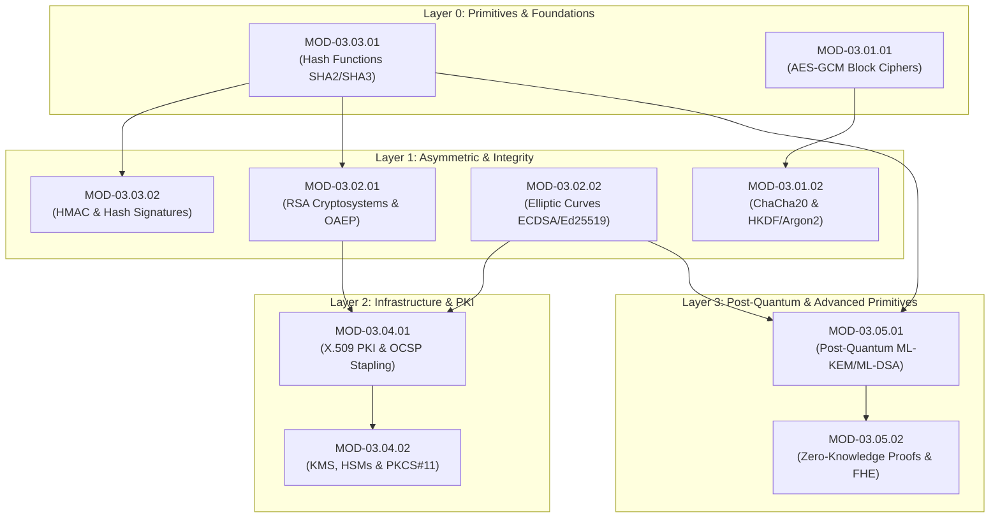

# Domain 03: Cryptography & PKI — Knowledge Tree & Specification

## 1. Domain Identity & Overview
- **Domain ID**: `DOM-03`
- **Canonical Name**: Cryptography & PKI
- **Ontology Parent**: `KU-CYBER`
- **Domain Status**: `Active`

`DOM-03` establishes the mathematical ciphers, public key infrastructure, asymmetric elliptic curve primitives, digital signature standards, hardware security modules, and post-quantum cryptographic primitives across Cyber Act.

---

## 2. Branch Decomposition Matrix

Domain 03 is partitioned into **5 Core Engineering Branches**:

```
Domain-03: Cryptography & PKI
├── Branch 03.1: Symmetric Cryptography & Block Ciphers (cry-symmetric)
├── Branch 03.2: Asymmetric Cryptography & Elliptic Curves (cry-asymmetric-ecc)
├── Branch 03.3: Cryptographic Hash Functions & Integrity (cry-hash-integrity)
├── Branch 03.4: Public Key Infrastructure & Key Management (cry-pki-keymgmt)
└── Branch 03.5: Post-Quantum Cryptography & Advanced Primitives (cry-pqc-advanced)
```

---

## 3. Branch & Module Detailed Breakdown

### Branch 03.1: Symmetric Cryptography & Block Ciphers (`cry-symmetric`)
*Root Directory: `04 - Branch Knowledge/Cryptography/Symmetric`*

- **Module 03.1.1: Block Cipher Architecture (AES-GCM, AES-CBC & AEAD) (`MOD-03.01.01`)**
  - *Concepts*: Substitution-Permutation Networks (SPN), AES-128/256 internal state, Cipher Block Chaining (CBC) padding oracle attacks, Galois Counter Mode (AES-GCM) AEAD, Nonce reuse vulnerability.
- **Module 03.1.2: Stream Ciphers & Key Derivation Functions (ChaCha20-Poly1305 & HKDF) (`MOD-03.01.02`)**
  - *Concepts*: ChaCha20 quarter-round operations, Poly1305 authenticator, HMAC-based Extract-and-Expand Key Derivation Function (HKDF), Password Hashing (Argon2id, PBKDF2, bcrypt).

### Branch 03.2: Asymmetric Cryptography & Elliptic Curves (`cry-asymmetric-ecc`)
*Root Directory: `04 - Branch Knowledge/Cryptography/Asymmetric-ECC`*

- **Module 03.2.1: RSA Cryptosystems, OAEP & Factorization Attack Surfaces (`MOD-03.02.01`)**
  - *Concepts*: Modular arithmetic, Euler's totient function, RSA key generation ($p \cdot q$), PKCS#1 v1.5 vs OAEP padding, Bleichenbacher padding oracle, Wiener's small private exponent attack.
- **Module 03.2.2: Elliptic Curve Cryptography (ECDSA, Ed25519 & X25519) (`MOD-03.02.02`)**
  - *Concepts*: Weierstrass equations ($y^2 = x^3 + ax + b$), Edwards curves (Ed25519), Montgomery curves (Curve25519 / X25519), ECDSA nonce reuse catastrophic private key leak, EdDSA.

### Branch 03.3: Cryptographic Hash Functions & Integrity (`cry-hash-integrity`)
*Root Directory: `04 - Branch Knowledge/Cryptography/Hash-Integrity`*

- **Module 03.3.1: Cryptographic Hash Functions (SHA-2, SHA-3 & BLAKE3) (`MOD-03.03.01`)**
  - *Concepts*: Merkle-Damgård construction (SHA-256/512), Length Extension Attacks, Sponge construction (SHA-3 / Keccak), BLAKE3 Merkle-tree hashing, Collision vs Preimage resistance.
- **Module 03.3.2: Message Authentication Codes (HMAC, KMAC) & Signatures (`MOD-03.03.02`)**
  - *Concepts*: Hash-based MAC (HMAC-SHA256), KMAC, MAC validation timing attacks (constant-time comparisons), Hash-Based Statefully Signed Schemes (LMS/XMSS).

### Branch 03.4: Public Key Infrastructure & Key Management (`cry-pki-keymgmt`)
*Root Directory: `04 - Branch Knowledge/Cryptography/PKI-KeyMgmt`*

- **Module 03.4.1: X.509 Certificate Architecture, CA Hierarchy & OCSP Stapling (`MOD-03.04.01`)**
  - *Concepts*: ASN.1 DER encoding, X.509 v3 extensions (SAN, Basic Constraints), Root vs Intermediate CAs, Certificate Revocation Lists (CRL), OCSP Stapling (RFC 6066), Certificate Transparency (CT) logs.
- **Module 03.4.2: Key Management Systems (KMS), HSMs & PKCS#11 Interfaces (`MOD-03.04.02`)**
  - *Concepts*: Hardware Security Modules (HSM), FIPS 140-3 Level 1-4 certification, PKCS#11 C-API, Key wrapping (AES-KW), Envelope Encryption, Cloud KMS (AWS KMS / Vault).

### Branch 03.5: Post-Quantum Cryptography & Advanced Primitives (`cry-pqc-advanced`)
*Root Directory: `04 - Branch Knowledge/Cryptography/PQC-Advanced`*

- **Module 03.5.1: Post-Quantum Cryptography (NIST ML-KEM & ML-DSA Standards) (`MOD-03.05.01`)**
  - *Concepts*: Shor's Algorithm quantum RSA/ECC threat, Grover's Algorithm, Lattice-Based Cryptography, Module Learning With Errors (MLWE), ML-KEM (Kyber), ML-DSA (Dilithium), Hybrid classical-PQC migration.
- **Module 03.5.2: Zero-Knowledge Proofs & Fully Homomorphic Encryption (FHE) (`MOD-03.05.02`)**
  - *Concepts*: Zero-Knowledge Proofs (zk-SNARKs, zk-STARKs), Trusted Setup, R1CS / QAP encodings, Fully Homomorphic Encryption (FHE - BGV/CKKS schemes), Secure Multi-Party Computation (SMPC).

---

## 4. Module Dependency Graph (Mermaid DAG)



---

## 5. 4-Tier Learning Roadmap

| Learning Tier | Target Competency Goal | Core Modules Included | Key Mastery Deliverable |
| :--- | :--- | :--- | :--- |
| **Tier 1: Awareness (L1)** | Understand symmetric vs asymmetric ciphers and digital certificate structures. | `MOD-03.01.01`, `MOD-03.03.01`, `MOD-03.04.01` | Decode an X.509 certificate using `openssl x509`. |
| **Tier 2: Understanding (L2)** | Explain ECDHE point multiplication, GCM tag generation, and RSA OAEP padding. | `MOD-03.01.01`, `MOD-03.02.02`, `MOD-03.03.02` | Mathematically trace ECDSA nonce reuse private key recovery. |
| **Tier 3: Practical (L3)** | Implement constant-time MAC comparisons, manage HSM keys, configure OCSP stapling. | `MOD-03.04.01`, `MOD-03.04.02`, `MOD-03.01.02` | Build a PKCS#11 HSM integration module in C/Python. |
| **Tier 4: Engineering (L4)** | Design hybrid Post-Quantum TLS key exchanges and zero-knowledge verification pipelines. | `MOD-03.05.01`, `MOD-03.05.02` | Implement an ML-KEM-768 hybrid key agreement engine. |

---

## 6. Implementation Checklist & Status
- [x] Domain-03 Master Architecture Specification Ratified.
- [x] 5 Engineering Branches defined.
- [x] 10 Universal Modules instantiated in `04 - Branch Knowledge/Cryptography/`.
- [x] Complete Mermaid DAG graph populated.
