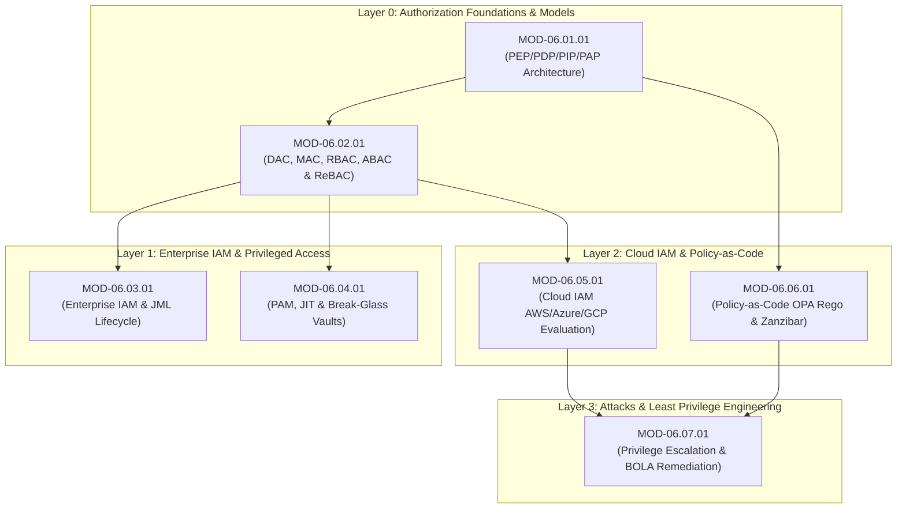

# Domain 06: Authorization & IAM — Master Knowledge Architecture

## 1. Domain Identity & Overview
- **Domain ID**: `DOM-06`
- **Canonical Name**: Authorization & Identity and Access Management (IAM)
- **Ontology Parent**: `KU-CYBER`
- **Domain Status**: `Active`

`DOM-06` defines the engineering principles, mathematical policy models, access decision architectures, enterprise identity governance frameworks, cloud IAM policy evaluation engines, and privileged access safeguards required to enforce the Principle of Least Privilege across software, cloud, and enterprise infrastructures.

---

## 2. Scope & Exclusion Boundaries
- **In Scope**: Access Control Models (DAC, MAC, RBAC, ABAC, ReBAC), Policy Enforcement Architecture (PEP, PDP, PIP, PAP), Enterprise IAM Lifecycle (Joiner-Mover-Leaver, SCIM, IGA), Privileged Access Management (PAM, Just-In-Time access, break-glass vaults), Cloud IAM policy engines (AWS IAM, Azure RBAC, GCP IAM), Policy-As-Code (Open Policy Agent - OPA / Rego, Google Zanzibar), and Authorization Attacks (BOLA, Vertical/Horizontal Privilege Escalation, Policy Abuse).
- **Explicit Exclusions**:
  - Authentication protocols, passwords, TOTP, and FIDO2 WebAuthn (governed by `DOM-05`).
  - Active Directory Kerberos ticket issuance & domain controller administration (governed by `DOM-10`).
  - Network firewall packet filtering & ACLs (governed by `DOM-02`).

---

## 3. Branch Decomposition Matrix

Domain 06 is partitioned into **7 Core Engineering Branches**:

```
Domain-06: Authorization & IAM
├── Branch 06.1: Authorization Foundations (authorization-foundations)
├── Branch 06.2: Access Control Models (access-control-models)
├── Branch 06.3: Enterprise IAM (enterprise-iam)
├── Branch 06.4: Privileged Access Management (privileged-access-management)
├── Branch 06.5: Cloud IAM (cloud-iam)
├── Branch 06.6: Authorization Engineering (authorization-engineering)
└── Branch 06.7: Authorization Attacks & Defenses (authorization-attacks-defenses)
```

---

## 4. Branch & Module Breakdown

### Branch 06.1: Authorization Foundations (`authorization-foundations`)
- **`MOD-06.01.01`**: Authorization Architecture, Access Decision Engine (PEP, PDP, PIP, PAP) & Subject-Object Action Model

### Branch 06.2: Access Control Models (`access-control-models`)
- **`MOD-06.02.01`**: Access Control Models (DAC, MAC, RBAC, ABAC, ReBAC & Capability-Based Security)

### Branch 06.3: Enterprise IAM (`enterprise-iam`)
- **`MOD-06.03.01`**: Enterprise IAM Architecture, Joiner-Mover-Leaver (JML) Lifecycle & Access Governance

### Branch 06.4: Privileged Access Management (`privileged-access-management`)
- **`MOD-06.04.01`**: Privileged Access Management (PAM), Just-In-Time (JIT) Access & Break-Glass Vault Architecture

### Branch 06.5: Cloud IAM (`cloud-iam`)
- **`MOD-06.05.01`**: Cloud IAM Policy Evaluation Engines (AWS IAM, Azure RBAC, GCP IAM & Cross-Account Trust)

### Branch 06.6: Authorization Engineering (`authorization-engineering`)
- **`MOD-06.06.01`**: Policy-as-Code Authorization (Open Policy Agent - OPA / Rego & Google Zanzibar ReBAC)

### Branch 06.7: Authorization Attacks & Defenses (`authorization-attacks-defenses`)
- **`MOD-06.07.01`**: Authorization Flaws (Privilege Escalation, BOLA/IDOR, Forced Browsing & Least Privilege Refactoring)

---

## 5. Module Dependency Graph (Mermaid DAG)



---

## 6. Implementation Checklist & Status
- [x] Domain-06 Master Specification Created & Frozen.
- [x] 7 Core Engineering Branches Defined.
- [x] 7 Universal Technical Modules mapped and scheduled.
- [x] Complete Mermaid DAG populated.
