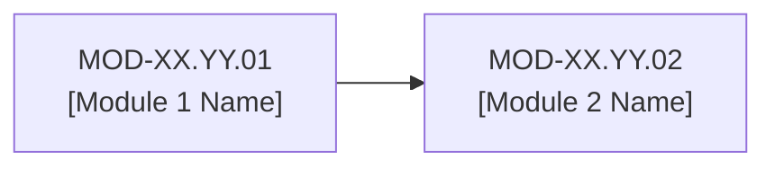

# Branch XX.YY: [Branch Name] — Master Branch Index

## 1. Branch Overview
- **Branch ID**: `BR-XX.YY`
- **Parent Domain**: `DOM-XX` ([Domain Name])
- **Canonical Slug**: `[branch-slug]`

[Provide a high-level summary of the engineering domain covered by this branch.]

---

## 2. Module Directory

| Module ID | Module Name | Status | Target File Path | Primary Concepts |
| :--- | :--- | :---: | :--- | :--- |
| **MOD-XX.YY.01** | [Module 1 Name] | `[ ]` | `04 - Branch Knowledge/[Domain]/[Branch]/01 - [Name].md` | [Concept 1], [Concept 2] |
| **MOD-XX.YY.02** | [Module 2 Name] | `[ ]` | `04 - Branch Knowledge/[Domain]/[Branch]/02 - [Name].md` | [Concept 3], [Concept 4] |

---

## 3. Branch Learning Path

---

## 4. Associated Labs & Projects
- **Labs**: `LAB-XXXXXX` ([Lab Name])
- **Projects**: `PRJ-XXXXXX` ([Project Name])
