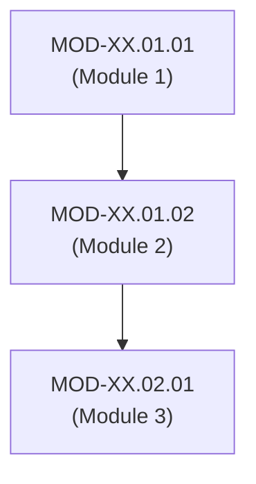

# Domain XX: [Domain Name] — Knowledge Tree & Specification

## 1. Domain Identity & Scope
- **Domain ID**: `DOM-XX`
- **Canonical Name**: [Domain Name]
- **Ontology Parent**: `KU-CYBER`
- **Domain Status**: `Active`

### Purpose & Responsibilities:
[Brief description of domain scope, engineering boundaries, and technical objectives.]

### In Scope:
- [Scope Item 1]
- [Scope Item 2]

### Out of Scope:
- [Explicitly excluded topic 1 - Handled by DOM-YY]

---

## 2. Branch Decomposition Matrix

```
Domain-XX: [Domain Name]
├── Branch XX.1: [Branch 1 Name] (branch-slug-1)
├── Branch XX.2: [Branch 2 Name] (branch-slug-2)
└── Branch XX.3: [Branch 3 Name] (branch-slug-3)
```

---

## 3. Branch & Module Detailed Breakdown

### Branch XX.1: [Branch 1 Name] (`branch-slug-1`)
- **Module XX.1.1: [Module 1 Name] (`MOD-XX.01.01`)**
  - *Concepts*: [Concept 1], [Concept 2].
- **Module XX.1.2: [Module 2 Name] (`MOD-XX.01.02`)**
  - *Concepts*: [Concept 3], [Concept 4].

---

## 4. Module Dependency Graph (Mermaid DAG)



---

## 5. 4-Tier Learning Roadmap

| Learning Tier | Competency Goal | Modules Included | Key Deliverable |
| :--- | :--- | :--- | :--- |
| **L1 — Awareness** | Basic terminology & high-level overview. | `MOD-XX.01.01` | Conceptual diagramming. |
| **L2 — Understanding** | Core mechanics & architecture. | `MOD-XX.01.02` | Mechanism trace analysis. |
| **L3 — Practical** | Operational commands & configuration. | `MOD-XX.02.01` | Hands-on lab execution. |
| **L4 — Engineering** | Advanced trade-offs & system design. | `MOD-XX.02.02` | Custom probe / mitigation build. |

---

## 6. Implementation Roadmap
- [ ] Phase 1: Branch XX.1 Implementation
- [ ] Phase 2: Branch XX.2 Implementation
- [ ] Phase 3: Branch XX.3 Implementation
