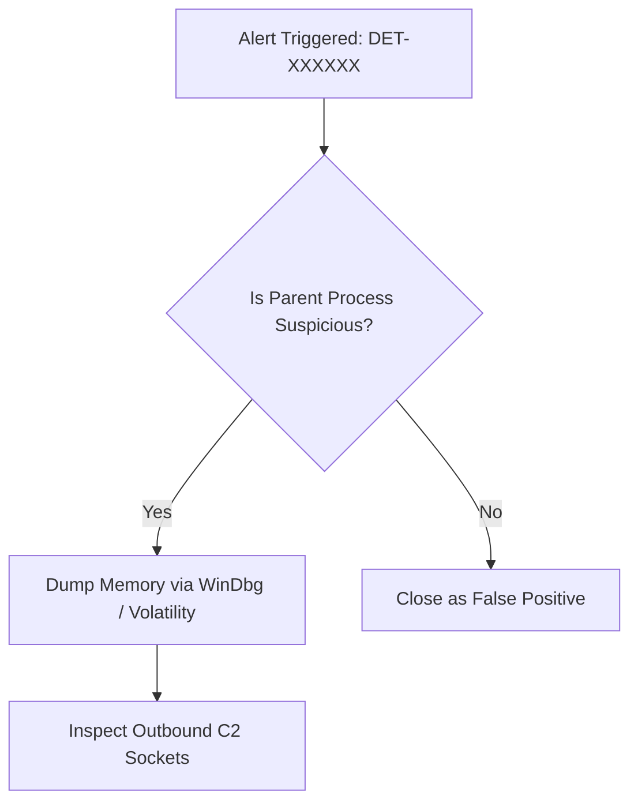

# Threat Investigation Playbook: [Investigation Title]

## 1. Incident Context & Triage Criteria
- **Investigation ID**: `INV-XXXXXX`
- **Initial Trigger**: Alert `DET-XXXXXX` fired on endpoint `[Hostname]`.

[Brief executive scenario describing the incident indicator.]

---

## 2. Investigation Workflow & Triage Tree



---

## 3. Evidence Artifact Collection Checklist

| Artifact Source | Location / Command | Investigation Purpose |
| :--- | :--- | :--- |
| **Process Tree** | `tasklist /v` or Sysmon Event 1 | Identify child process lineage |
| **Network Sockets** | `netstat -ano` or `ss -tulpn` | Identify active C2 connections |
| **Memory Dump** | `winpmem` / `dumpit` | Extract un-encrypted payload |

---

## 4. Forensics Query Playbook
```kql
// Sentinel Forensic Query for Host Timeline
DeviceProcessEvents
| where DeviceName == "HOST-01"
| where Timestamp >= ago(24h)
| order by Timestamp asc
```

---

## 5. Containment & Remediation Actions
1. **Network Isolation**: Isolate host from LAN via EDR command.
2. **Credential Revocation**: Reset active User Account Access Tokens.
3. **IOC Scrubber**: Sweep enterprise SIEM for matching IP / MD5 hashes.
