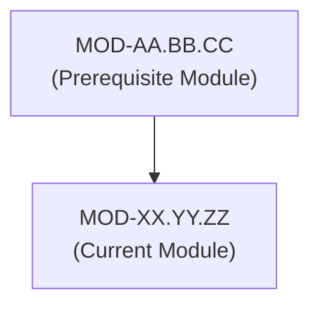
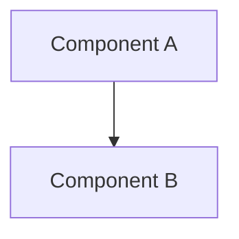

# [Module Name]

## 1. Overview & Purpose
[High-level executive summary of what this module covers and why it exists.]

---

## 2. Prerequisites & Prerequisites Graph
- **Prerequisites**: `MOD-AA.BB.CC`, `CON-XXXXXX`



---

## 3. Learning Objectives & Taxonomy Alignment
- **L1 Awareness**: [Objective 1]
- **L2 Understanding**: [Objective 2]
- **L3 Practical**: [Objective 3]
- **L4 Engineering**: [Objective 4]

---

## 4. L1 — Awareness (Overview & Core Terminology)
[Introductory overview, core terminology, definitions, and high-level mental models.]

---

## 5. L2 — Understanding (Core Theory & Mechanics)
[In-depth theoretical foundation, data flows, data structures, and protocol mechanics.]

---

## 6. L3 — Practical (Commands & Configurations)
[Hands-on operational commands, configuration file examples, CLI invocations.]

```bash
# Practical Command Example
example-tool --flag value /path/to/target
```

---

## 7. L4 — Engineering (Design Trade-offs & System Integration)
[Systems engineering trade-offs, performance optimization, architectural limits.]

---

## 8. Internal Architecture & Data Structures
[Diagrams, C struct definitions, memory layouts, flowcharts.]



---

## 9. Security Perspective & Boundary Protection
[Security boundaries, authorization checks, isolation mechanisms.]

---

## 10. Attack Perspective & Exploitation Primitives
[Attacker TTPs, exploitation mechanics, bypass strategies.]

---

## 11. Defense Perspective & Hardening Guidelines
[Defensive countermeasures, configuration hardening blueprints, best practices.]

---

## 12. Detection & Telemetry Verification
[Log sources, Event IDs, Sysmon events, Sigma rules.]

```yaml
# Sigma Detection Rule Stub
title: Example Detection Rule
logsource:
  category: process_creation
  product: windows
detection:
  selection:
    Image|endswith: '\example.exe'
  condition: selection
```

---

## 13. Hands-On Lab Reference
- **Associated Lab**: `LAB-XXXXXX` ([Lab Name])

---

## 14. Related Projects & Applications
- **Associated Project**: `PRJ-XXXXXX` ([Project Name])

---

## 15. Troubleshooting & Diagnostics Matrix

| Symptom | Root Cause | Remediation / Diagnostic Command |
| :--- | :--- | :--- |
| [Issue 1] | [Root Cause 1] | [Diagnostic Command] |

---

## 16. Related Concepts & Cross-Domain Links
- `CON-XXXXXX`: [Concept Name] (`DOM-AA`)

---

## 17. Technical Interview Preparation (Q&A)
**Q1: [Interview Question 1]**  
*Answer*: [Detailed engineering answer.]

---

## 18. Self-Assessment & Mastery Checklist
- [ ] Understand core data structures.
- [ ] Able to execute hands-on telemetry validation.

---

## 19. References & Further Reading
- [Reference Author], *[Book / Article Title]*, [Publisher/URL].
