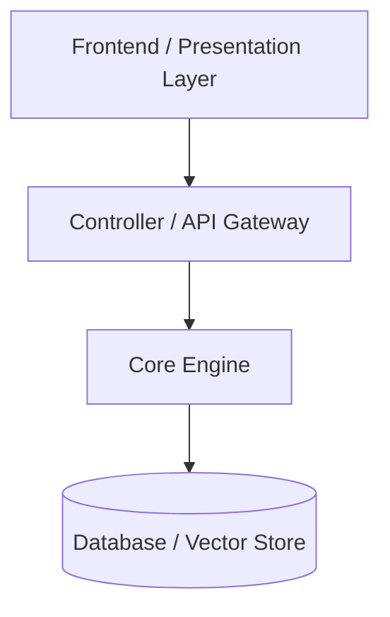

# Flagship Project Architecture: [Project Name]

## 1. Project Overview & Mission
- **Project ID**: `PRJ-XXXXXX`
- **Canonical Name**: [Project Name]
- **Target Repository**: `10 - Flagship Projects/[Project Name]`

[Comprehensive project overview, problem statement, and engineering goals.]

---

## 2. System Architecture & Module Graph



---

## 3. Technology Stack & Dependencies
- **Core Language**: [Python / C++ / Rust / Go / TypeScript]
- **Frameworks**: [FastAPI / React / gRPC / eBPF]
- **Knowledge Domains Implemented**: `DOM-01`, `DOM-02`

---

## 4. Key Engineering Modules
- `MOD-01.01.03`: Native Syscall Dispatcher Engine
- `MOD-02.01.01`: Protocol Parser

---

## 5. Build, Test & Deployment Pipeline
```bash
# Build Project Engine
make build

# Execute Test Suite
make test
```

---

## 6. Project Roadmap & Contribution Guide
- [ ] Milestone 1: Core Engine Proof-of-Concept
- [ ] Milestone 2: Production API Gateway
